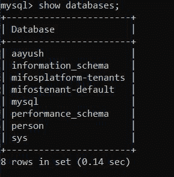
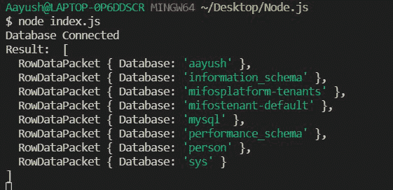

# 如何将 Node.js 应用连接到 MySQL？

> 原文:[https://www . geesforgeks . org/how-connect-node-js-application-to-MySQL/](https://www.geeksforgeeks.org/how-to-connect-node-js-application-to-mysql/)

[Node.js](https://www.geeksforgeeks.org/nodejs-tutorials/) 是一个开源的跨平台运行时环境，构建在 Chrome 的 V8 引擎之上，让我们可以在浏览器之外使用 JavaScript。Node.js 帮助我们使用 JavaScript 构建服务器端应用程序。在本文中，我们将讨论如何将 Node.js 应用程序连接到 MySQL。为了连接 node.js 和 MySQL 数据库，我们需要一个第三方 **mysql** 模块。

**进场:**

*   首先，在你机器的特定文件夹**中初始化 node.js 项目。**
*   在项目文件夹中下载 mysql 模块。
*   之后，使用 mysql 模块的 create connection()方法创建到数据库的连接。

**下面讨论上述方法:**

**步骤 1:** 创建一个 NodeJS 项目，并使用以下命令对其进行初始化:

```js
npm init
```

**步骤 2:** 使用以下命令安装 mysql 模块:

```js
npm install mysql
```

**文件结构:**我们的文件结构如下图所示:


**Mysql 数据库结构:**



## index.js

```js
// Importing module
var mysql = require('mysql')

var connection = mysql.createConnection({
    host:"localhost",
    user:"root",
    password:"Aayush",
    database : "aayush"
})

// Connecting to database
connection.connect(function(err) {
    if(err){
      console.log("Error in the connection")
      console.log(err)
    }
    else{
      console.log(`Database Connected`)
      connection.query(`SHOW DATABASES`, 
      function (err, result) {
        if(err)
          console.log(`Error executing the query - ${err}`)
        else
          console.log("Result: ",result) 
      })
    }
})
```

使用以下命令运行 **index.js** 文件:

```js
node index.js
```

**控制台输出:**

