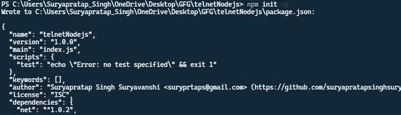
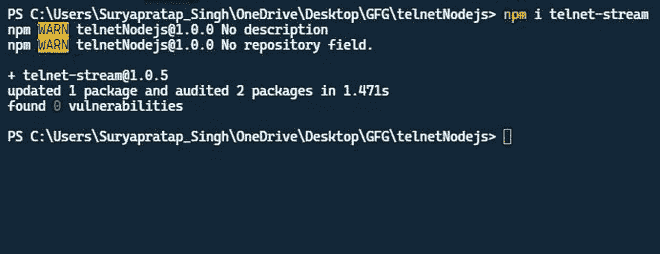
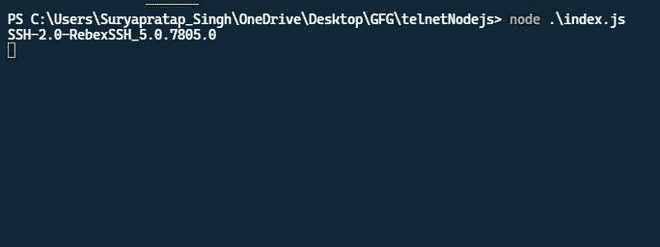

# 如何从 Node.js 连接到 Telnet 服务器？

> 原文:[https://www . geesforgeks . org/如何从节点连接到 telnet-服务器-js/](https://www.geeksforgeeks.org/how-to-connect-to-telnet-server-from-node-js/)

在本文中，我们将看到如何将远程登录服务器与 Node.js 应用程序连接起来。

**Telnet:**Telnet 是传输控制协议(TCP)上的一种应用协议，用于互联网或局域网，使用虚拟终端连接提供双向交互式面向文本的通信设施。Telnet 用于与远离我们的人共享终端。它们提供了许多好处，比如虚拟终端和在共享终端上实时执行命令。如果你对 telnet 有更多的好奇请参考[这篇文章](https://www.geeksforgeeks.org/introduction-to-telnet/)。

**NodeJS:** Node.js 是 javascript 的运行时环境，基于服务器端执行 javascript 的 V8 引擎。因此，在 nodejs 的帮助下，我们还创建了一个事件驱动的应用程序，如果你对 telnet 有更多的好奇，请参考[这篇文章。](https://www.geeksforgeeks.org/introduction-to-nodejs/)

**程序方法:**

*   首先声明同一个全局变量，以便进一步使用。
*   导入或需要两个模块来使用 telnet 服务器，第一个是网络模块，帮助管理网络，第二个是 telnet 流，用于建立与 telnet 服务器的连接。
*   用远程登录服务器的 IP 和端口号初始化网络套接字对象。
*   创建一个 telnet 客户端并连接到上面的套接字。
*   连接后，列出一些事件的套接字与连接关闭时一样关闭，用于从 telnet 服务器收集数据的数据最后但同样重要的是，telnet 服务器中每一个新步骤发生的事件将创建一个日志。

**从 Node.js** 连接 Telnet 服务器

**步骤 1:** 运行以下命令初始化 npm。

```
npm init -y
```

**注意:** -y 用于所有默认设置。



**第二步:**安装一些包。

```
npm install telnet-stream
```

**注意:** telnet-stream 用于将 telnet 连接到我们的节点应用程序。



**步骤 3:** 用下面的代码创建一个文件。这里，文件名是 index.js

## java 描述语言

```
// Some global variable for further use
var TelnetSocket, net, socket, tSocket;

// Require the net module for work with networking
net = require("net");

// Require and create a TelnetSocket Object
({ TelnetSocket } = require("telnet-stream"));

// Initialize the socket with the our ip and port
socket = net.createConnection(22, "test.rebex.net");

// Connect the socket with telnet
tSocket = new TelnetSocket(socket);

// If the connection are close "close handler"
tSocket.on("close", function () {
    return process.exit();
});

// If the connection are on "on handler"
tSocket.on("data", function (buffer) {
    return process.stdout.write(buffer.toString("utf8"));
});

// If the connection are occure somethin "doing handler"
tSocket.on("do", function (option) {
    return tSocket.writeWont(option);
});

tSocket.on("will", function (option) {
    return tSocket.writeDont(option);
});

// If the connection are send teh data "data handler"
process.stdin.on("data", function (buffer) {
    return tSocket.write(buffer.toString("utf8"));
});
```

**第四步:**运行 index.js 文件。

```
node index.js
```

**输出:**最后，您已经将节点应用程序连接到 telnet。

