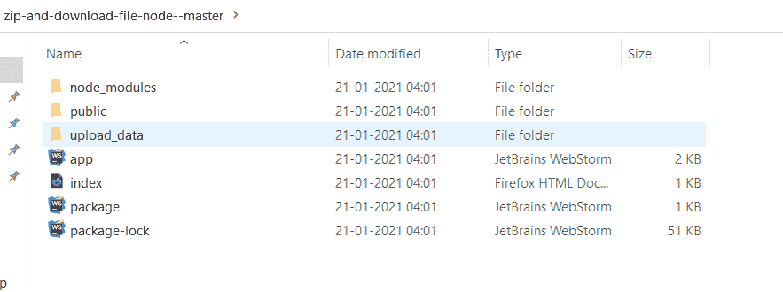
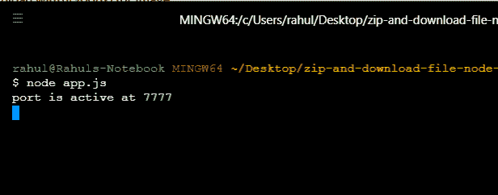
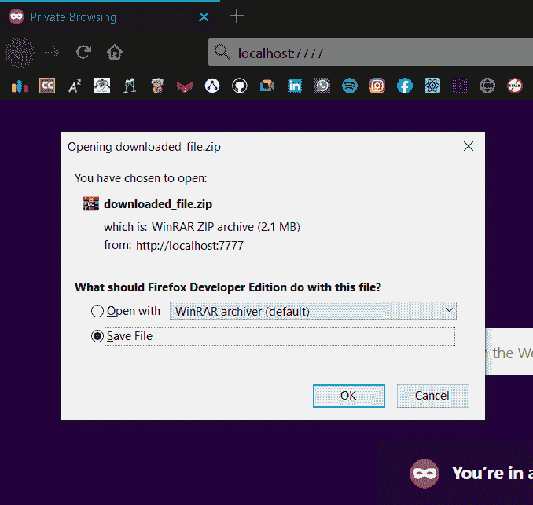
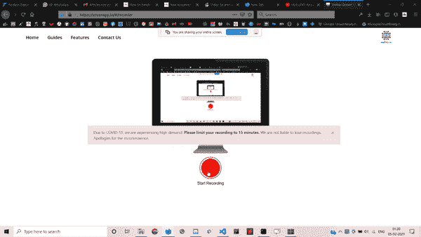

# 如何使用 Node.js 将文件转换为 zip 文件并下载？

> 原文:[https://www . geesforgeks . org/如何使用节点 js/将文件转换为 zip 文件并下载](https://www.geeksforgeeks.org/how-to-convert-a-file-to-zip-file-and-download-it-using-node-js/)

压缩文件是存储压缩文件和文件夹的常用方式。在本文中，我将演示如何使用 adm-zip 模块(NPM 包)将文件转换为 zip 格式。

**ADM-ZIP 的用途**

*   压缩原始文件并将其更改为 zip 格式。
*   更新/删除现有文件(。zip 格式)。

**安装 ADM-ZIP:**

**步骤 1:** 在终端中使用以下命令安装模块。

```
npm install adm-zip
```

**步骤 2:** 使用以下命令检查安装模块的版本。

```
npm version adm-zip
```

我们将使用 adm-zip 模块将这个 upload_data 文件夹更改为 zip 文件！


upload_data FOLDER

**转换下载 zip 文件代码:**

## java 描述语言

```
// express is a node framework that is helps in creating
// 2 or more web-pages application
const express = require('express')

// filesystem is a node module that allows us to work with
// the files that are stored on our pc
const file_system = require('fs')

// it is an npm package.this is to be required in our JS 
// file for the conversion of data to a zip file!
const admz = require('adm-zip')

// stores the express module into the app variable!
const app = express()

// this is the name of specific folder which is to be 
// changed into zip file1
var to_zip = file_system.readdirSync(__dirname+'/'+'upload_data')

// this is used to request the specific file and then print 
// the data in it!
app.get('/',function(req,res){
    res.sendFile(__dirname+'/'+'index.html')

    // zp is created as an object of class admz() which 
    // contains functionalities
    var zp = new admz();

    // this is the main part of our work!
    // here for loop check counts and passes each and every 
    // file of our folder "upload_data"
    // and convert each of them to a zip!
    for(var k=0 ; k<to_zip.length ; k++){
        zp.addLocalFile(__dirname+'/'+'upload_data'+'/'+to_zip[k])
    }

    // here we assigned the name to our downloaded file!
    const file_after_download = 'downloaded_file.zip';

    // toBuffer() is used to read the data and save it
    // for downloading process!
    const data = zp.toBuffer();

    // this is the code for downloading!
    // here we have to specify 3 things:
        // 1\. type of content that we are downloading
        // 2\. name of file to be downloaded
        // 3\. length or size of the downloaded file!

    res.set('Content-Type','application/octet-stream');
    res.set('Content-Disposition',`attachment; filename=${file_after_download}`);
    res.set('Content-Length',data.length);
    res.send(data);

})

// this is used to listen a specific port!
app.listen(7777,function(){
    console.log('port is active at 7777');
})
```

**运行程序的步骤:**

1.  **我们的项目看起来像:**



最终方案

在所需的本地打开终端，并使用以下命令确保您已经下载了 adm-zip 包。

```
npm install adm-zip
```

使用以下命令运行 app.js 文件。

```
node app.js
```



应用程序正在运行

打开浏览器打开 **localhost:7777** 然后**上传 _ 数据**文件夹转换成 zip 文件下载！



已更改为 zip 文件

**输出:**借助下面的 gif 表示将文件转换为 zip 文件的整个过程，这样就可以将文件夹更改为 zip 文件，然后下载！



文件到压缩文件