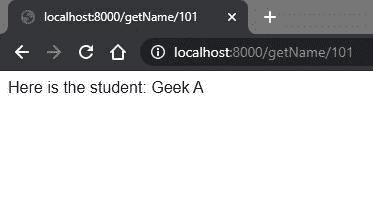

# 如何在 Node.js 中将已有的回调转换为承诺？

> 原文:[https://www . geesforgeks . org/如何将现有的回调转换为节点中的承诺-js/](https://www.geeksforgeeks.org/how-to-convert-an-existing-callback-to-a-promise-in-node-js/)

**回调:**就 JavaScript 而言，回调是作为参数传递给另一个函数的函数。调用函数的结果一准备好，函数就执行。简单来说，它处理 JavaScript 的异步需求。

**示例:**演示这个的最佳示例是使用 setTimeout()函数，该函数接受回调并延迟 JavaScript 代码的执行。一旦设置为函数的时间结束，回调函数就会执行。

```js
// Defining a callback function 
var callback = ()=>{
    console.log("Hello! GeeksforGeeks");
}

// Passing the callback function
// as a parameter
setTimeout(callback, 2000);

// The callback gets executed as
// soon as 2 seconds are over.
// This behavior shows the 
// execution of a callback.
```

**输出:**

```js
Hello! GeeksforGeeks
```

**承诺:**非常类似于运行中的回调。但是，使用 Promises 的好处是提高代码的可读性，因为它将我们从**回调的地狱中拯救出来。**
许诺有四个州

*   **待定:**承诺尚未完成。它没有成功，也没有失败。
*   **兑现:**承诺以成功告终。
*   **拒绝:**承诺以错误结束。
*   **解决:**承诺要么出错，要么成功。

**将现有回调转换为承诺:**

```js
// Existing Callback
var callback = function(err, success) {
    if(err) {
        console.log("Geek is very sad!");
    }
    else {
        console.log("Geek is optimistic, "
            + "thus becomes successful");
    }
}

var caller = function(status, callback){
    if(status === 'Happy')
        callback(null, true);
    else {
        callback(new Error(), false);
    } 
}

// Calling the caller method

// Executes the success part
caller('Happy', callback);

// Executes the error part
caller('Sad', callback);
```

**输出:**

```js
Geek is optimistic, thus becomes successful
Geek is very sad!
```

**后续步骤:**

*   定义一个名为 error 的函数，并将回调函数的错误代码块插入其中。
*   定义一个名为 success 的函数，并将 success 代码块插入其中。
*   然后通过返回 promise 对象修改调用者代码。
*   以下列任何一种方式使用成功和错误方法。
*   为了更好地理解，请参见下面的代码片段。

```js
// This snippet briefly shows
// the implementation
var error = function(){

    // The error codeblock from
    // the existing callback.
    console.log("Geek is very sad!");
}

var success = function(){

    // The success codeblock from
    // the existing callback
    console.log("Geek is optimistic, "
        + "thus becomes successful");
}

var caller = function(status) {
    return new Promise(function(resolve, reject) {
        if(status === 'Happy') {

            // Calling the resolve function 
            // when function returns success
          resolve();
        }
        else {

            // Calling the reject function
            // when function returns failure
            reject();
        }
    });
};

// Throw success
caller('Happy').then(success).catch(error);

// Throw error
caller('Sad').then(success).catch(error);
```

**输出:**

```js
Geek is optimistic, thus becomes successful
Geek is very sad!
```

让我们将下面的代码片段变成一个承诺实现。为了使实现运行，我们需要设置一个运行在节点服务器上的 web 应用程序。

为了理解这个例子，我们需要在系统上设置一个节点服务器。您可以按照以下步骤设置节点服务器。

按照这里所示的步骤安装节点并设置一个简单的节点应用程序。

**示例:**这里，场景是我们有一个学生数组，id 和 name 作为值。我们需要获得拥有给定 id 的学生的姓名。我们得到了一个现有的回调，需要转换成一个承诺。

```js
/* The following code snippet depicts a GET request
to the server made by the client, which requests for
the name of the student with a given student id. Here we
have a student array that stores JSON objects of
student id and name. We are going to create a GET
Request using expressjs in node first. Then we will
write a route to get name of student based on id. */
const express = require('express');
const app = express();

// Students array
var students = [
    {
        id: 101,
        name: "Geek A"
    },
    {
        id: 102,
        name: "Geek B"
    },
    {
        id: 103,
        name: "Geek C"
    },
    {
        id: 104,
        name: "Geek D"
    }
];

// Definition of the callback function
const callback = (err, student) => {
    if(err) {
        return `Student with given id ${err} not found`;
    }
    else {
        return "Here is the student: " + student.name;
    }
}

// Passing studentid and callback function as parameter
const findName = (studentId, callbackFunction) => {
    let student = students.find(function(studentValue) {
        return studentValue.id == studentId;
    });

    // Student not found
    if(typeof student === 'undefined')  {
        return callbackFunction(studentId, false);
    }
    else {  // Student found
       return callbackFunction(null, student);
    }
}

const getName = (req, res)=>{

    // Sending back the response to the server
    res.send(findName(req.params.studentId, callback));
}

app.get('/getName/:studentId', getName);

app.listen(8000, 'localhost', function () {
    console.log('Server Listening');
});
```

**输出:**


现在，我们可以将回调函数转换为承诺。在这里，我们可以再次遵循前面的步骤，即失败函数中的错误逻辑和成功函数中的成功逻辑。请查看下面的代码，以便更清楚。

```js
const express = require('express');
const app = express();

var students = [
    {
        id: 101,
        name: "Geek A"
    },
    {
        id: 102,
        name: "Geek B"
    },
    {
        id: 103,
        name: "Geek C"
    },
    {
        id: 104,
        name: "Geek D"
    }
];

// Writing the success logic here
const success = (student) => {
    return "Here is the student: " + student.name;
}

// Writing the failure logic here.
const failure = (fail) => {
    return `Student with the given id ${fail} was not found`;
}

const findName = (studentId) => {
    return new Promise(function (resolve, reject) {
        let student = students.find(function (studentValue) {
            return studentValue.id == studentId;
        });
        if (student) {
            resolve(student);
        }
        else {
            reject(id);
        }
    });
}

const getName = async (req, res) => {
    let answer = await findName(
        req.params.studentId).then(success).catch(failure);

    res.send(answer);
}

app.get('/getName/:studentId', getName);

app.listen(8000, 'localhost', function () {
    console.log('Server Listening');
});
```

**输出:**
