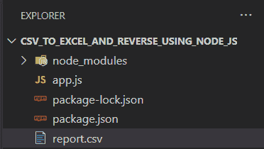
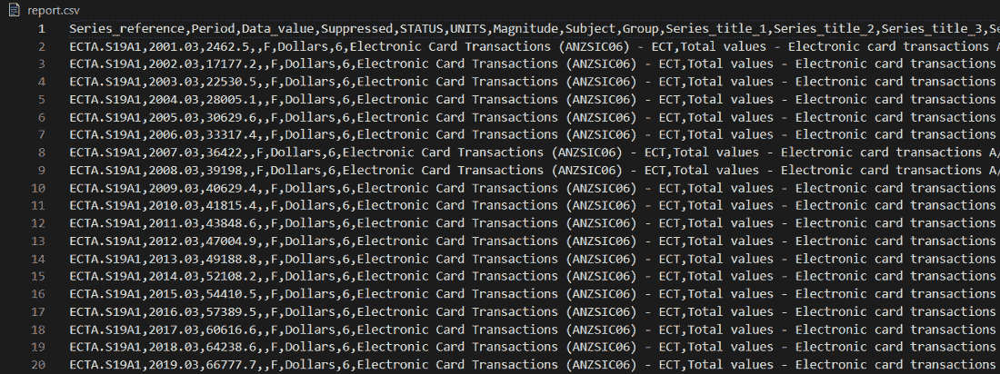
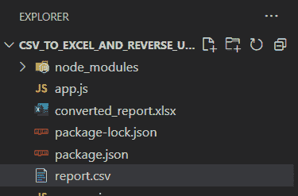
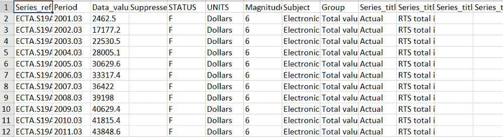

# 如何在 Node.js 中把 CSV 转换成 Excel？

> 原文:[https://www . geesforgeks . org/how-convert-CSV-to-excel-in-node-js/](https://www.geeksforgeeks.org/how-to-convert-csv-to-excel-in-node-js/)

NodeJS 已经成为著名的开发后端框架之一。因此，在本文中，我们将看到它将 CSV 转换为 Excel 的用途之一

我们将使用 CSVtoExcel npm 包来进行文件的转换。它提供了 convertCsvToXlsx 函数来实现转换。

```js
convertCsvToXlsx(source, destination);
```

**实施步骤:**

*   导入路径和 csv 到 xlsx 模块。
*   用 path 模块函数指定源目录和目标目录以及文件名。
*   使用 try catch 块进行错误检测。
*   调用 convert 函数将 csv 转换为 excel 函数。
*   检查目标目录，你会看到 excel 文件。

**所需模块:**

*   **路径:**此模块用于加入路径。
*   **csv-to-xlsx:** 该模块提供将 csv 转换为 excel 文件的功能。

**创建 Nodejs 应用程序并安装模块:**

*   **步骤 1:** 在 cli 中运行 NPM 初始化并输入基本信息

    ```js
    npm init
    ```

*   **第 2 步:**现在，创建 app.js 或 index.js 或我们将在其中实现功能的任何东西

    ```js
    touch app.js
    ```

*   **步骤 3:** 创建 Nodejs 应用程序后，使用以下命令安装所需的****模块:****

    ```js
    **npm i path @aternur/csv-to-xlsx**
    ```

******项目结构:**如下图。****

********

****Report.csv 文件****

********

******代码:******

## ****java 描述语言****

```js
**// Importing modules
const path = require('path');
const convertCsvToXlsx = require('@aternus/csv-to-xlsx');

// Specifying source directory + file name
let source = path.join(__dirname, 'report.csv');

// Specifying destination directory + file name
let destination = path.join(__dirname, 'converted_report.xlsx');

// try-catch block for handling exceptions
try {

    // Functions to convert csv to excel
    convertCsvToXlsx(source, destination);
} catch (e) {

    // Handling error
    console.error(e.toString());
}**
```

******输出:******

********

******Excel 文件:******

********