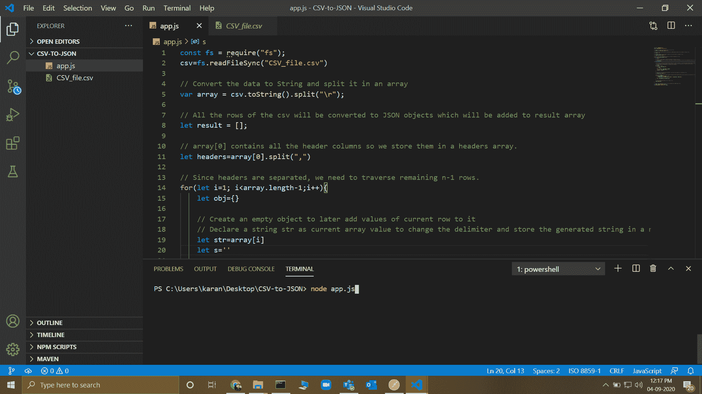
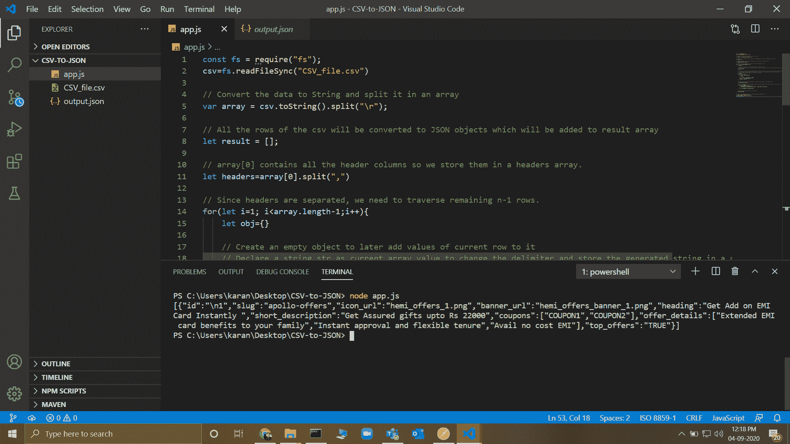

# 如何在 Node.js 中将 CSV 转换成逗号分隔值的 JSON 文件？

> 原文:[https://www . geesforgeks . org/how-convert-CSV-to-JSON-file-having-逗号分隔值 in-node-js/](https://www.geeksforgeeks.org/how-to-convert-csv-to-json-file-having-comma-separated-values-in-node-js/)

一个 **CSV** 是一个逗号分隔的值文件，带有。csv 扩展，允许以表格格式保存数据。这里有一篇文章将 csv 文件的数据转换成 JavaScript 对象符号 **(JSON** )而不使用任何第三方 npm 包。与正常转换的主要区别在于，任何一行的值都可以是**逗号分隔**，正如我们所知，不同的列也是逗号分隔的。

在这种方法中，我们将在数组中输入 CSV 文件的内容，并根据分隔符分割数组的内容。CSV 的所有行都将被转换为 JSON 对象，这些对象将被添加到结果数组中，然后该数组将被转换为 JSON，并生成相应的 JSON 输出文件。

**方法:**
按照以下步骤实现解决方案:

1.  使用默认文件系统 npm 包读取 csv 文件。
2.  将数据转换为字符串，并将其拆分为数组。
3.  生成标题数组。
4.  对于所有剩余的 n-1 行，请执行以下操作:
    *   创建一个空对象，将当前行的值添加到其中。
    *   将字符串声明为当前数组值，以更改分隔符并将生成的字符串存储在新的字符串中。
    *   如果我们遇到开头的引号(")，那么我们保留逗号，否则我们用管道“|”替换它们
    *   继续添加我们遍历字符串的字符
    *   使用管道分隔符|拆分字符串，并将值存储在属性数组中。
    *   对于每个头，如果值包含多个逗号分隔的数据，那么我们以数组的形式存储它，否则直接存储值。
    *   将生成的对象添加到我们的结果数组中。
5.  将结果数组转换为 json 并生成 JSON 输出文件。

**文件名:app.js**

## java 描述语言

```js
// Reading the file using default
// fs npm package
const fs = require("fs");
csv = fs.readFileSync("CSV_file.csv")

// Convert the data to String and
// split it in an array
var array = csv.toString().split("\r");

// All the rows of the CSV will be
// converted to JSON objects which
// will be added to result in an array
let result = [];

// The array[0] contains all the
// header columns so we store them
// in headers array
let headers = array[0].split(", ")

// Since headers are separated, we
// need to traverse remaining n-1 rows.
for (let i = 1; i < array.length - 1; i++) {
  let obj = {}

  // Create an empty object to later add
  // values of the current row to it
  // Declare string str as current array
  // value to change the delimiter and
  // store the generated string in a new
  // string s
  let str = array[i]
  let s = ''

  // By Default, we get the comma separated
  // values of a cell in quotes " " so we
  // use flag to keep track of quotes and
  // split the string accordingly
  // If we encounter opening quote (")
  // then we keep commas as it is otherwise
  // we replace them with pipe |
  // We keep adding the characters we
  // traverse to a String s
  let flag = 0
  for (let ch of str) {
    if (ch === '"' && flag === 0) {
      flag = 1
    }
    else if (ch === '"' && flag == 1) flag = 0
    if (ch === ', ' && flag === 0) ch = '|'
    if (ch !== '"') s += ch
  }

  // Split the string using pipe delimiter |
  // and store the values in a properties array
  let properties = s.split("|")

  // For each header, if the value contains
  // multiple comma separated data, then we
  // store it in the form of array otherwise
  // directly the value is stored
  for (let j in headers) {
    if (properties[j].includes(", ")) {
      obj[headers[j]] = properties[j]
        .split(", ").map(item => item.trim())
    }
    else obj[headers[j]] = properties[j]
  }

  // Add the generated object to our
  // result array
  result.push(obj)
}

// Convert the resultant array to json and
// generate the JSON output file.
let json = JSON.stringify(result);
fs.writeFileSync('output.json', json);
```

**输入:**



在终端上运行命令“node app.js”运行程序。

**输出:**



创建 output.json 文件，并在终端上记录该文件的内容。