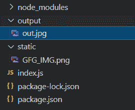

# 如何用 Node.js 把 PNG 转换成 JPG？

> 原文:[https://www . geesforgeks . org/how-convert-png-to-jpg-using-node-js/](https://www.geeksforgeeks.org/how-to-convert-png-to-jpg-using-node-js/)

下面的方法介绍了如何使用 **Jimp** 模块在 Node.js 中将 PNG 转换为 JPG。Jimp 是一个图像处理库，我们可以用它对图像进行很多操作。Jimp 代表 JavaScript 图像处理程序。

**进场:**我们将采用以下步骤:

1.  在我们的应用程序中导入**跳转**模块。
2.  在跳转模块中读取 png 图像。
3.  使用跳转功能将 png 转换为 jpg。
4.  返回最终的 JPG 图像。

**设置环境和执行:**

**步骤 1:** 使用以下命令初始化 node.js 项目。

```js
npm init
```

**步骤 2:** 使用以下命令安装所需模块。

```js
npm install jimp
```

**第三步:**获取一个示例 PNG 文件，对于本例，我们已经拍摄了下面的图像，并将其放置在*静态*文件夹中。


**项目结构:**应该如下图所示:


**第 4 步:**用以下代码创建一个 *index.js* 文件。

## index.js

```js
// Import jimp module
const Jimp = require("jimp");

// Read the PNG file and convert it to editable format
Jimp.read("./static/GFG_IMG.png", function (err, image) {
    if (err) {

        // Return if any error
        console.log(err);
        return;
    }

    // Convert image to JPG and store it to 
    // './output/' folder with 'out.jpg' name
    image.write("./output/out.jpg");
});
```

**步骤 5:** 使用以下命令运行 node.js 项目。

```js
node index.js
```

**输出:**参见*输出*文件夹中的 JPG 输出。

