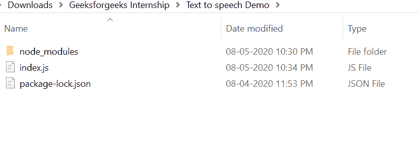
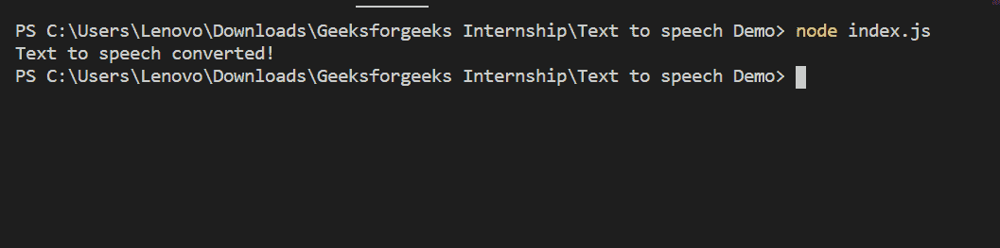
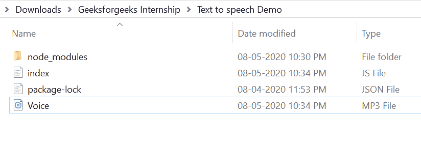

# 如何在 Node.js 中将文本转换成语音？

> 原文:[https://www . geesforgeks . org/如何在节点中将文本转换为语音-js/](https://www.geeksforgeeks.org/how-to-convert-text-to-speech-in-node-js/)

在 Node.js 中将文本转换为语音，有各种各样的模块，但其中最流行的是 gtts
(谷歌文本转换为语音)模块。

**gtts 模块特点:**

1.  它很容易上手，也很容易使用。
2.  它被广泛用于将文本转换为语音。

**gtts 模块安装:**

1.  您可以访问[安装 gtts 模块](https://www.npmjs.com/package/gtts)的链接。您可以使用此命令安装此软件包。

    ```
    npm install gtts
    ```

2.  安装 gtts 模块后，您可以使用命令在命令提示符下检查您的 gtts 版本。

    ```
    npm version gtts
    ```

3.  之后，您可以创建一个文件夹并添加一个文件，例如 index.js。

    ```
    node index.js
    ```

**文件名:index.js**

```
const gTTS = require('gtts');

var speech = 'Welcome to GeeksforGeeks';
var gtts = new gTTS(speech, 'en');

gtts.save('Voice.mp3', function (err, result){
    if(err) { throw new Error(err); }
    console.log("Text to speech converted!");
});
```

**运行程序的步骤:**

1.  项目结构会是这样的:
    
2.  确保您已经使用以下命令安装了 gtts 模块:

    ```
    npm install gtts
    ```

3.  Run index.js file using below command:

    ```
    node index.js
    ```

    

4.  运行上述命令后，您的文本被转换为语音并保存在您的 Voice.mp3 文件中，如下所示:
    

这就是如何在 Node.js 中使用 gtts(谷歌文本到语音)模块将文本转换成语音