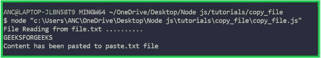

# 如何在 Node.js 中复制文件？

> 原文:[https://www . geesforgeks . org/如何复制节点中的文件-js/](https://www.geeksforgeeks.org/how-to-copy-a-file-in-node-js/)

[Node.js](https://www.geeksforgeeks.org/introduction-to-nodejs/) 是一个开源的跨平台运行时环境，用于在浏览器外执行 [JavaScript](https://www.geeksforgeeks.org/JavaScript-tutorial/) 代码。Node.js 运行的平台有 Windows、Linux、Mac OS 等多种。

Node.js 中使用了各种方法，比如 readFile()和 writeFile()方法。readFile()和 writeFile()方法用于将文件内容复制到另一个文件。

### 解释:

> *   [**Readfile (file [,option], callback)**](https://www.geeksforgeeks.org/node-js-fs-readfile-method/)
> 
> 1.  File: Path of source file name.
> 2.  Option: must be encoded, that is, utf8.
> 3.  Callback: Callback gets two parameters.
> 
> *   [**Write file (file name, data, code, callback)**](https://www.geeksforgeeks.org/node-js-fs-writefile-method/)
> 
> 1.  File name: the file path of the file to be read.
> 2.  Data: It is the data we want to write.
> 3.  Code: it is the code of data.
> 4.  Callback: Error will be displayed or blank.

### 履行

## java 描述语言

```
var fs=require('fs'); // Import the filesystem module

console.log('File Reading from file.txt ..........');

// ReadFile method is used to read the content from file.txt
fs.readFile('file.txt','utf8',readingFile);

function readingFile(error,data)
{
    if(error){
        console.log(error);
    } else
    {
        console.log(data); // Printing the file.txt file's content

         // Creating new file - paste.txt with file.txt's content
        fs.writeFile('paste.txt',data,'utf8',writeFile);
    } 
}

function writeFile(error)
{
    if(error){
        console.log(error)
    } else {
        console.log('Content has been pasted to paste.txt file');
    }
}
```

### 输出



输出