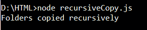

# 如何在 Node.js 中递归复制文件夹？

> 原文:[https://www . geesforgeks . org/如何在节点中递归复制文件夹-js/](https://www.geeksforgeeks.org/how-to-copy-folder-recursively-in-node-js/)

Node.js 是对现有 javaScript 的增强。它用于服务器端脚本。它主要用于开发动态 web 应用程序。Node.js 开发人员更喜欢使用异步函数，而不是同步函数，因为前者在任何情况下都不会阻止程序执行。使用传统的 Node.js 文件复制方法，复制带有多个子文件夹的文件或文件夹会很繁琐。然而，附加模块的使用使任务变得更容易。

讨论中的两个模块是 NCP 模块和 fs-extra 模块。这两个模块都支持异步函数，以帮助递归复制文件夹的过程。

下面的例子演示了如何使用这些模块递归复制文件夹。

```js
Create a folder structure as follows 
in the working directory:
mkdir f1\f2\f3\f4\f5
notepad f1\f2\f3\f4\f5\new.txt
// Write some text and save the .txt file
```

**语法:**

```js
ncp(source, destination, options, callback)
```

**参数:**

*   **来源:**来源文件夹的文件路径。
*   **目标:**目标文件夹的文件路径。
*   **选项**
    *   **options.filter:** 一个正则表达式，可用于指定是否必须复制或跳过文件夹/文件。
    *   **options.transform:** 可用于在复制时应用流转换的函数。
    *   **选项. clobber:** 可以设置为真或假。如果设置为 false，ncp 不会覆盖目标中已经存在的文件。
    *   **选项. stopOnErr:** 可以设置为真或假。默认情况下，它被设置为 false，即 ncp 继续复制，记录所有错误并返回一个数组。如果设置为 true，ncp 将在遇到第一个错误时停止。
*   **回调:**给定任务完成时调用的函数，以错误为第一参数。如果出现错误，回调函数会在不阻止程序执行的情况下处理它。

**示例 1:** 使用 ncp 模块
使用以下命令安装 **ncp** 模块:

```js
npm install ncp
```

**文件名:recursiveCopy.js 文件**

```js
var ncp = require('ncp').ncp;

// Represents the number of pending
// file system requests at a time.
ncp.limit = 16;

// ncp(source, destination, callback) 
ncp('D:\\HTML\\f1', 'D:\\HTML\\recursive', 
        function (err) {
    if (err) {
        return console.error(err);
    }

    console.log('Folders copied recursively');
});
```

**输出:**


**语法:**

```js
fs.copy(source, destination, callback)
```

**参数:**

*   **来源:**来源文件夹的文件路径。
*   **目标:**目标文件夹的文件路径。
*   **回调:**给定任务完成时调用的函数，以错误为第一参数。如果出现错误，回调函数会在不阻止程序执行的情况下处理它。如果回调未通过，它将返回承诺。

**示例 2:** 使用 fs-extra 模块
使用以下命令安装 **fs-extra** 模块:

```js
npm install fs-extra
```

**档案名称:fsrecur . js】t1**

```js
const fs = require('fs-extra');

// Async with promises:
fs.copy('D:\\HTML\\f1', 'D:\\HTML\\fsextra')
.then(() => console.log('Files copied successfully!'))
.catch(err => console.error(err));
```

**输出:**


**说明:**f1 内从 f2 开始到 f5 的所有文件夹都递归复制到‘递归’文件夹中。这些文件夹中的任何文件或文件夹都会被复制到新文件夹中。