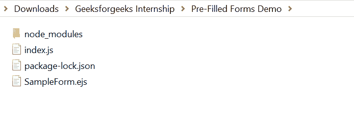
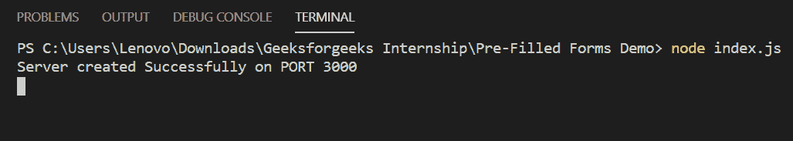
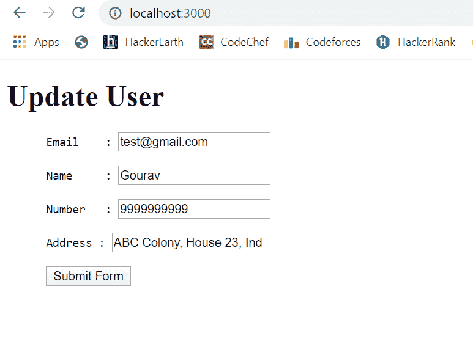

# 如何在 Node.js 中创建预填表单？

> 原文:[https://www . geeksforgeeks . org/如何创建预填充节点表单-js/](https://www.geeksforgeeks.org/how-to-create-a-pre-filled-forms-in-node-js/)

预填表单是那些已经填写了所需数据的表单。当用户想要更新他的个人资料之类的东西时，这些是有帮助的。

我们只需创建一个文件夹并添加一个文件，例如 index.js。

```js
node index.js
```

**文件名:SampleForm .例**

```js
<!DOCTYPE html>
<html>

<head>
    <title>Pre-Filled Form Demo</title>
</head>

<body>
    <h1>Update User</h1>

    <form action="saveData" method="POST">
        <pre>
            Email    : <input type="text" name="email"
                        value='<%=user.email%>'> <br>

            Name     : <input type="text" name="name"
                        value='<%=user.name%>'> <br>

            Number   : <input type="number" name="mobile"
                        value='<%=user.mobile%>'> <br>

            Address : <input type="text" name="address"
                        value='<%=user.address%>'> <br>

            <input type="submit" value="Submit Form"> 
        </pre>
    </form>
</body>

</html>
```

**文件名:index.js**

```js
const express = require("express")
const path = require('path')
const app = express()

var PORT = process.env.port || 3000

// View Engine Setup
app.set("views", path.join(__dirname))
app.set("view engine", "ejs")

app.get("/", function(req, res){

    // Sample date to be filled in form
    var user = {
        email: 'test@gmail.com',
        name: 'Gourav',
        mobile: 9999999999,
        address: 'ABC Colony, House 23, India'
    }

    res.render("SampleForm",
        {
            user: user
        }
    );
})

app.listen(PORT, function(error){
    if(error) throw error
    console.log("Server created Successfully on PORT", PORT)
})
```

**运行程序的步骤:**

1.  项目结构会是这样的:
    
2.  确保您已经安装了“查看引擎”，就像我使用“ejs”一样，并使用以下命令安装了 express 模块:

    ```js
    npm install express
    npm install ejs

    ```

3.  Run index.js file using below command:

    ```js
    node index.js
    ```

    

4.  现在打开浏览器，输入这个网址:

    ```js
    http://localhost:3000/
    ```

5.  然后你会看到预填的更新用户表单，如下所示:
    

这就是你如何创建自己的预填表格。