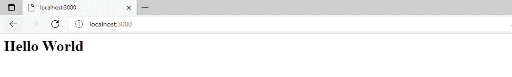

# 如何在 Node.js 中创建一个显示 Hello World 的简单服务器？

> 原文:[https://www . geesforgeks . org/如何创建一个简单的节点中服务器-js-the-display-hello-world/](https://www.geeksforgeeks.org/how-to-create-a-simple-server-in-node-js-that-display-hello-world/)

一个**服务器**是一个为其他程序或设备提供功能的计算机硬件或软件，称为客户端。这种架构被称为客户端-服务器模型。 **Node** 是一个开源的、跨平台的运行时环境，允许开发者用 JavaScript 创建各种服务器端工具和应用。

在下面的例子中，我们将在 Node.js 中创建一个简单的服务器，使用快速服务器返回 *Hello World* 。

**创建节点应用程序:**使用以下命令初始化节点应用程序:

```js
npm init
```

**模块安装:**使用以下命令安装 *express* 模块，该模块是 NodeJS 的 web 框架。

```js
npm install express
```

**实现:**创建一个 *app.js* 文件，并在其中写下以下代码。

## app.js

```js
// Require would make available the
// express package to be used in
// our code
const express = require("express");

// Creates an express object
const app = express();

// It listens to HTTP get request. 
// Here it listens to the root i.e '/'
app.get("/", (req, res) => {

  // Using send function we send
  // response to the client
  // Here we are sending html
  res.send("<h1> Hello World </h1>");
});

// It configures the system to listen
// to port 3000\. Any number can be 
// given instead of 3000, the only
// condition is that no other server
// should be running at that port
app.listen(3000, () => {

  // Print in the console when the
  // servers starts to listen on 3000
  console.log("Listening to port 3000");
});
```

**运行应用程序的步骤:**使用以下命令运行 *app.js* 文件。

```js
node app.js
```

**输出:**现在打开浏览器，转到***http://localhost:3000/***，会看到如下输出:



输出

这就是如何设置服务器并完成任务。如果您想返回任何其他内容，请在 *app.get()* 函数的 *res.send()* 中传递该参数，而不是“Hello World”。