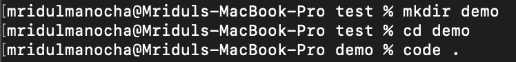
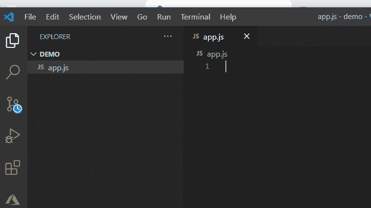
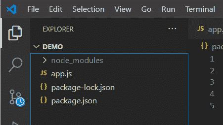
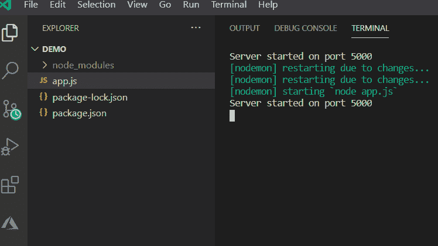
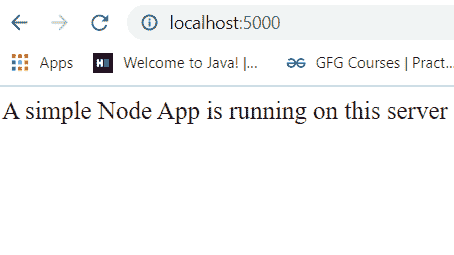

# 如何在 VS 代码编辑器中创建和运行 Node.js 项目？

> 原文:[https://www . geesforgeks . org/如何创建和运行节点-js-in-project-vs-code-editor/](https://www.geeksforgeeks.org/how-to-create-and-run-node-js-project-in-vs-code-editor/)

下面是一些简单的步骤，以便创建一个简单的 NodeJS 项目，并在 VS 代码编辑器中运行它。

**步骤 1:** 创建一个空文件夹，并从 VS 代码编辑器中将其移动到该文件夹中，使用以下命令。

```
mkdir demo
cd demo
code .
```



**第二步:**现在在你的文件夹中创建一个文件 **app.js** 文件，如下图所示。



**步骤 3:安装模块:**使用以下命令安装模块。

```
npm install express
npm install nodemon
```

**第四步:**在*包文件中分别添加这两个在 Node.js app 中进行更改后，对运行和动态运行代码很重要的命令。*

```
"start": "node app.js",
"dev": "nodemon app.js"
```

**package . JSON 文件的配置:**

```
{
  "name": "demo",
  "version": "1.0.0",
  "description": "",
  "main": "app.js",
  "scripts": {
    "test": "echo \"Error: no test specified\" && exit 1",
    "start": "node app.js",
    "dev": "nodemon app.js"
  },
  "author": "",
  "license": "ISC",
  "dependencies": {
    "express": "^4.17.1",
    "nodemon": "^2.0.12"
  }
}
```

**第五步:**以下是我们的项目结构:



**第六步:**在 **app.js** 文件中写下以下代码。

## java 描述语言

```
// Requiring module
const express = require('express');

// Creating express object
const app = express();

// Handling GET request
app.get('/', (req, res) => {
    res.send('A simple Node App is '
        + 'running on this server')
    res.end()
})

// Port Number
const PORT = process.env.PORT ||5000;

// Server Setup
app.listen(PORT,console.log(
  `Server started on port ${PORT}`));
```

**步骤 7:** 使用以下命令运行应用程序:

```
npm run dev
```

**输出:**



**第八步:**现在转到浏览器中的***http://localhost:5000/***，会看到如下输出:

