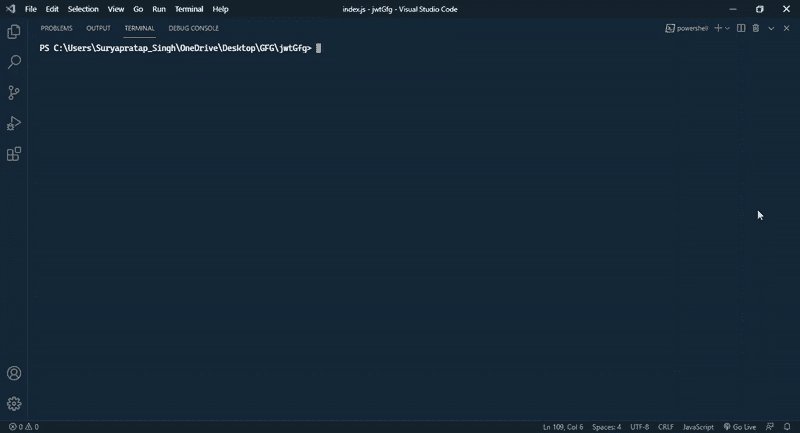
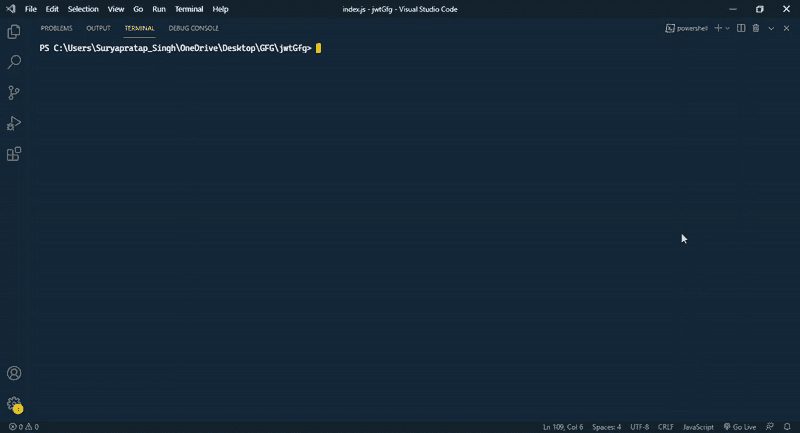
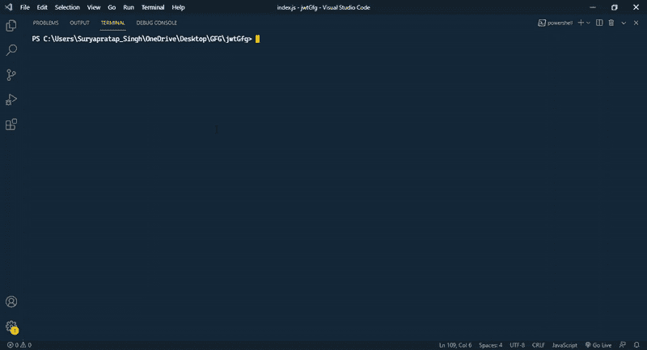
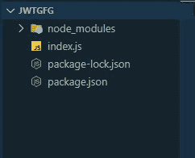
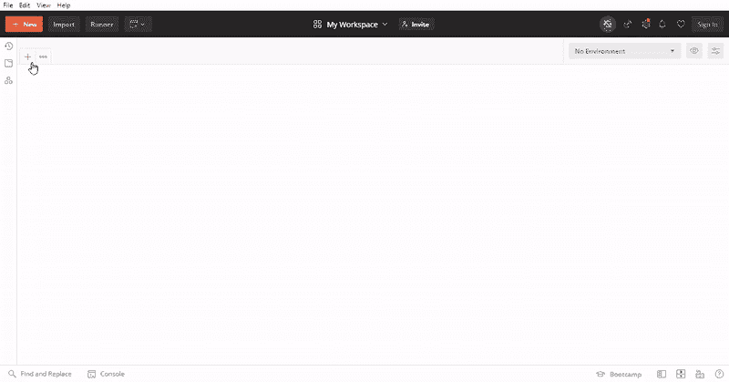
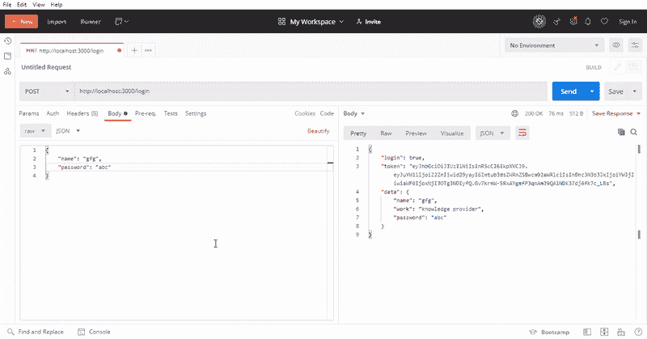

# 如何用 Node.js 创建和验证 JWTs？

> 原文:[https://www . geesforgeks . org/how-create-and-verify-jwts-with-node-js/](https://www.geeksforgeeks.org/how-to-create-and-verify-jwts-with-node-js/)

在本文中，我们将看到如何在 Node.js 中创建和验证 JWT 令牌

### 先决条件:

*   良好的 [JavaScript](https://www.geeksforgeeks.org/javascript-tutorial/) 知识。
*   关于 [ExpressJs](https://www.geeksforgeeks.org/introduction-to-express/) 的基础知识。
*   关于 API [认证](https://www.geeksforgeeks.org/jwt-authentication-with-nodejs/)的基础知识。
*   关于[邮递员](https://www.geeksforgeeks.org/tag/postman/)的基本知识及其用法。

在 web 开发中，我们还希望保护我们的路由，因此我们有三种方法来保护我们的路由，它们是 cookies、会话或 API 身份验证。cookies 和会话仅在您希望在应用编程接口的端点中使用安全路由时才与浏览器一起工作。所以必须需要 API 的认证机制。或者在目前，我们主要使用应用编程接口，因此制作安全的应用编程接口端点至关重要。API 认证中最流行的方式是使用 JsonWebToken，它可以与许多类型的技术以及 NodeJs 一起工作。在本文中，我们在 ExpressJs 的帮助下创建了一些虚拟的 API 端点，并在 JWT 令牌机制的帮助下使它们的路由安全，并了解它们如何工作和验证令牌。JsonWebtoken 的缩写是 JWT。

**方法:**在开始文章之前，我们将在这里讨论文章的问题细节，我们讨论的是最流行的保护 API 端点的方法。这是 JWT 提供的。我们将首先设置 NodeJs 来编写我们的代码，然后我们将看到如何创建和验证 JWT 令牌，最后，我们将看到我们的 API 在 Postman API 测试工具的帮助下的输出。

**分步实施:**

**第一步:**首先设置 NodeJs 项目。如果您没有[节点](https://www.geeksforgeeks.org/installation-of-node-js-on-windows/)或 [NPM](https://www.geeksforgeeks.org/node-js-npm-node-package-manager/) 请参考本文。用 npm 启动 NodeJs 项目。

```
npm init -y
```

“-y”将所有问题答案标记为默认答案。



启动 node.js 项目后，进入第二步

**步骤 2:** 启动项目后安装一些依赖项。通过 npm 安装 express 和 jsonwebtoken

```
npm install express jsonwebtoken
```



**步骤 3:** 将 nodemon 作为开发依赖项安装。

```
npm install -d nodemon
```



**项目结构:**安装完成后，创建一个 index.js 文件，现在你的目录结构是这样的。



**步骤 4:** 在 package.json 文件中再添加一个脚本。打开 package.json 文件，并在下面的测试脚本中添加一行。


**第五步:**在借助 JWT 和 express 创建和验证 API 端点之前，先写一些代码以备后用。

## index.js

```
// Import express for creating API's endpoints
const express = require('express');

// Import jwt for API's endpionts authentication
const jwt = require('jsonwebtoken');

// Creates an Express application, initiate
// express top level function
const app = express();

// A port for serving API's
const port = 3000;

// A demo get route
app.get('/', (req, res) => {
    res.json({
        route: '/',
        authentication: false
    });
});

// Listen the server
app.listen(port, () => {
    console.log(`Server is running : http://localhost:${port}/`);
});
```

**步骤 6:** 伪代码准备好之后，再创建一个 json 数据库对象，存储一些伪数据。

## index.js

```
// A faek database object.
let databse = [
    {
        name: 'gfg',
        work: 'knowledge provider',
        password: 'abc'
    },
    {
        name: 'suryapratap',
        work: 'technical content writer',
        password: '123'
    }
];
```

**步骤 7:** 允许 JSON 数据与 API 进行通信。通过为主体解析器添加中间件，允许请求中包含 JSON 数据。

## index.js

```
// Allow json data
app.use(express.json());
```

**步骤 8:** 创建登录路由并创建 JWT 令牌。在这里，创建一个登录后路由，创建一个 JWT 令牌并将其返回给响应。，阅读代码注释以便更好地理解。

## index.js

```
// Login route.
app.post('/login', (req, res) => {

    // Get the name to the json body data
    const name = req.body.name;

    // Get the password to the json body data
    const password = req.body.password;

    // Make two variable for further use
    let isPresent = false;
    let isPresnetIndex = null;

    // Itarate a loop to the data items and
    // check what data are method
    for(let i=0; i<databse.length; i++){

        // If data name are matched so check
        // the password are correct or not
        if(databse[i].name === name && 
        databse[i].password === password){

            // If both are correct so make 
            // isPresent variable true
            isPresent = true;

            // And store the data index
            isPresnetIndex = i;

            // Break the loop after matching
            // successfully
            break;
        }
    }

    // If isPresent is true, then create a
    // token and pass to the response
    if(isPresent){

        // The jwt.sign method are used
        // to create token
        const token = jwt.sign(
            databse[isPresnetIndex],
            'secret'
        );

        // Pass the data or token in response
        res.json({
            login: true,
            token: token,
            data: databse[isPresnetIndex]
        });
    }else{

        // If isPresent is false return the error
        res.json({
            login: false,
            error: 'please check name and password.'
        });
    }
});
```

**第 9 步:**使用 JWT 符号方法创建令牌 take 有三个参数一个是响应对象，第二个是密钥，最后一个是选项对象，以便更好地使用令牌。

## index.js

```
jwt.sign(
    {data_obeject},
    "secret_key",
    {Options}
)
```

如果您想了解更多关于 jwt.sign 方法的信息，请参考[官方文档。](https://www.npmjs.com/package/jsonwebtoken)

**步骤 10:** 现在我们将为认证 jwt 令牌制作另一条路由。在这里，我们创建一个身份验证路由，并对即将到来的 JWT 令牌进行身份验证。

## index.js

```
// Verify route
app.get('/auth', (req, res) => {

    // Get token value to the json body
    const token = req.body.token;

    // If the token is present
    if(token){

        // Verify the token using jwt.verify method
        const decode = jwt.verify(token, 'secret');

        //  Return response with decode data
        res.json({
            login: true,
            data: decode
        });
    }else{

        // Return response weith error
        res.json({
            login: false,
            data: 'error'
        });
    }
});
```

**步骤 11:** JWT 验证方法用于验证令牌取两个参数一个是令牌字符串值，第二个是匹配令牌是否有效的密钥。验证方法返回一个解码对象，我们在其中存储了令牌。

## index.js

```
jwt.verify(token_value, 'secret_key');
```

如果您想了解更多关于 jwt.verify 方法的信息，请参考[官方文档。](https://www.npmjs.com/package/jsonwebtoken)

**以下是以上分步实现的完整代码:**

## index.js

```
// Import express for creating API's endpoints
const express = require("express");

// Import jwt for API's endpionts authentication
const jwt = require("jsonwebtoken");

// Creates an Express application, initiate
// express top level function
const app = express();

// A port for serving API's
const port = 3000;

// A faek database object
let databse = [
  {
    name: "gfg",
    work: "knowledge provider",
    password: "abc",
  },
  {
    name: "suryapratap",
    work: "technical content writer",
    password: "123",
  },
];

// A demo get route
app.get("/", (req, res) => {
  res.json({
    route: "/",
    authentication: false,
  });
});

// Allow json data
app.use(express.json());

// Login route
app.post("/login", (req, res) => {

  // Get the name to the json body data
  const name = req.body.name;

  // Get the password to the json body data
  const password = req.body.password;

  // Make two variable for further use
  let isPresent = false;
  let isPresnetIndex = null;

  // Itarate a loop to the data items and
  // check what data are matched.
  for (let i = 0; i < databse.length; i++) {

    // If data name are matched so check
    // the password are correct or not
    if (databse[i].name === name 
      && databse[i].password === password) {

      // If both are correct so make 
      // isPresent variable true
      isPresent = true;

      // And store the data index
      isPresnetIndex = i;

      // Break the loop after matching successfully
      break;
    }
  }

  // If isPresent is true, then create a
  // token and pass to the response
  if (isPresent) {

    // The jwt.sign method are used
    // to create token
    const token = jwt.sign(databse[isPresnetIndex], "secret");

    // Pass the data or token in response
    res.json({
      login: true,
      token: token,
      data: databse[isPresnetIndex],
    });
  } else {

    // If isPresent is false return the error
    res.json({
      login: false,
      error: "please check name and password.",
    });
  }
});

// Verify route
app.get("/auth", (req, res) => {

  // Get token value to the json body
  const token = req.body.token;

  // If the token is present
  if (token) {

    // Verify the token using jwt.verify method
    const decode = jwt.verify(token, "secret");

    //  Return response with decode data
    res.json({
      login: true,
      data: decode,
    });
  } else {

    // Return response weith error
    res.json({
      login: false,
      data: "error",
    });
  }
});

// Listen the server
app.listen(port, () => {
  console.log(`Server is running : 
    http://localhost:${port}/`);
});
```

**步骤测试路线:**我们将使用 Postman 测试 API 路线。首先测试登录路径。打开邮递员，用适当的 JSON 数据在**/【登录】**路线上发出邮寄请求。



使用 localhost 地址，在/login 路由中发出 post 请求，并以 json 格式发送适当的数据，最后，您会得到一个带有登录状态和对象的令牌或数据的 JSON 响应。使用令牌对 API 端点进行身份验证，并再次使用本地主机地址，在 **'/auth'** 路由中发出 get 请求，并发送适当的数据令牌。



验证之后，您将在令牌中获得正确的数据对象存储。