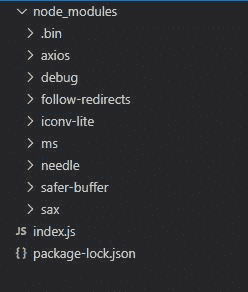
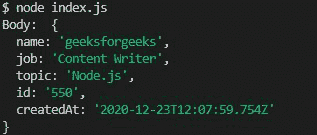
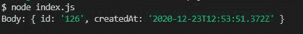

# 如何使用 Node.js 创建不同的帖子请求？

> 原文:[https://www . geesforgeks . org/how-differential-post-request-use-node-js/](https://www.geeksforgeeks.org/how-to-create-different-post-request-using-node-js/)

一个 POST 请求是所有 HTTP 请求中重要的请求之一。 该请求用于将数据存储在网络服务器上。例如，文件上传是一个常见的发布请求的例子。有许多方法可以在 [Node.js](https://www.geeksforgeeks.org/introduction-to-nodejs/) 中执行 HTTP POST 请求。各种开源库也可用于执行任何类型的 HTTP 请求。

下面讨论创建不同帖子请求的三种方法。

1.  使用针头模块
2.  使用公理模块
3.  使用 https 模块

下面详细讨论三种方法:

**方法 1:** 在 Node.js 中发出 HTTP POST 请求的方法之一是使用**针库**。Needle 是一个 HTTP 客户端，用于在 Node.js 中发出 HTTP 请求、多部分表单数据(如文件上传)、自动 XML & JSON 解析等。

**项目结构:**



**安装模块:**

```
npm install needle
```

**Index.js**

## java 描述语言

```
//Importing needle module
const needle = require('needle');

// Data to be sent
const data = {
    name: 'geeksforgeeks',
    job: 'Content Writer',
    topic:'Node.js'
};

// Making post request
needle('post', 'https://requires.in/api/usersdata', 
    data, {json: true})
    .then((res) => {

        // Printing the response after request
        console.log('Body: ', res.body);
    }).catch((err) => {

        // Printing the err
        console.error(err.Message);
    }
);
```

**执行命令:**

```
node index.js
```

**控制台输出:**



**方法 2:** 另一个可以使用的库是 **Axios** 。这是一个流行的 node.js 模块，用于执行 HTTP 请求，支持所有最新的浏览器。它还支持异步/等待语法来执行开机自检请求。

**安装模块:**

```
npm install axios
```

**Index.js**

## java 描述语言

```
// Importing the axios module
const axios = require('axios');

// Data to be sent
const data = {
    name: 'geeksforgeeks',
    job: 'Content Writer',
    topic: 'Node.js'
};

const addUser = async () => {
    try {

        // Making post request 
        const res = await axios.post(
'https://reqres.in/api/usersdata', data);

        // Printing the response data   
        console.log('Body: ', res.data);
    } catch (err) {

        // Printing the error
        console.error(err.Message);
    }
};
```

**执行命令:**

```
node index.js
```

**控制台输出:**


**方法 3:** 也可以使用 Node.js 内置的 [HTTPS 模块执行 POST 请求。](https://www.geeksforgeeks.org/https-in-node/)该模块用于发送加密格式的数据

**Index.js**

## java 描述语言

```
// Importing https module
const https = require('https');

// Converting data in JSON format
const data = JSON.stringify({
    name: 'geeksforgeeks',
    job: 'Content Writer',
    topic:'Node.js'
});

// Setting the configuration for
// the request
const options = {
    hostname: 'reqres.in',
    path: '/api/users',
    method: 'POST'
};

// Sending the request
const req = https.request(options, (res) => {
    let data = '';

    res.on('data', (chunk) => {
        data += chunk;
    });

    // Ending the response 
    res.on('end', () => {
        console.log('Body:', JSON.parse(data));
    });

}).on("error", (err) => {
    console.log("Error: ", err.message);
});

// Write data to request body
req.write(data);
req.end();
```

**执行命令:**

```
node index.js
```

**控制台输出:**

