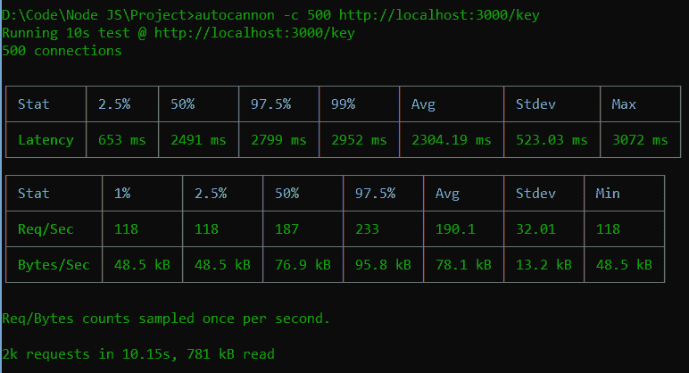
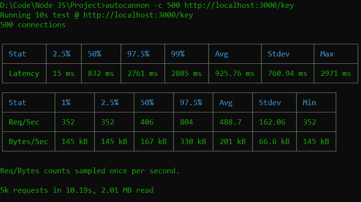
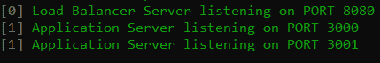
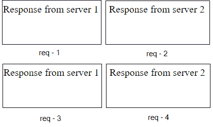

# 如何使用 Node.js 创建负载均衡服务器？

> 原文:[https://www . geesforgeks . org/如何创建负载平衡-服务器-使用节点-js/](https://www.geeksforgeeks.org/how-to-create-load-balancing-servers-using-node-js/)

如果您的网站或应用程序没有收到很多请求，您不必使用负载平衡，但是当它变得非常流行并开始接收大量流量时，您的底层服务器可能无法处理它。因为单个 NodeJS 服务器对于处理非常大量的流量并不灵活。

增加更多的机器可以解决这个问题。但是为了共享所有应用服务器的流量，需要一个负载平衡器。

**负载均衡器:**负载均衡器充当位于应用服务器前的*流量 cop* ，以最大化速度和容量利用率的方式在所有能够满足这些请求的服务器之间路由客户端请求，并确保没有一台服务器过度工作，这可能会降低性能。

**如何设置负载均衡服务器？**

**1。使用集群模块:** NodeJS 有一个名为**集群模块**的内置模块，以利用多核系统的优势。使用这个模块，您可以将 NodeJS 实例移植到系统的每个核心。主进程监听一个端口，以接受客户端请求，并使用某种智能方式在工作人员之间分发。因此，使用该模块，您可以利用系统的工作能力。

以下示例介绍了使用和不使用群集模块时的性能差异。

**无集群模块:**

使用以下命令确保您已经安装了 *express* 和 *crypto* 模块:

```
npm install express crypto
```

**index.js**

## java 描述语言

```
const { generateKeyPair } = require('crypto');
const app = require('express')();

// API endpoint
// Send public key as a response
app.get('/key', (req, res) => {
  generateKeyPair('rsa', {
    modulusLength: 2048,
    publicKeyEncoding: {
      type: 'spki',
      format: 'pem'
    },
    privateKeyEncoding: {
      type: 'pkcs8',
      format: 'pem',
      cipher: 'aes-256-cbc',
      passphrase: 'top secret'
    }
  }, (err, publicKey, privateKey) => {

    // Handle errors and use the
    // generated key pair.
    res.send(publicKey);
  })
})

app.listen(3000, err => {
  err ?
    console.log("Error in server setup") :
    console.log('Server listening on PORT 3000')
});
```

使用以下命令运行**索引. js** 文件:

```
node index.js
```

**输出:**我们将在终端屏幕上看到以下输出:

```
Server listening on PORT 3000
```

现在打开浏览器，进入***http://localhost:3000/key**，*会看到如下输出:

> ——开始公共密钥——miibijanbghkig 9w 0 baqdaaocaq 8 amiibcgkcaquewaneyp 5 hl93 和 3zlpahjzanpfvbkkfo 4 an 8 jskcgeg 85 knz 7/16 kqw 8/7 ksdm 0 SIF 7 qmauo 0 b 773 x1 bqq 0 liwh+cthiq/c0e 9 en 1 zo sx 6 vwwx 5y+wh 610 cpcb 50 ltmceyrmd 5 qvf

上面的代码监听端口 3000，并发送公钥作为响应。生成 RSA 密钥是一项 CPU 密集型工作。这里只有一个 NodeJS 实例在一个内核中工作。为了查看性能，我们使用了*autocanon*工具来测试我们的服务器，如下所示:



上图显示，在 10 秒内运行 500 个并发连接时，服务器可以响应 2000 个请求。平均请求/秒为 190.1 秒。

**使用集群模块:**

## java 描述语言

```
const express = require('express');
const cluster = require('cluster');
const { generateKeyPair } = require('crypto');

// Check the number of available CPU.
const numCPUs = require('os').cpus().length;

const app = express();
const PORT = 3000;

// For Master process
if (cluster.isMaster) {
  console.log(`Master ${process.pid} is running`);

  // Fork workers.
  for (let i = 0; i < numCPUs; i++) {
    cluster.fork();
  }

  // This event is firs when worker died
  cluster.on('exit', (worker, code, signal) => {
    console.log(`worker ${worker.process.pid} died`);
  });
}

// For Worker
else {
  // Workers can share any TCP connection
  // In this case it is an HTTP server
  app.listen(PORT, err => {
    err ?
      console.log("Error in server setup") :
      console.log(`Worker ${process.pid} started`);
  });

  // API endpoint
  // Send public key
  app.get('/key', (req, res) => {
    generateKeyPair('rsa', {
      modulusLength: 2048,
      publicKeyEncoding: {
        type: 'spki',
        format: 'pem'
      },
      privateKeyEncoding: {
        type: 'pkcs8',
        format: 'pem',
        cipher: 'aes-256-cbc',
        passphrase: 'top secret'
      }
    }, (err, publicKey, privateKey) => {

      // Handle errors and use the
      // generated key pair.
      res.send(publicKey);
    })
  })
}
```

使用以下命令运行 **index.js** 文件:

```
node index.js
```

**输出:**我们将在终端屏幕上看到以下输出:

```
Master 16916 is running
Worker 6504 started
Worker 14824 started
Worker 20868 started
Worker 12312 started
Worker 9968 started
Worker 16544 started
Worker 8676 started
Worker 11064 started
```

现在打开浏览器，进入***http://localhost:3000/key**，*会看到如下输出:

> ——开始公共密钥——miibijanbghkig 9w0baqdaaocaq 8 amiibcgkceazxmqp 9 和 9mblp 9 dxwuqhf sdlevnrgmtype 7 caveyeki 6 ua 5 pjtrstkhte 3 o 8 r Xu+h6i 2 Exxon 92 f/4re 9 yo 8 eon cslqy 9 QB 9 QY 8 D7 ubmwir 0 i65 xmzu 3 yxi+6gp 8 H4 cmdijhloieap+d9 czr

上述 NodeJS 应用程序是在我们系统的每个核心上启动的。其中主进程接受请求并分配给所有工作人员。在这种情况下执行的如下所示:



上图显示，在 10 秒内运行 500 个并发连接时，服务器可以响应 5000 个请求。平均请求/秒为 162.06 秒。

因此，使用集群模块，您可以处理更多的请求。但是，有时这是不够的，如果这是你的情况，那么你的选择是水平缩放。

**2。使用 Nginx:** 如果您的系统有多个应用服务器需要响应，并且您需要将客户端请求分布在所有服务器上，那么您可以智能地使用 *Nginx* 作为代理服务器。 *Nginx* 位于服务器池的前端，使用一些智能方式分发请求。

在下面的示例中，我们在不同的端口上有 4 个相同 NodeJS 应用程序的实例，您也可以使用另一个服务器。

文件名是 index.js

## java 描述语言

```
const app = require('express')();

// API endpoint
app.get('/', (req,res)=>{
    res.send("Welcome to GeeksforGeeks !");
})

// Launching application on several ports
app.listen(3000);
app.listen(3001);
app.listen(3002);
app.listen(3003);
```

现在在你的机器上安装 *Nginx* ，并在 **/etc/nginx/conf.d/** 中创建一个名为 **your-domain.com.conf** 的新文件，其中包含以下代码。

```
upstream my_http_servers {
    # httpServer1 listens to port 3000
    server 127.0.0.1:3000;

    # httpServer2 listens to port 3001
    server 127.0.0.1:3001;

    # httpServer3 listens to port 3002
    server 127.0.0.1:3002;

    # httpServer4 listens to port 3003
    server 127.0.0.1:3003;
}
server {
    listen 80;
    server_name your-domain.com www.your-domain.com;
    location / {
        proxy_set_header   X-Real-IP $remote_addr;
        proxy_set_header   Host      $http_host;
        proxy_pass         http://my_http_servers;
    }
}
```

**3。使用快速网络服务器:**快速网络服务器有很多优势。如果您对 NodeJS 感到满意，您可以实现自己的 Express 基本负载平衡器，如下例所示。

**步骤 1:** 创建一个空的 NodeJS 应用程序。

```
mkdir LoadBalancer
cd LoadBalancer
npm init -y
```

**步骤 2:** 使用以下命令同时安装所需的依赖项，如 **ExpressJS、axios** 、**T5 和**。****

```
npm i express axios
npm i concurrently -g
```

****步骤 3:** 为负载均衡服务器创建两个文件 **config.js** ，为应用服务器创建两个文件 **index.js** 。**

**这里的文件名是 config.js**

## **java 描述语言**

```
const express = require('express');
const path = require('path');
const app = express();
const axios = require('axios');

// Application servers
const servers = [
    "http://localhost:3000",
    "http://localhost:3001"
]

// Track the current application server to send request
let current = 0;

// Receive new request
// Forward to application server
const handler = async (req, res) =>{

    // Destructure following properties from request object
    const { method, url, headers, body } = req;

    // Select the current server to forward the request
    const server = servers[current];

    // Update track to select next server
    current === (servers.length-1)? current = 0 : current++

    try{
        // Requesting to underlying application server
        const response = await axios({
            url: `${server}${url}`,
            method: method,
            headers: headers,
            data: body
        });
        // Send back the response data
        // from application server to client
        res.send(response.data)
    }
    catch(err){
        // Send back the error message
        res.status(500).send("Server error!")   
    }
}

// Serve favicon.ico image
app.get('/favicon.ico', (req, res
    ) => res.sendFile('/favicon.ico'));

// When receive new request
// Pass it to handler method
app.use((req,res)=>{handler(req, res)});

// Listen on PORT 8080
app.listen(8080, err =>{
    err ?
    console.log("Failed to listen on PORT 8080"):
    console.log("Load Balancer Server "
          + "listening on PORT 8080");
});
```

 **这里，文件名是 index.js**

## **java 描述语言**

```
const express = require('express');
const app1 = express();
const app2 = express();

// Handler method
const handler = num => (req,res)=>{
    const { method, url, headers, body } = req;
    res.send('Response from server ' + num);
}

// Only handle GET and POST requests
// Receive request aand pass to handler method
app1.get('*', handler(1)).post('*', handler(1));
app2.get('*', handler(2)).post('*', handler(2));

// Start server on PORT 3000
app1.listen(3000, err =>{
    err ?
    console.log("Failed to listen on PORT 3000"):
    console.log("Application Server listening on PORT 3000");
});

// Start server on PORT 3001
app2.listen(3001, err =>{
    err ?
    console.log("Failed to listen on PORT 3001"):
    console.log("Application Server listening on PORT 3001");
});
```

****说明:**以上代码从 2 个 Express 应用开始，一个在端口 3000，另一个在端口 3001。独立的负载平衡器进程应该在这两个进程之间交替进行，将一个请求发送到端口 3000，将下一个请求发送到端口 3001，将下一个请求发送回端口 3000。**

****第 4 步:**在项目文件夹中打开命令提示符，并使用并行方式运行两个脚本。**

```
concurrently "node config.js" "node index.js" 
```

****输出:****

**我们将在控制台上看到以下输出:**

****

**现在，打开一个浏览器，转到***http://localhost:8080/***进行几个请求，我们会看到如下输出:**

****