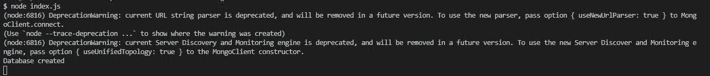
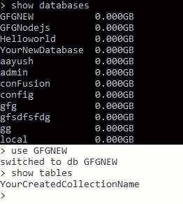

# 如何使用 Node.js 创建新的 Mongodb 数据库？

> 原文:[https://www . geesforgeks . org/how-new-MongoDB-database-use-node-js/](https://www.geeksforgeeks.org/how-to-create-new-mongodb-database-using-node-js/)

**mongodb 模块:**该模块用于使用 Node.js. **在 mongodb 中执行 CRUD(创建读取更新读取)操作**我们不能只制作一个数据库。我们必须创建一个新的集合来查看数据库。connect()方法用于连接 MongoDb 服务器和 Node.js 项目。

连接()方法请参考本[链接](https://www.geeksforgeeks.org/how-to-connect-mongodb-server-with-node-js/)。

**安装模块:**

```
npm install mongodb

```

**启动 MongoDB 服务器:**

```
mongod --dbpath=data --bind_ip 127.0.0.1

```

1.  数据是服务器所在的目录名。
2.  127.0.0.1 运行服务器的 ip 地址。


**项目结构:**


**文件名索引. js**

## java 描述语言

```
const MongoClient = require('mongodb');

// server location
const url = 'mongodb://localhost:27017';
MongoClient.connect(url).then((client) => {

    console.log('Database created');

    // database name
    const db = client.db("GFGNodejs");

    // collection name
    db.createCollection("GFGNEW");
})
```

**输出:**



**Mongodb 数据库:**

