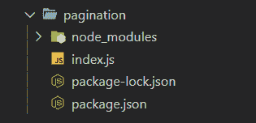
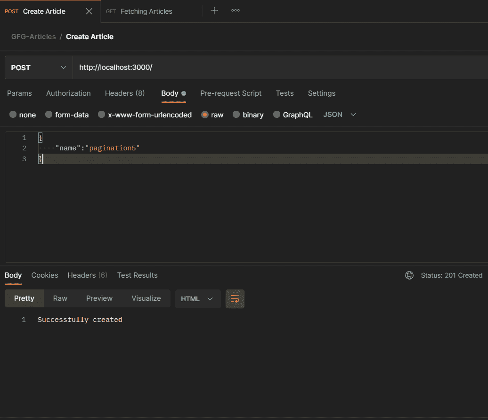
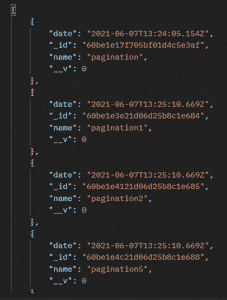
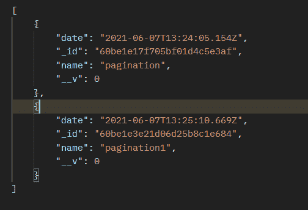

# 如何在 Node.js 中使用跳过和限制创建分页？

> 原文:[https://www . geesforgeks . org/如何在节点中创建分页-js-使用-跳过并限制/](https://www.geeksforgeeks.org/how-to-create-pagination-in-node-js-using-skip-and-limit/)

[Nodejs](https://www.geeksforgeeks.org/introduction-to-nodejs/) 是一个开源的跨平台运行时环境，用于在浏览器外执行 JavaScript 代码。它被广泛用于从小公司到大公司开发 API 和微服务。这是一个很好的工具，因为它使开发人员能够在服务器端和客户端使用 JavaScript。

**什么是分页？**

分页是一种非常有用的方法。这允许客户端获取页面中的数据。这是通过使用选项“跳过”和“限制”来实现的，让客户端可以完全控制他们正在返回的页面(数据)。

**先决条件:**基础知识 [Nodejs](https://www.geeksforgeeks.org/introduction-to-nodejs/) 和 [Mongodb。](https://www.geeksforgeeks.org/mongodb-an-introduction/)

**何时使用分页？**

正如其声明所述，应使用分页:

*   当客户应该控制数据时，他们正在返回。
*   改善用户体验(UX)和更好的导航。

**创建项目**

**步骤 1:** 使用以下命令为项目创建新文件夹:

```js
mkdir pagination
```

**步骤 2:** 使用以下命令导航到我们的文件夹:

```js
cd pagination
```

**步骤 3:** 使用以下命令和服务器文件初始化 npm:

```js
npm init -y
touch index.js
```

**步骤 4:** 使用以下命令安装所需的软件包:

```js
npm i express mongoose 
```

**项目结构:**如下图



**示例 1:** 不使用分页

## index.js

```js
// Requiring module
const express = require('express');
const mongoose = require('mongoose');
const port = 3000;
const app = express();

app.use(express.json());
app.use(express.urlencoded({ extended: false }));

// Database URL
const MONGODB_URL = 'mongodb://127.0.0.1/pagination';

// Connecting Database through mongoose(ORM For Mongodb)
mongoose
    .connect(MONGODB_URL, {
        useCreateIndex: true,
        useFindAndModify: false,
        useUnifiedTopology: true,
        useNewUrlParser: true,
    })
    .then(() => {
        console.log('Database connected');
    })
    .catch((err) => {
        console.log('Error in connecting database');
    });

// Creating Schema for Posts, then it will
// be used in creating Model
const PostSchema = new mongoose.Schema({
    name: String,
    date: {
        type: Date,
        default: Date.now(),
    },
});

const postModel = new mongoose.model('PostModel', PostSchema);

// For creating Posts
app.post('/', async (req, res) => {
    const post = new postModel(req.body);
    await post.save();
    res.status(201).send('Successfully created');
});

// For Fetching Post
app.get('/', async (req, res) => {
    try {
        const posts = await postModel.find();
        res.status(200).send(posts);
    } catch (e) {
        console.log(e);
    }
});

// Starting the server
app.listen(port, () => {
    console.log(`Started at ${port}`);
});
```

使用以下命令运行**服务器**:

```js
node index.js
```

**插入数据库:**数据在邮递员的帮助下通过以下方法插入:



通过邮递员向“/”路径发出投递请求来插入数据库。

**输出:**无分页



不使用分页通过邮差获取数据。

从上面的例子中可以看出，没有分页，所有的文档都会被获取。更清楚分页的使用和需要。当有成千上万的文档而不仅仅是 4 个时，请考虑这种情况。

**示例 2:** 使用分页

对于分页跳过和限制，将使用限制和跳过方法以及查找来使用参数。

## index.js

```js
// Requiring module
const express = require('express');
const mongoose = require('mongoose');
const port = 3000;
const app = express();

app.use(express.json());
app.use(express.urlencoded({ extended: false }));

// Database URL
const MONGODB_URL = 'mongodb://127.0.0.1/pagination';

// Connecting Database through mongoose(ORM For Mongodb)
mongoose
    .connect(MONGODB_URL, {
        useCreateIndex: true,
        useFindAndModify: false,
        useUnifiedTopology: true,
        useNewUrlParser: true,
    })
    .then(() => {
        console.log('Database connected');
    })
    .catch((err) => {
        console.log('Error in connecting database');
    });

// Creating Schema for Posts, then it will
// be used in creating Model
const PostSchema = new mongoose.Schema({
    name: String,
    date: {
        type: Date,
        default: Date.now(),
    },
});

const postModel = new mongoose.model('PostModel', PostSchema);

// For creating Posts
app.post('/', async (req, res) => {
    const post = new postModel(req.body);
    await post.save();
    res.status(201).send('Successfully created');
});

// For Fetching Post
app.get('/', async (req, res) => {
    try {
        // Adding Pagination
        const limitValue = req.query.limit || 2;
        const skipValue = req.query.skip || 0;
        const posts = await postModel.find()
            .limit(limitValue).skip(skipValue);
        res.status(200).send(posts);
    } catch (e) {
        console.log(e);
    }
});

// Starting the server
app.listen(port, () => {
    console.log(`Started at ${port}`);
});
```

使用以下命令运行**服务器**:

```js
node index.js
```

**输出:**带分页



限制=2 且跳过=0 的分页返回前 2 个文档，