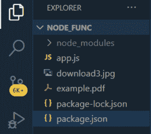

# 如何在 Node.js 中创建 PDF 文档？

> 原文:[https://www . geesforgeks . org/how-create-pdf-document-in-node-js/](https://www.geeksforgeeks.org/how-to-create-pdf-document-in-node-js/)

在本文中，我们将看到如何在 NodeJS 中生成 PDF 文档。

**先决条件:**

*   Node.js 的基础知识
    1.  [已安装 Node.js(版本 12+)](https://www.geeksforgeeks.org/installation-of-node-js-on-windows/) 。
    2.  已安装 npm(版本 6+)。

**第一步:**安装 PDF 模块。**PDF kit**–这是一个内置模块，用于以非常简单和容易的方式在节点中生成 PDF 文档，我们可以制作图形、加载图像，还可以提供网站链接。

*   要在项目中安装它，请在终端或命令提示符下编写以下命令。

```js
npm install pdfkit
```

**语法:**

```js
const PDFDocument = require('pdfkit');
const doc = new PDFDocument;
```

*   用于在 PDF 中添加新页面。

```js
doc.addPage()
```

*   用于在根目录下保存 PDF 文档。

```js
doc.pipe(fs.createWriteStream('PDF Name'));
```

**第二步:**安装设置 NodeJS 环境的模块。我们还需要配置 package.json 文件。

```js
npm install express
```

**文件名:package.json**

## java 描述语言

```js
{
  "name": "node_func",
  "version": "1.0.0",
  "description": "",
  "main": "index.js",
  "scripts": {
    "test": "echo \"Error: no test specified\" && exit 1",
    "start": "node app.js",
    "dev": "nodemon app.js"
  },
  "author": "",
  "license": "ISC",
  "dependencies": {
    "fs": "^0.0.1-security",
    "pdfkit": "^0.11.0"
  }
}
```

**文件夹结构:**我们可以看到 PDF 文件是在根目录下创建的。



文件夹结构

**示例:**这里是应该用 app.js 写的 JavaScript 代码，是给 NodeJS 用的。

**文件名:index.js**

index.js

```js
// Importing modules
import PDFDocument from 'pdfkit'
import fs from 'fs'

// Create a document
const doc = new PDFDocument();

// Saving the pdf file in root directory.
doc.pipe(fs.createWriteStream('example.pdf'));

// Adding functionality
doc

  .fontSize(27)
  .text('This the article for GeeksforGeeks', 100, 100);

// Adding image in the pdf.

  doc.image('download3.jpg', {
    fit: [300, 300],
    align: 'center',
    valign: 'center'
  });

  doc
  .addPage()
  .fontSize(15)
  .text('Generating PDF with the help of pdfkit', 100, 100);

// Apply some transforms and render an SVG path with the 
// 'even-odd' fill rule
doc
  .scale(0.6)
  .translate(470, -380)
  .path('M 250,75 L 323,301 131,161 369,161 177,301 z')
  .fill('red', 'even-odd')
  .restore();

// Add some text with annotations
doc
  .addPage()
  .fillColor('blue')
  .text('The link for GeeksforGeeks website', 100, 100)

  .link(100, 100, 160, 27, 'https://www.geeksforgeeks.org/');

// Finalize PDF file
doc.end();
```