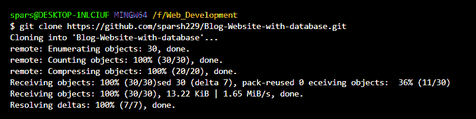
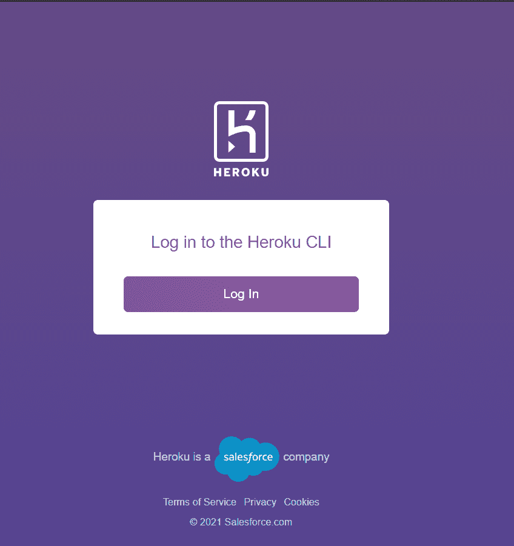
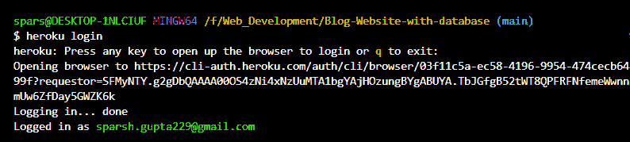
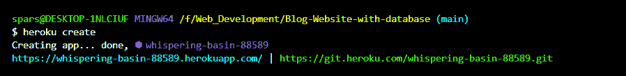
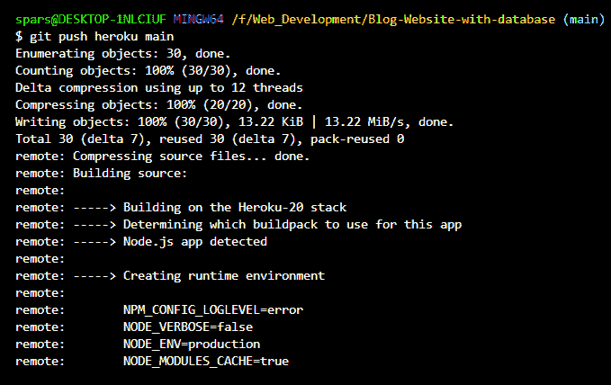
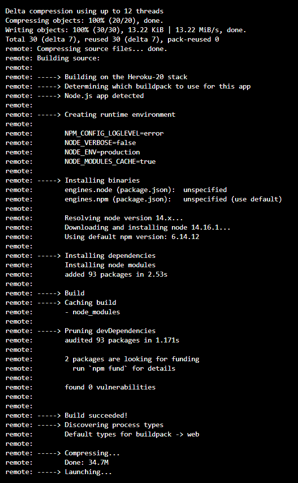
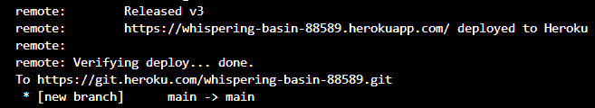

# 如何在 Node.js 中的 Heroku 上创建代理服务器？

> 原文:[https://www . geesforgeks . org/如何在节点中创建代理服务器-heroku-in-js/](https://www.geeksforgeeks.org/how-to-create-proxy-server-on-heroku-in-node-js/)

下面的方法介绍了如何使用 NodeJS 在 Heroku 上创建代理服务器。 **Heroku** 是一个云应用平台，作为 PaaS(平台即服务)在他们的云上构建、运行和运行应用。

**先决条件:**要创建代理服务器，您需要在计算机上安装以下软件:

*   安装 Heroku 命令行界面。
*   安装 node.js。
*   安装 git。
*   Git 版本控制技巧。

**按照以下简单步骤在 Heroku 上创建代理服务器:**

**步骤 1:** 设置本地存储库。将远程存储库克隆到本地目录。



现在**将**CD 到您的克隆存储库中，并运行命令 **npm install** 将所有节点依赖项安装到您的项目中。

**步骤 2:** 使用以下方法设置 Heroku 环境:

*   使用Heroku **登录命令，从终端登录 Heroku。**
*   从终端发出登录命令后，按照打开的浏览器中的提示进行登录。



*   成功执行后，以下内容将显示在您的终端屏幕上。



*   下一步是使用Heroku **create 命令在 Heroku 上创建一个应用。**
*   完成上述步骤后，Heroku 将显示一条带有已部署 URL 的通用消息，该消息可以在任何地方交换为通用 URL。



**第三步:**将我们的代理服务器推入 Heroku 服务器。最后一步是将我们的代理服务器推送到 Heroku，这可以通过使用以下命令来完成。

```js
git push heroku (branch-name)
```

  

现在，您的代理服务器已成功创建并部署在 Heroku 上。