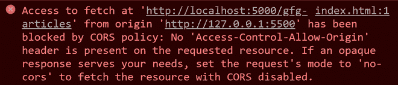
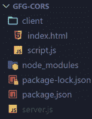
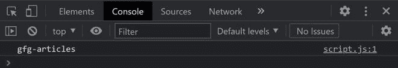

# 如何处理 express Node.js 项目中的 CORS 错误？

> 原文:[https://www . geesforgeks . org/如何处理-CORS-in-error-express-node-js-project/](https://www.geeksforgeeks.org/how-to-deal-with-cors-error-in-express-node-js-project/)

CORS，也称为跨来源资源共享，应该启用，如果你想让你的客户端和服务器之间的请求时，他们在不同的网址。

让我们考虑客户端在 ***上 http://localhost:5500*** 和服务器在 ***上 http://localhost:5000*** 。现在，如果您尝试从客户端向服务器发出请求，您将收到一条错误消息，指出被 CORS 策略阻止。



**如何启用 CORS？**

我们将使用 cors，一个 node.js 包，在快速 Node.js 项目中启用 CORS。

**项目设置和模块安装:**

*   **步骤 1:** 创建一个 Node.js 应用程序，并使用以下命令将其命名为 *gfg-cors* 。

    ```js
    mkdir gfg-cors && cd gfg-cors
    npm init 
    ```

*   **步骤 2:** 使用以下命令安装依赖模块。

    ```js
    npm i express cors
    ```

*   **第三步:**在根目录下创建*客户端*目录和 *server.js* 文件。然后在*客户端*目录下创建*index.html*和 *script.js* 。

**项目目录:**会是这样的。



**示例:**在*index.html、script.js* 、*和 server.js* 文件中写下以下代码。

## index.html

```js
<!DOCTYPE html>
<html lang="en">
<head>
    <meta charset="UTF-8">
    <meta http-equiv="X-UA-Compatible" content="IE=edge">
    <meta name="viewport" content=
        "width=device-width, initial-scale=1.0">
    <title>gfg-cors</title>
    <script src="script.js"></script> 
</head>
<body>  
</body>
</html>
```

## script.js

```js
fetch('http://localhost:5000/gfg-articles')
.then((res) => res.json())
.then((gfg_articles) => console.log(gfg_articles));
```

## server.js

```js
// Requiring module
const express = require('express');
const cors = require('cors');

// Creating express app object
const app = express();

// CORS is enabled for all origins
app.use(cors());

// Example api 
app.get('/gfg-articles', 
    (req, res) => res.json('gfg-articles'));

// Port Number
const port = 5000;

// Server setup
app.listen(port, () => `Server running on port ${port}`);
```

**注意:**如果你想允许所选的原点访问你的站点，那么你需要配置 cors，如下所示。

## server.js

```js
// Requiring module
const express = require('express');
const cors = require('cors');

// Creating express app object
const app = express();

// CORS is enabled for the selected origins
let corsOptions = {
    origin: [ 'http://localhost:5500', 'http://localhost:3000' ]
};

// Using cors as a middleware
app.get('/gfg-articles',cors(corsOptions),
    (req,res) => res.json('gfg-articles'))

// Port number
const port = 5000;

// Server setup
app.listen(port, () => `Server running on port ${port}`);
```

如果您只想允许某个特定的源访问您的站点，那么*操作*如下:

```js
let corsOptions = {
    origin: 'http://localhost:5500'
};
```

**运行应用程序的步骤:**使用以下命令运行 server.js。

```js
node server.js
```

**输出:**打开*index.html*，然后在控制台检查以下输出。

