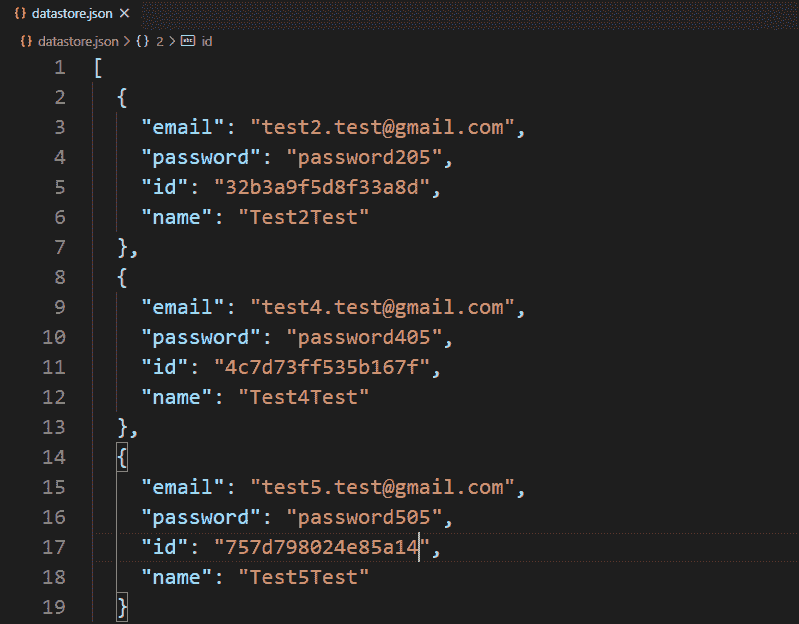

# 如何在 Node.js 中删除本地/自定义数据库中的记录？

> 原文:[https://www . geeksforgeeks . org/如何从本地自定义节点数据库中删除记录-js/](https://www.geeksforgeeks.org/how-to-delete-a-record-from-your-local-custom-database-in-node-js/)

自定义数据库表示文件系统中的本地数据库。有两种类型的数据库“SQL”和“NoSQL”。在 SQL 数据库中，数据以表的方式存储，而在 Nosql 数据库中，数据以某种特定的方式独立存储，以独立标识每条记录。我们还可以用 Nosql 方式在本地创建自己的数据库或数据存储。

创建本地数据库和创建、删除数据库信息需要一些步骤。这些步骤如下:

*   使用以下命令在项目目录的根目录下创建 package.json 文件:

    ```js
    npm init -y
    ```

*   使用以下命令安装 express 和 body-parser 包:

    ```js
    npm install body-parser
    npm install express
    ```

*   使用 id 创建一个 POST 路由来删除特定的用户记录。
*   将服务器设置为在特定端口(开发者端口–3000)上运行。
*   创建一个存储库文件，并添加与创建本地数据库相关的所有逻辑。
*   在存储库文件中创建一个方法，使用 id 从数据库中删除记录。

**示例:**此示例说明如何从本地自定义数据库中删除记录。

**文件名:index.js 文件**

```js
const express = require('express')
const repo = require('./repository')
const showRecordTemplet = require('./showRecord')

const app = express()
const port = process.env.PORT || 3000

// Home page
app.get('/', async (req, res) => {
  const records = await repo.getAllRecords()
  res.send(showRecordTemplet(records))
})

// Post route to delete record
app.post('/delete/:id', async (req, res) => {
  const id = req.params.id
  const temp = await repo.delete(id)
  res.redirect('/')
})

// Server setup
app.listen(port, () => {
  console.log(`Server start on port ${port}`)
})
```

**文件名:repository.js 文件**该文件包含删除自定义数据库记录的所有逻辑。

```js
// Importing node.js file system, crypto module 
const fs = require('fs')

class Repository {

    constructor(filename) {

        // The filename where datas are
        // going to store
        if (!filename) {
            throw new Error(
'Filename is required to create a datastore!')
        }

        this.filename = filename

        try {
            fs.accessSync(this.filename)
        } catch (err) {

            // If file not exist it is created
            // with empty array
            fs.writeFileSync(this.filename, '[]')
        }
    }

    // Method to fetch all records
    async getAllRecords() {
        return JSON.parse(
            await fs.promises.readFile(this.filename, {
                encoding: 'utf8'
            })
        )
    }

    // Delete Method
    async delete(id) {

        // Read all file contents of 
        // the datastore
        const jsonRecords = await 
            fs.promises.readFile(this.filename, {
            encoding: 'utf8'
        })

        // Parsing json records in javascript
        // object type records
        const records = JSON.parse(jsonRecords)

        // Filter Records
        const filteredRecords = records.filter(
                    record => record.id !== id)

        // Write all records back to the 
        // custom database
        await fs.promises.writeFile(
            this.filename,
            JSON.stringify(filteredRecords, null, 2)
        )
    }
}

// The 'datastore.json' file created at runtime
// if it not exist, here we try to delete 
// information from database that means 
// database(datastore.json) already exist
// and there are also records in it.
module.exports = new Repository('datastore.json')
```

**文件名:showRecord.js**

```js
module.exports = records => {
  const displayRecordId = records.map(record => {
    return `
    <p>
      Record ID - <strong>${record.id}</strong>
      <form action='delete/${record.id}' method='POST'>
        <button>Delete Record</button>
      </form>
    </p> 
    `
  }).join('')

  return `
    <div>
      ${displayRecordId}
    </div>
  `
}
```

**文件名:package.json 文件**


package.json 文件

使用以下命令运行 **index.js** 文件:

```js
node index.js
```

**输出:**

<video class="wp-video-shortcode" id="video-451720-1" width="640" height="360" preload="metadata" controls=""><source type="video/mp4" src="https://media.geeksforgeeks.org/wp-content/uploads/20200710125009/custom-db-delete.mp4?_=1">[https://media.geeksforgeeks.org/wp-content/uploads/20200710125009/custom-db-delete.mp4](https://media.geeksforgeeks.org/wp-content/uploads/20200710125009/custom-db-delete.mp4)</video>

**数据库:**


删除前的数据库



删除后的数据库

**注意:**首次运行的程序数据库(datastore.json)文件在项目目录中不存在，它是在运行程序后动态创建的。但是在这里，我们尝试从数据库中删除一条记录，这意味着假设程序已经运行了一次，并且一些记录被添加到我们尝试删除的数据库中。