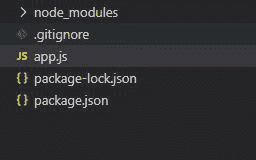
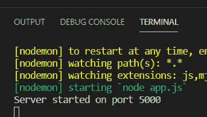
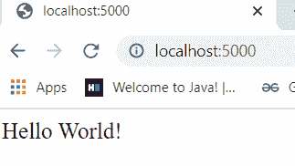
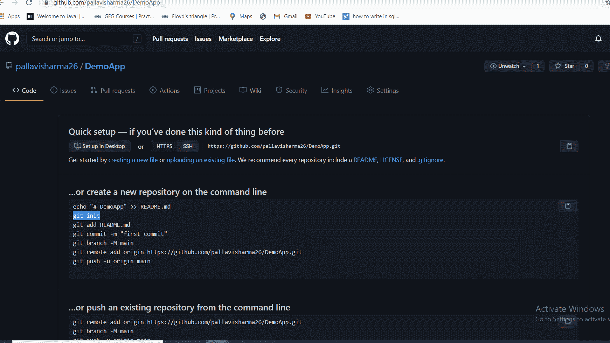
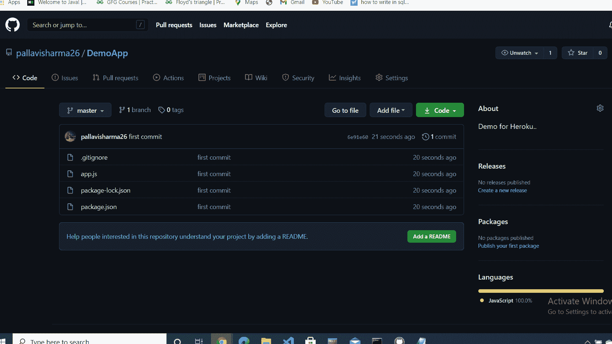
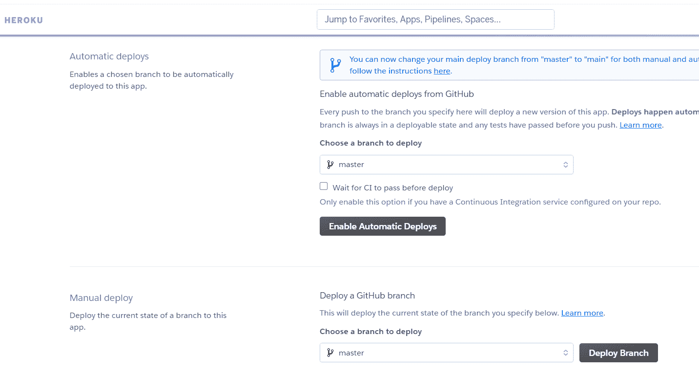
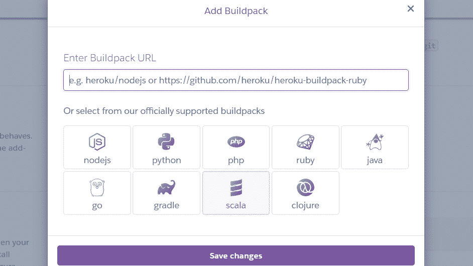
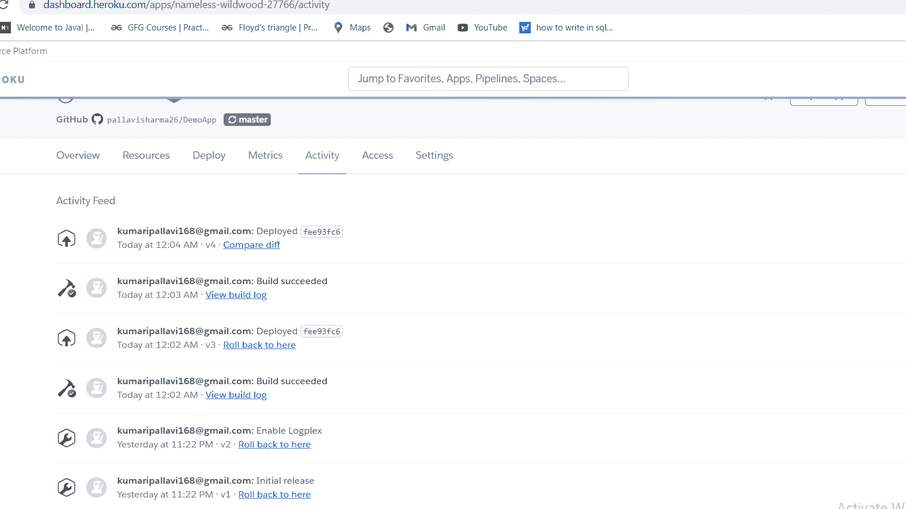
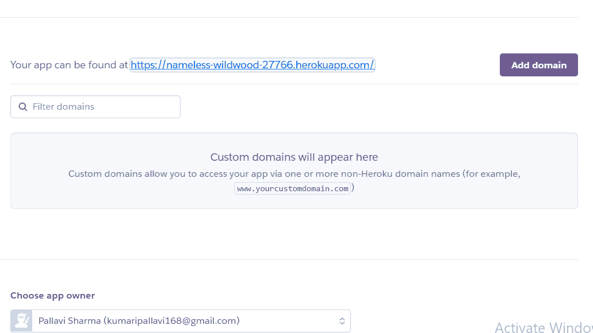

# 如何从 GitHub 在 Heroku 上部署 Node.js app？

> 原文:[https://www . geesforgeks . org/如何部署-node-js-app-on-heroku-from-github/](https://www.geeksforgeeks.org/how-to-deploy-node-js-app-on-heroku-from-github/)

在本文中，我们将研究如何将您的 Demo Node.js 应用程序部署到 **Heroku** 。在本文的最后，我们将有一个基本的 Hello World 应用程序运行在公共域上，任何人都可以访问。节点必须安装在您的计算机上。参考[这篇](https://www.geeksforgeeks.org/installation-of-node-js-on-windows/)文章如何在你的机器上安装节点。我们还将使用 **Github** 账户。

**步骤 1** :在项目文件夹中安装 Nodemon 和 Express 模块

**安装** [快递](https://www.geeksforgeeks.org/introduction-to-express/) **模块:**

```
npm install express
```

**安装** [节点](https://www.geeksforgeeks.org/node-js-nodemon-module/#:~:text=The%20nodemon%20Module%20is%20a,code%20and%20method%20of%20development.) **模块:**

```
npm install nodemon
```

**步骤 2:** 使用 npm init 命令在项目文件夹中创建 [package.json](https://www.geeksforgeeks.org/node-js-package-json/#:~:text=The%20package.&text=It%20is%20the%20manifest%20file,and%20work%20with%20the%20Node.) 文件:

这两个命令对于分别在 Node.js 应用程序中进行更改后运行和动态运行代码非常重要。

```
"start": "node app.js",
"dev": "nodemon app.js"
```

package.json 文件
的配置

```
{
    "name": "demoapp",
    "version": "1.0.0",
    "description": "",
    "main": "app.js",
    "scripts": {
        "start": "node app.js",
        "dev": "nodemon app.js"
    },
    "author": "",
    "license": "ISC",
    "dependencies": {
        "express": "^4.17.1",
        "nodemon": "^2.0.6"
    }
}
```

**项目结构:**



**app.js**

## java 描述语言

```
// Importing express module
const express = require('express');
const app = express();

// Getting Request
app.get('/', (req, res) => {

    // Sending the response
    res.send('Hello World!')

    // Ending the response
    res.end()
})

// Establishing the port
const PORT = process.env.PORT ||5000;

// Executing the server on given port number
app.listen(PORT, console.log(
  `Server started on port ${PORT}`));
```

**执行命令:**

```
nodemon app.js
```

**控制台输出:**



**浏览器输出:**现在，如果我们在你的浏览器中打开 **http://localhost:5000/** ，我们会看到这个:



我们刚刚创建了一个基本的 **Node.js** 应用程序。

部署 Node.js 应用程序

**第三步:将 Node.js 应用推送到 GitHub:** 点击标签上的新建存储库，在 GitHub 上新建一个存储库。GitHub 将创建一个存储库，并给出一些克隆项目的指令。



在命令提示符下，运行以下命令将您的项目推送到新的存储库。

```
git init
git add . 
git commit -m “first commit”
git push — set-upstream origin master
git remote add origin https://github.com/pallavisharma26/DemoApp
git push — set-upstream origin master
```

*   现在，如果您打开 GitHub 并刷新存储库，您应该能够看到您最近添加的代码。



**第四步:将 Node.js 应用部署到 Heroku**

*   在 [Heroku](https://signup.heroku.com/login) 上创建一个免费账户
*   完成所有流程后，现在登录您的帐户。
*   点击**新建应用**。
*   打开“部署”选项卡，滚动到该选项卡的“部署方法”部分。
*   选择 GitHub 作为方法。它将显示一个**“连接到 GitHub”**选项，我们在其中添加提供我们的 GitHub 存储库。如果你是第一次这样做，Heroku 会请求允许访问你的 GitHub 账户，你必须允许。在这里，您可以搜索您的 **GitHub** 存储库，然后单击**连接**以创建连接。
*   之后，部署部分将显示，您可以选择拾取和部署或手动部署，单击**启用自动部署。**



*   现在我们必须告诉 heroku，我们的应用程序是 node.js 应用程序
*   打开设置选项卡向下滚动，点击**“添加构建包”**。



*   从选项中选择节点，点击**保存更改**。现在，回到部署选项卡，点击底部的**部署分支**。
*   Heroku 会接受代码并主持它。打开**活动**标签，可以看到进度:



*   现在打开设置选项卡滚动并寻找域。我们可以看到一个网址，如果我们复制粘贴并在浏览器中运行，我们可以看到我们的**部署的应用程序**。



这是一个**简单明了的应用**，我们可以在 Heroku 上部署任何高级项目，而无需将其安装在我们的桌面或机器上。