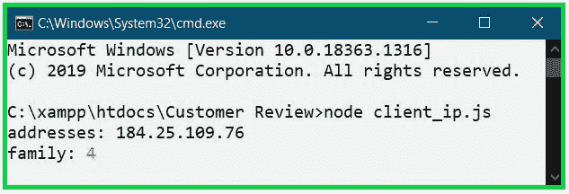

# 如何使用 node.js 确定用户 IP 地址？

> 原文:[https://www . geesforgeks . org/如何确定用户-IP-地址-使用-节点-js/](https://www.geeksforgeeks.org/how-to-determine-the-user-ip-address-using-node-js/)

[Node.js](https://www.geeksforgeeks.org/introduction-to-nodejs/) 是一个开源的后端 JavaScript 运行时环境，运行在 web 引擎上，执行 JavaScript 代码。Node.js 可以运行的平台有 Windows、Linux、Mac OS 等多种。域名系统是一个分级和分散的命名系统，用于连接到互联网的计算机等。为了在 Node.js 中找到用户的 IP 地址，我们使用了 dns 模块的 [dns.lookup()](https://www.geeksforgeeks.org/node-js-dns-lookup-method/) 方法。

**dns.lookup()函数:**

```
dns.lookup(hostname[, options], callback)
```

**参数**:

1.  **主机名:**由有效或活动的网站链接组成。
2.  **选项:**默认值为 0。它可以是 0、4 或 6，表示 IPv4 和 IPv6 地址。
3.  **回调:**此功能有用户的 IP 地址和家族(即 IPv4 和 IPv6)以及错误。

**确定 IP 地址的方法:**

1.  在 node.js 文件中导入 dns 模块。
2.  使用 dns.lookup()函数搜索客户端的地址和系列。
3.  显示地址和家庭。

**实施:**

## index.js

```
// Import file
const dns = require('dns');

// dns.lookup() function searches
// for user IP address and family
// if there is no error
dns.lookup('www.geeksforgeeks.org', 
(err, addresses, family) => {

    // Print the address found of user
    console.log('addresses:', addresses);

    // Print the family found of user  
    console.log('family:', family);
});
```

使用以下命令运行 **index.js** 文件:

```
node client_ip.js
```

**输出:**


**参考:**
[<u>https://nodejs . org/API/DNS . html # DNS _ DNS _ lookup _ hostname _ options _ callback</u>](https://nodejs.org/api/dns.html#dns_dns_lookup_hostname_options_callback)