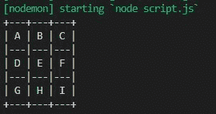
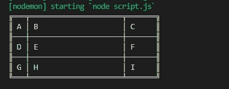

# 如何在 Node.js 中以表格形式显示输出数据？

> 原文:[https://www . geesforgeks . org/how-display-output-data-in-table-form-in-node-js/](https://www.geeksforgeeks.org/how-to-display-output-data-in-tabular-form-in-node-js/)

表格是行和列的组合。Node.js 有自己的名为 table 的模块，有助于制作具有各种样式的表格，这些样式可以应用于表格，例如边框样式、颜色、正文样式等。

**模块安装:**

```
npm install table
```

**语法:**

```
table(data, config)
```

**参数:**

*   **数据:**数据是数组的数组，即保存在表中的数据。
*   **配置:**不同的预定义配置。

**返回值:**函数返回一个字符串。

**示例 1:** **文件名:script.js**

```
let table = require("table");
let data, config;

// Data to be saved in the tables
data = [
  ["A", "B", "C"],          
  ["D", "E", "F"],
  ["G", "H", "I"],
]

config = {

  // Predefined styles of table
  border: table.getBorderCharacters("ramac"),
}

let x = table.table(data, config);
console.log(x)
```

**运行该程序的步骤:**使用以下命令运行**脚本。**

```
node script.js
```

**输出:**


**示例 2:** **文件名:script.js**

```
let table = require("table");
let data, config;

data = [
  ["A", "B", "C"],
  ["D", "E", "F"],
  ["G", "H", "I"],
]

// Creating column width configuration
config = { 
  columns: {
    0: {
      width: 1   // Column 0 of width 1
    },
    1: {
      width: 20  // Column 1 of width 20
    },
    2: {
      width: 5   // Column 2 of width 5
    }
  }
};
let x = table.table(data, config);
console.log(x)
```

**运行该程序的步骤:**使用以下命令运行**脚本。**

```
node script.js
```

**输出:**
