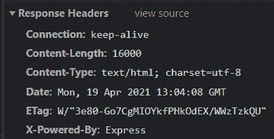
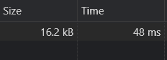
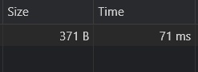

# 如何用 Node.js 中的 Gzip 做压缩？

> 原文:[https://www . geesforgeks . org/how-to-do-to-to-to-compression-with-gzip in-node-js/](https://www.geeksforgeeks.org/how-to-do-compression-with-gzip-in-node-js/)

下面的方法介绍了如何在 Node.js 中使用 Gzip 压缩进行压缩。Gzip 是最广泛使用的压缩，尤其是对于服务器和客户端交互。

**压缩**有助于减少 NodeJS 应用程序中可下载的数据量，从而提高应用程序的性能。这种压缩过程可以将有效负载的大小大幅降低到 70%以上。

以下两个示例介绍了压缩是如何有用的，因为与示例 1 相比，它减少了示例 2 中清晰可见的有效载荷大小。

**实施例 1:无压缩使用:**

**步骤 1:** 使用以下命令创建一个空的 NodeJS 应用程序:

```js
mkdir Project 
cd Project
npm init -y
```

**步骤 2:** 使用以下命令安装 ExpressJS 模块:

```js
npm i express --save
```

**第 3 步:**在项目的根目录下创建一个文件，并命名 **index.js** 并编写以下代码。

## index.js

```js
const express = require('express');
const app = express();

// It will repeatedly the word 'I love GeeksforGeeks'
const data = ('I love GeeksforGeeks').repeat(800) ;

app.get('/', (req, res) => {
  // Send as 'text/html' format file
  res.send(data);
});

// Server setup
app.listen(8080, function () {
  console.log('Server listening on port 8080!');
});
```

使用以下命令运行 **index.js** 文件:

```js
node index.js
```

打开浏览器，转到 URL***http://localhost:8080/，*** 没有压缩，服务器返回的响应会有 16 kB 左右的权重，如下图:

 

**示例 2:使用 Gzip 压缩:**

在 NodeJS 应用的 **index.js** 文件中添加压缩中间件。这将启用 GZIP，使您的 HTTP 响应更小。

**步骤 1:** 使用以下命令创建一个空的 NodeJS 应用程序:

```js
mkdir Project
cd Project
npm init -y
```

**步骤 2:** 使用以下命令安装压缩和 ExpressJS 模块:

```js
npm install compression --save
npm install express --save
```

**第 3 步:**在项目的根目录下创建一个文件，并命名 **index.js** 并编写以下代码。

## index.js

```js
// Initialize compression module
const compression = require('compression');
const express = require('express');
const app = express();

// Compress all HTTP responses
app.use(compression());

// It will repeatedly the word 'I love GeeksforGeeks'
const data = ('I love GeeksforGeeks').repeat(800) ;

app.get('/', (req, res) => {
  // Send as 'text/html' format file
  res.send(data);
});

// Server setup
app.listen(8080, function () {
  console.log('Server listening on port 8080!');
});
```

使用以下命令运行 **index.js** 文件:

```js
node index.js
```

打开浏览器，转到 URL***http://localhost:8080/，*** 现在，如果打开压缩，服务器返回的响应将重约 371 字节，如下所示:



因此，上面的例子表明，使用压缩响应大小大大减少。