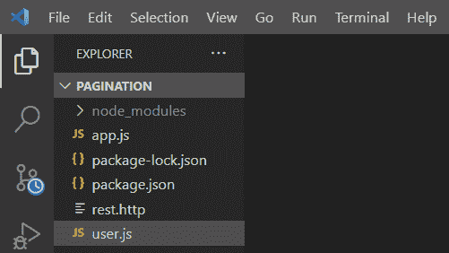
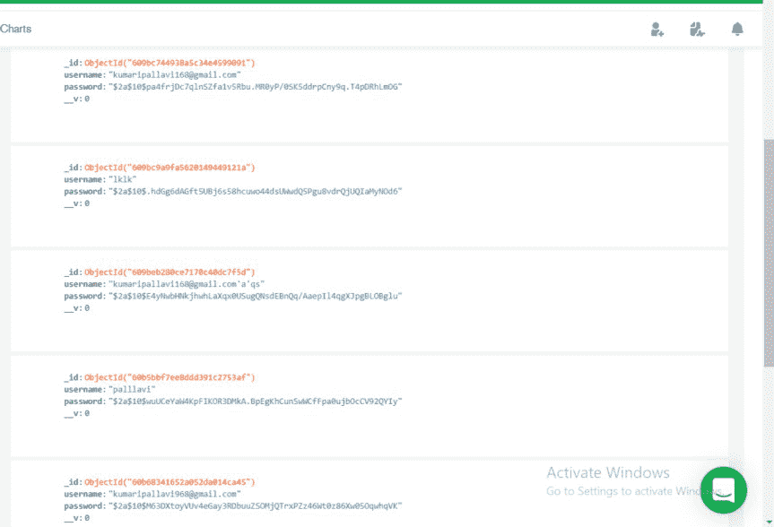
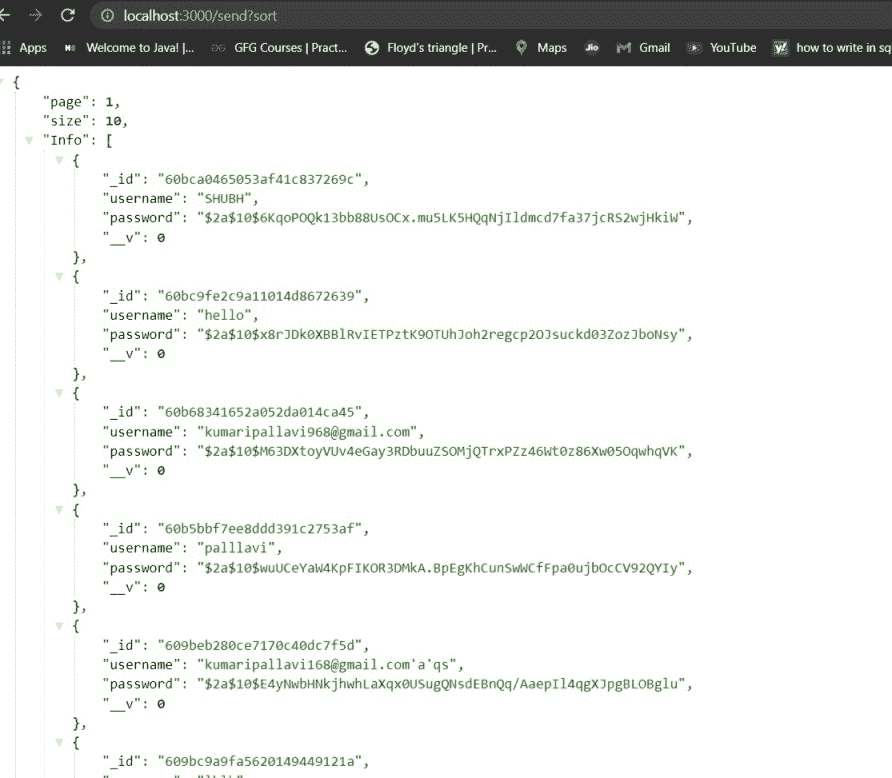

# 如何使用排序 id 在 Node.js 中进行分页？

> 原文:[https://www . geesforgeks . org/how-do-paging-in-node-js-using-sorting-ids/](https://www.geeksforgeeks.org/how-to-do-pagination-in-node-js-using-sorting-ids/)

NodeJS 中的分页被定义为添加数字来标识页面的顺序号。在分页中，当数据库中的数据数量非常大时，我们通常会跳过并限制数据的大小。在本文中，我们将使用排序标识在 NodeJS 中进行分页。

**方法:**NodeJS 中的排序有助于按升序或降序对结果进行排序。我们使用 sort()方法，其中我们传递一个导致升序或降序的参数。使用排序对象中的值 ***-1*** 进行降序排序，使用 ***1*** 进行升序排序。

**安装模块:**您可以使用以下命令安装所需的模块。

```
npm install mongoose 
npm install express 
npm install bcryptjs 
npm install body-parser
```

**项目结构:**会是这样的。



**MongoDB 数据库:**以下是本例中存储在数据库中的示例数据。



**方法 1:** 使用 id 按升序排序。

## user.js

```
var mongoose = require("mongoose");

var userSchema = new mongoose.Schema({
    username:String,
    password:String
});

module.exports = mongoose.model("User",userSchema);
```

## app.js

```
var express = require('express'),
    Mongoose = require('mongoose'),
    Bcrypt = require('bcryptjs'),
    bodyParser = require('body-parser'),
    jsonParser = bodyParser.json(),
    User = require('./user')

const app = express();

const db = `mongodb+srv://pallavi:pallavi123@
cluster0.k0sop.mongodb.net/user?retryWrites=
true&w=majority`

Mongoose.connect(db, {
    useNewUrlParser: true,
    useUnifiedTopology: true,
    useCreateIndex: true
}).then(() => console.log('MongoDB Connected....'))

// Handling GET /send Request
app.get("/send", async (req, res, next) => {

    try {
        let { page, size, sort } = req.query;

        // If the page is not applied in query.
        if (!page) {

            // Make the Default value one.
            page = 1;
        }

        if (!size) {
            size = 10;
        }

        //  We have to make it integer because
        // query parameter passed is string
        const limit = parseInt(size);

        // We pass 1 for sorting data in 
        // ascending order using ids
        const user = await User.find().sort(
            { votes: 1, _id: 1 }).limit(limit)
        res.send({
            page,
            size,
            Info: user,
        });
    }
    catch (error) {
        res.sendStatus(500);
    }
});

// Handling POST /send Request
app.post('/send', jsonParser, (req, res) => {

    req.body.password = 
        Bcrypt.hashSync(req.body.password, 10);
    var newUser = new User({
        username: req.body.username,
        password: req.body.password,

    })

    newUser.save()
        .then(result => {
            console.log(result);
        });
})

// Server setup
app.listen(3000, function () {
    console.log("Express Started on Port 3000");
});
```

运行 **app** **。js** 文件使用以下命令:

```
node app.js
```

**输出:**现在打开浏览器，转到***http://localhost:3000/send？排序*** ，你会看到如下输出:


**方法二:使用 IDs** 进行降序排序

## user.js

```
var mongoose = require("mongoose");

var userSchema = new mongoose.Schema({
    username:String,
    password:String
});

module.exports = mongoose.model("User", userSchema);
```

## app.js

```
var express = require('express'),
    Mongoose = require('mongoose'),
    Bcrypt = require('bcryptjs'),
    bodyParser = require('body-parser'),
    jsonParser = bodyParser.json(),
    User = require('./user')

const app = express();

const db = `mongodb+srv://pallavi:pallavi123
@cluster0.k0sop.mongodb.net/user?
retryWrites=true&w=majority`

Mongoose.connect(db, {
    useNewUrlParser: true,
    useUnifiedTopology: true,
    useCreateIndex: true
}).then(() => console.log('MongoDB Connected....'))

// Handling GET /send Request
app.get("/send", async (req, res, next) => {
    try {
        let { page, size, sort } = req.query;

        // If the page is not applied in query
        if (!page) {

            // Make the Default value one
            page = 1;
        }

        if (!size) {
            size = 10;
        }

        //  We have to make it integer because
        // the query parameter passed is string
        const limit = parseInt(size);

        // We pass 1 for sorting data in 
        // descending order using ids
        const user = await User.find().sort(
            { votes: 1, _id: -1 }).limit(limit)

        res.send({
            page,
            size,
            Info: user,
        });
    }
    catch (error) {
        res.sendStatus(500);
    }
});

// Handling POST /send Request
app.post('/send', jsonParser, (req, res) => {

    req.body.password = 
        Bcrypt.hashSync(req.body.password, 10);

    var newUser = new User({
        username: req.body.username,
        password: req.body.password,

    })

    newUser.
        save()
        .then(result => {
            console.log(result);

        });
})

// Server setup
app.listen(3000, function () {
    console.log("Express Started on Port 3000");
});
```

运行 **app** **。js** 文件使用以下命令:

```
node app.js
```

**输出:**现在打开浏览器，转到***http://localhost:3000/send？排序*** ，你会看到如下输出:

