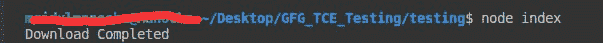

# 如何使用 Node.js 下载文件？

> 原文:[https://www . geesforgeks . org/如何使用节点 js 下载文件/](https://www.geeksforgeeks.org/how-to-download-a-file-using-node-js/)

使用 node js 下载文件可以使用内置包或第三方库来完成。

**方法 1:** 使用“https”和“fs”模块

HTTPS 使用 GET 方法来获取要下载的文件。createWriteStream()是一个用于创建可写流的方法，它只接收一个参数，即保存文件的位置。 **pipe()** 是一种从可读流中读取数据并将其写入可写流的方法。

## java 描述语言

```
const fs = require('fs');
const https = require('https');

// URL of the image
const url = 'GFG.jpeg';

https.get(url,(res) => {
    // Image will be stored at this path
    const path = `${__dirname}/files/img.jpeg`; 
    const filePath = fs.createWriteStream(path);
    res.pipe(filePath);
    filePath.on('finish',() => {
        filePath.close();
        console.log('Download Completed'); 
    })
})
```

**方法 2:** 使用第三方库

4.  **‘node-downloader-helper’ Library**

    安装:

    ```
    npm install node-helper-library
    ```

    下面是从网站下载图片的代码。一个对象 **dl** 是在 DownloadHelper 类中创建的，它接收两个参数:

    *   要下载的图像。
    *   下载后必须保存图像的路径。

    文件变量包含将要下载的图像的网址，文件路径变量包含保存文件的路径。

    ## java 描述语言

    ```
    const { DownloaderHelper } = require('node-downloader-helper');

    // URL of the image
    const file = 'GFG.jpeg';
    // Path at which image will be downloaded
    const filePath = `${__dirname}/files`; 

    const dl = new DownloaderHelper(file , filePath);

    dl.on('end', () => console.log('Download Completed'))
    dl.start();
    ```

5.  **‘download’ Library**

    安装:

    ```
    npm install download
    ```

    下面是从网站下载图片的代码。下载功能接收文件和文件路径

    ## java 描述语言

    ```
    const download = require('download');

    // Url of the image
    const file = 'GFG.jpeg';
    // Path at which image will get downloaded
    const filePath = `${__dirname}/files`;

    download(file,filePath)
    .then(() => {
        console.log('Download Completed');
    })
    ```

    

    以上三个代码的控制台输出