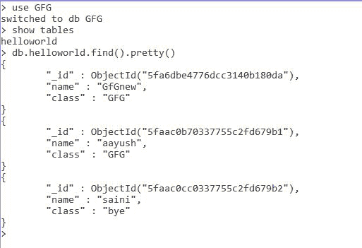
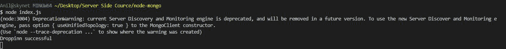
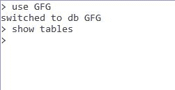

# 如何使用 Node.js 在 MongoDb 中放置集合？

> 原文:[https://www . geesforgeks . org/how-drop-collection-in-MongoDB-using-node-js/](https://www.geeksforgeeks.org/how-to-drop-collection-in-mongodb-using-node-js/)

**MongoDB，**最受欢迎的 NoSQL 数据库，是一个开源的面向文档的数据库。术语“NoSQL”的意思是“非关系的”。这意味着 MongoDB 不是基于类似表的关系数据库结构，而是提供了一种完全不同的数据存储和检索机制。这种存储格式称为 BSON(类似于 JSON 格式)。

**MongoDB 模块:**node . js 的这个模块用于连接 MongoDB 数据库，也用于操作 MongoDB 中的集合和数据库。 **mongodb.connect()** 方法用于连接您机器上特定服务器上运行的 mongodb 数据库。(参考[这篇](https://www.geeksforgeeks.org/how-to-connect-mongodb-server-with-node-js/)文章)。我们还可以在这个方法中使用 promises 来解析包含集合操作所需的所有方法和属性的对象，在 reject 中，错误发生在连接期间。


**安装模块:**

```
node install mongodb

```

**项目结构:**


**在本地 IP 上运行服务器:数据是 MongoDB 服务器所在的目录。**

```
mongod --dbpath=data --bind_ip 127.0.0.1

```


**MongoDB 数据库:**

```
Database:GFG
Collection:helloworld

```



**Index.js**

## java 描述语言

```
const MongoClient = require("mongodb");
const url = 'mongodb://localhost:27017/';
const databasename = "GFG";// Database name
MongoClient.connect(url).then((client) => {

    const connect = client.db(databasename);

    // Collection name
    const collection = connect.collection("helloworld");

    collection.drop();  // Dropping the collection

    console.log("Dropping successful");
}).catch((err) => {
    console.log(err.Message);
})
```

**输出:**



**MongoDB 数据库:**

