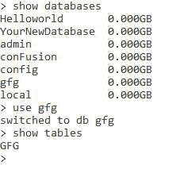
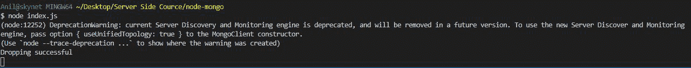
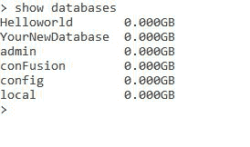

# 如何使用 Node.js 删除 MongoDB 的数据库？

> 原文:[https://www . geesforgeks . org/how-drop-of-database-MongoDB-using-node-js/](https://www.geeksforgeeks.org/how-to-drop-database-of-mongodb-using-node-js/)

**MongoDB，**最受欢迎的 NoSQL 数据库，是一个开源的面向文档的数据库。术语“NoSQL”的意思是“非关系的”。这意味着 MongoDB 不是基于类似表的关系数据库结构，而是提供了一种完全不同的数据存储和检索机制。这种存储格式称为 BSON(类似于 JSON 格式)。

**MongoDB 模块:**node . js 的这个模块用于连接 MongoDB 数据库，也用于操作 MongoDB 中的集合和数据库。mongodb.connect()方法用于连接在您的计算机上的特定服务器上运行的 mongodb 数据库。(参考 [**本**](https://www.geeksforgeeks.org/how-to-connect-mongodb-server-with-node-js/) 篇)。我们还可以在这个方法中使用 promises 来解析包含集合操作所需的所有方法和属性的对象，并在连接过程中拒绝出现的错误。

```
We cannot create database without inserting one and more collection in it

```

**安装模块:**

```
node install mongodb

```

**项目结构:**


**在本地 IP 上运行服务器:**

```
mongod --dbpath=data --bind_ip 127.0.0.1

```


**MongoDB 数据库:**

```
Database: GFG

```



**Index.js:**

## java 描述语言

```
const MongoClient = require("mongodb");
const url = 'mongodb://localhost:27017/';
const databasename = "gfg"; // Database name
MongoClient.connect(url).then((client) => {

    // Reference of database
    const connect = client.db(databasename);

    // Dropping the database
    connect.dropDatabase();

    console.log("Dropping successful");
}).catch((err) => {
    console.log(err.Message);
})
```

**执行命令:**



**MongoDB 数据库:**

