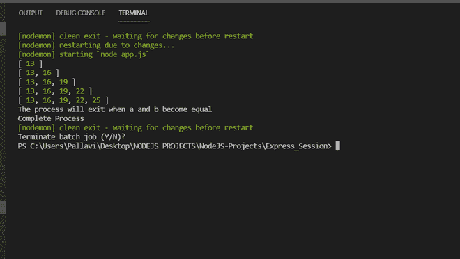
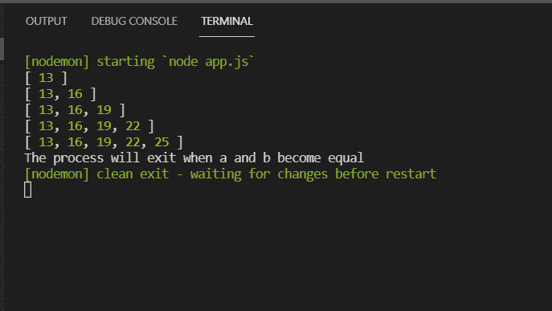
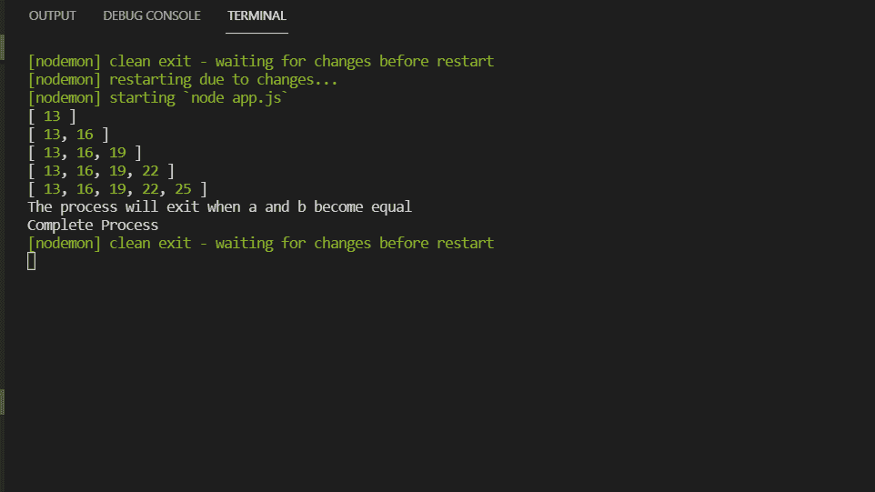
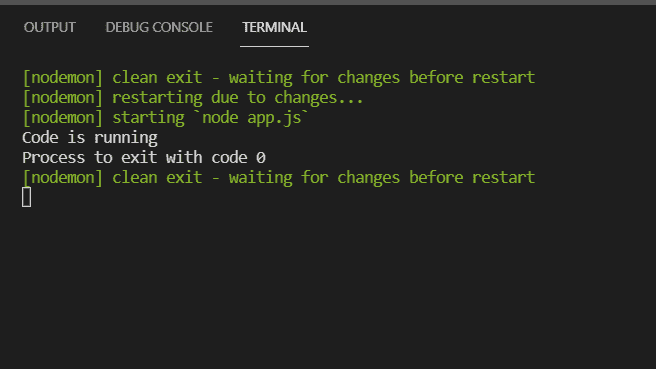

# 如何在 Node.js 中退出进程？

> 原文:[https://www . geesforgeks . org/如何退出节点内进程-js/](https://www.geeksforgeeks.org/how-to-exit-process-in-node-js/)

在本文中，我们将看到如何在 NodeJS 应用程序中退出。Nodejs 应用程序中有不同类型的退出方法，这里我们讨论了以下四种方法。

**方法一:使用 ctrl+C 键:**在控制台运行 NodeJS 的程序时，可以通过更改如下所示的代码，直接从控制台用 **ctrl+C** 关闭:



**方法二:使用 process.exit()函数:**这个函数告诉 Node.js 用一个退出代码结束同时运行的进程。通过调用这个函数，Node.js 将强制当前正在运行的进程尽快退出。

**语法:**

```
process.exit(code)
```

**参数:**该功能接受如上所述的单个参数，描述如下:

*   **代码:**可以是 0，也可以是 1。这里，0 表示在没有任何失败的情况下结束该过程，1 表示在有一些失败的情况下结束该过程。

## app.js

```
// An empty array.
var arr = [];

// Variable a and b
var a = 8;
var b = 2;

// While condition to run loop
// infinite times
while (a != 0 || b != 0) {

    // Increment then value
    // of a and b  
    a = a + 1;
    b = b + 2;

    // Push the sum of a and b
    // into array
    arr.push(a + b);

    // If a and b become equal it
    // will exit the process
    if (a == b) {
        console.log("The process will "
        + "exit when a and b become equal");
        process.exit(0);

        console.log("Complete Process")
    }

    //  It will print the result when
    // a and is not equal
    else {
        console.log(arr);
    }
}
```

**输出:**



**方法 3:使用 process.exitCode 变量:**另一种方法是设置 *process.exitCode* 值，该值将允许 Node.js 程序自行退出，而不会为将来留下进一步的调用。这种方法更安全，并且会减少 Node.js 代码中的问题。

## app.js

```
// An empty array.
var arr = [];

// Variable a and b
var a = 8;
var b = 2;

// While condition to run
// loop infinite times
while (a > b) {

    // Increment then value
    // of a and b
    a = a + 1;
    b = b + 2;

    // Push the sum of a and
    // b into array
    arr.push(a + b);

    // If a and b become equal
    // it will exit the process
    if (a == b) {
        console.log("The process will "
        + "exit when a and b become equal");
        process.exitCode = 0;
        console.log("Complete Process")
    }

    //  It will print the result when
    // a and is not equal
    else {
        console.log(arr);
    }
}
```

**输出:**



**方法 4:使用 process.on()函数:****Process 对象**是一个全局变量，它让我们管理当前的 Node.js，当进程到达我们必须使用的代码行的末尾时就会退出，因为它自动出现在 NodeJS 中。

## app.js

```
console.log('Code is running');

process.on('exit', function (code) {
    return console.log(`Process to exit with code ${code}`);
});
```

**输出:**

