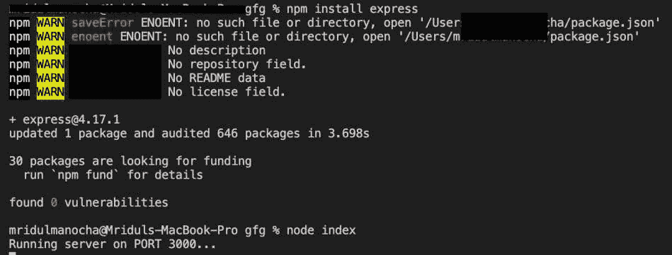
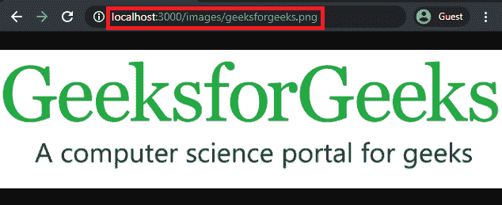

# 如何从 Node.js 服务器获取图像？

> 原文:[https://www . geesforgeks . org/如何从节点-js-server/](https://www.geeksforgeeks.org/how-to-fetch-images-from-node-js-server/) 获取图像

客户端从服务器下载的图像、CSS 文件、JavaScript 文件和其他文件称为静态文件。这些静态文件可以使用 express 框架获取，也可以不使用它。下面讨论可用于服务静态文件的方法。

要访问的图像*(geeksforgeeks.png)*位于*图像*文件夹*、*内，如下图目录树所示:

**目录树:**

```
server.js
package.json
package-lock.json
nodemoules
  | -- *
images
  | -- geeksforgeeks.png
public
  | -- index.html
```

方法一:使用 express 框架:使用 Express 框架其内置的中间件功能 **express.static()** 可以用来服务静态文件。

**语法:**

```
express.static(root, [options])
```

**参数:**该方法接受两个参数，如上所述，如下所述:

*   **根目录:**它指定了静态文件的服务目录。基本上，所有静态文件都位于公共目录中。
*   **选项:**用于指定其他选项，您可以在这里阅读更多关于[的内容。](https://expressjs.com/en/4x/api.html#express.static)

**示例:**以下代码是如何从节点服务器获取映像或其他静态文件的示例。

**文件名:server.js**

## java 描述语言

```
// Requiring module
const express = require('express');

// Creating express object
const app = express();

// Defining port number
const PORT = 3000;                 

// Function to serve all static files
// inside public directory.
app.use(express.static('public')); 
app.use('/images', express.static('images'));

// Server setup
app.listen(PORT, () => {
  console.log(`Running server on PORT ${PORT}...`);
})
```

**运行程序的步骤:**

1.使用以下命令安装 express:

```
npm install express
```

2.使用以下命令运行 **server.js** 文件:

```
node server.js
```



3.打开任意浏览器，转到***http://localhost:3000/images/geeksforgeeks . png***，您将看到以下输出:



上述命令的输出

**方法 2:不使用 express 框架:**要使用 Node.js 的基础来服务静态文件，我们可以遵循以下步骤:

1.  解析传入的 HTTP 请求，以了解请求的路径。
2.  检查路径是否存在，以响应状态为“成功”或“未找到”(可选)。
3.  获取文件的扩展名以设置内容类型。
4.  在标题中提供内容类型，并作为响应提供请求的文件。

**文件名:server.js**

## java 描述语言

```
// Requiring modules
const http = require("http");
const fs = require("fs");
const path = require("path");
const url = require("url");

// Creating server to accept request
http.createServer((req, res) => {

    // Parsing the URL
    var request = url.parse(req.url, true);

    // Extracting the path of file
    var action = request.pathname;

    // Path Refinements
    var filePath = path.join(__dirname,
            action).split("%20").join(" ");

    // Checking if the path exists
    fs.exists(filePath, function (exists) {

        if (!exists) {
            res.writeHead(404, {
                "Content-Type": "text/plain" });
            res.end("404 Not Found");
            return;
        }

        // Extracting file extension
        var ext = path.extname(action);

        // Setting default Content-Type
        var contentType = "text/plain";

        // Checking if the extension of
        // image is '.png'
        if (ext === ".png") {
            contentType = "image/png";
        }

        // Setting the headers
        res.writeHead(200, {
            "Content-Type": contentType });

        // Reading the file
        fs.readFile(filePath,
            function (err, content) {
                // Serving the image
                res.end(content);
            });
    });
})

// Listening to the PORT: 3000
.listen(3000, "127.0.0.1");
```

**运行程序的步骤:**

1.使用以下命令安装 express:

```
npm install express
```

2.使用以下命令运行 **server.js** 文件:

```
node server.js
```

3.打开任意浏览器，转到***http://localhost:3000/images/geeksforgeeks . png***，您将看到以下输出:


上述命令的输出