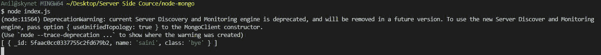
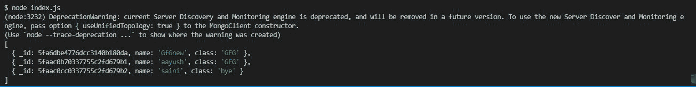

# 如何使用 Node.js 从 MongoDb 中获取单个和多个文档？

> 原文:[https://www . geeksforgeeks . org/如何从 mongodb 获取单个和多个文档-使用节点-js/](https://www.geeksforgeeks.org/how-to-fetch-single-and-multiple-documents-from-mongodb-using-node-js/)

**MongoDB** ，最受欢迎的 NoSQL 数据库，是一个开源的面向文档的数据库。术语“NoSQL”的意思是“非关系的”。这意味着 MongoDB 不是基于类似表的关系数据库结构，而是提供了一种完全不同的数据存储和检索机制。这种存储格式称为 BSON(类似于 JSON 格式)。参考([本](https://www.geeksforgeeks.org/mongodb-an-introduction/)篇)。

**MongoDB 模块:**node . js 的这个模块用于连接 MongoDB 数据库，也用于操作 MongoDB 中的集合和数据库。mongodb.connect()方法用于连接在您的计算机上的特定服务器上运行的 mongodb 数据库。(参考[这篇](https://www.geeksforgeeks.org/how-to-connect-mongodb-server-with-node-js/)文章)。我们也可以使用 promises，在这个方法中解析包含集合操作所需的所有方法和属性的对象，并在拒绝连接期间发生错误。

**安装模块:**

```js
node install mongodb

```

**项目结构:**


**在本地 IP 上运行服务器:数据是文件夹名**

```js
mongod --dbpath=data --bind_ip 127.0.0.1

```


**MongoDB 数据库:**

```js
Database:GFG
Collection:GFGcollections

```


**Index.js**

**1。获取 gfg 集合的单个文档**

## java 描述语言

```js
const MongoClient = require("mongodb");
const url = 'mongodb://localhost:27017/';
const databasename = "GFG";  // Database name
MongoClient.connect(url).then((client) => {

    const connect = client.db(databasename);

    // Connect to collection
    const collection = connect
            .collection("GFGcollections");

    // Fetching the records having 
    // name as saini
    collection.find({ "name": "saini" })
        .toArray().then((ans) => {
            console.log(ans);
        });
}).catch((err) => {

    // Printing the error message
    console.log(err.Message);
})
```

**输出:**



**2。正在获取 GFGcollections 的所有文档**

## java 描述语言

```js
const MongoClient = require("mongodb");
const url = 'mongodb://localhost:27017/';
const databasename = "GFG";  // Database name
MongoClient.connect(url).then((client) => {

    const connect = client.db(databasename);

    // Connect to collection
    const collection = connect
        .collection("GFGcollections");

    collection.find({}).toArray().then((ans) => {
        console.log(ans);
    });
}).catch((err) => {

    // Printing the error message
    console.log(err.Message);
})
```

**输出:**

