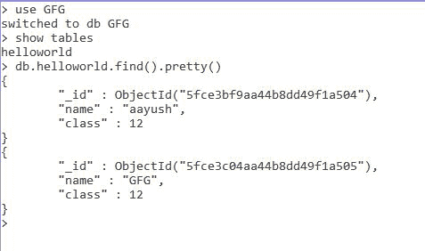
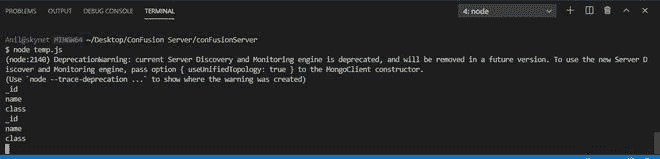

# 如何用 Node.js 找到 MongoDB 的所有文档键？

> 原文:[https://www . geesforgeks . org/how-to-find-all-document-key-of-MongoDB-using-node-js/](https://www.geeksforgeeks.org/how-to-find-all-the-document-keys-of-mongodb-using-node-js/)

最流行的 NoSQL 数据库 MongoDB 是一个面向文档的开源数据库。术语“NoSQL”的意思是“非关系的”。这意味着 MongoDB 不是基于类似表的关系数据库结构，而是提供了一种完全不同的数据存储和检索机制。这种存储格式称为 BSON(类似于 JSON 格式)。

**MongoDB 模块**:node . js 的这个模块用于连接 MongoDB 数据库，也用于操作 MongoDB 中的集合和数据库。mongodb.connect()方法用于连接在您的计算机上的特定服务器上运行的 mongodb 数据库。(参考[这篇](https://www.geeksforgeeks.org/how-to-connect-mongodb-server-with-node-js/)文章)。 **MongoDB 将所有具有不同或相同键值对的记录存储为一个对象**

**安装模块:**

```
node install mongodb
```

**项目结构:**


**在本地 IP 上运行服务器:数据是 MongoDB 服务器所在的目录。**

```
mongod --dbpath=data --bind_ip 127.0.0.1
```


**MongoDB 数据库:**

```
Database:GFG
Collection:helloworld
```



**Index.js**

## java 描述语言

```
const MongoClient = require("mongodb"); 
const url = 'mongodb://localhost:27017/'; 
const databasename = "GFG";// Database name 
MongoClient.connect(url).then((client) => { 

    const connect = client.db(databasename); 

    // Collection name 
    const collection = connect.collection("helloworld"); 

     collection.find().forEach(e=>{
         for(key in e){

             console.log(key);  // Printing the keys 
         }
     })
}).catch((err) => { 
    console.log(err.Message); 
})
```

**输出:**

