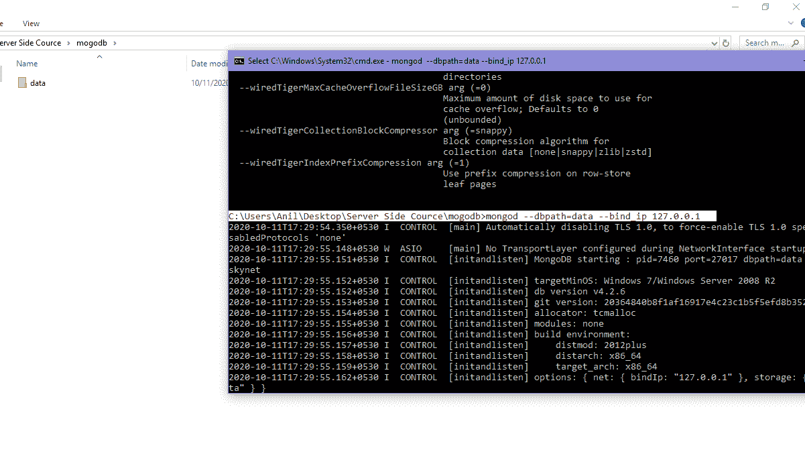
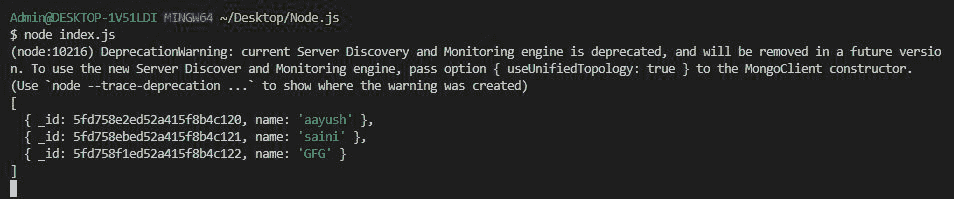

# 如何用 Node.js 找到 MongoDB 数据库特定键的所有值？

> 原文:[https://www . geesforgeks . org/如何找到 MongoDB-database-use-node-js/](https://www.geeksforgeeks.org/how-to-find-all-the-values-of-particular-key-of-mongodb-database-using-node-js/)的所有特定键的值

**MongoDB 模块:**node . js 的这个模块用于连接 MongoDB 数据库，也用于操作 MongoDB 中的集合和数据库。 *mongodb.connect()* 是用于连接到您机器上特定服务器上运行的 mongodb 数据库的主要方法(参考[这篇](https://www.geeksforgeeks.org/how-to-connect-mongodb-server-with-node-js/)文章)。我们还可以使用 promises，在这个方法中解析包含集合操作所需的所有方法和属性的对象，并拒绝连接过程中出现的错误。

**MongoDB 模块的 Project()方法**只允许在该方法中指定为参数的文档。此方法采用文档的键名以及 0 和 1 的值。

*   0 表示除此键外，显示 MongoDB Collection 的所有其他键的值。
*   1 表示只显示给定的键值。蒙古数据库集合。

**安装模块:**您可以使用以下命令安装 *mongodb* 模块:

```
node install mongodb
```

**项目结构:**项目结构如下图。


**在本地 IP 上运行服务器:**在下面的命令中，*数据*是文件夹名称。

```
mongod --dbpath=data --bind_ip 127.0.0.1
```



**MongoDB 数据库:**我们的数据库名称和集合如下所示，并带有一些伪数据。

```
Database:GFG
Collection:aayush
```


**文件名:index.js**

## java 描述语言

```
// Requiring module
const MongoClient = require("mongodb");

// Connection URL
const url = 'mongodb://localhost:27017/';

// Database name
const databasename = "GFG";

MongoClient.connect(url).then((client) => {

    const connect = client.db(databasename);

    // Connect to collection
    const collection = connect.collection("aayush");

    // Fetching the records of name key
    collection.find({ }).project({name:1})
        .toArray().then((values) => {

        // Printing the values
        console.log(ans);
    });

}).catch((err) => {

    // Printing the error message
    console.log(err.Message);
})
```

使用以下命令运行 **index.js** 文件:

```
node index.js
```

**输出:**

