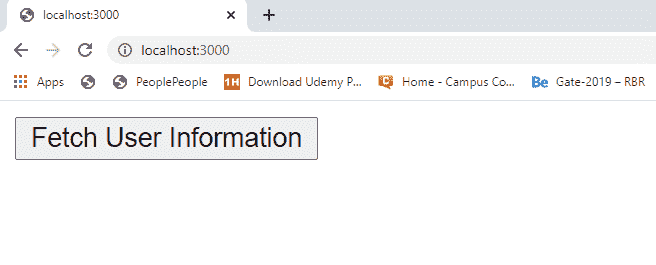

# 如何在 Node.js 中从本地/自定义数据库中按 Id 查找记录？

> 原文:[https://www . geesforgeks . org/如何从本地自定义数据库节点中按 id 查找记录-js/](https://www.geeksforgeeks.org/how-to-find-record-by-id-from-local-custom-database-in-node-js/)

自定义数据库表示文件系统中的本地数据库。有两种类型的数据库“SQL”和“NoSQL”。在 SQL 数据库中，数据以表的方式存储，而在 Nosql 数据库中，数据以某种特定的方式独立存储，以独立标识每条记录。我们也可以用 Nosql 方式在本地创建自己的数据库或数据存储。

创建本地数据库并使用 id 从中获取记录需要一些步骤。这些步骤如下:

*   在项目目录的根目录下创建 package.json 文件。
    **命令创建包文件**

    ```
    npm init -y
    ```

*   安装 express 和 body-parser 包。
    **命令安装软件包**

    ```
    npm install express
    ```

*   使用 id 为特定用户数据库创建一个 POST 路由请求。
*   将服务器设置为在特定端口(开发者端口–3000)上运行。
*   创建一个存储库文件，并添加与创建本地数据库相关的所有逻辑。
*   在存储库文件中创建一个方法，使用 id 从数据库中获取记录。

**示例 1:** 此示例说明了如何使用 id 从本地自定义数据库中获取记录。
T3】文件名:index.js

```
const express = require('express')
const repo = require('./repository')
const {userInfo} = require('./fetchUser')

const app = express()

const port = process.env.PORT || 3000

app.get('/', (req, res) => {
  res.send(`
    <form method='POST'>
      <button>Fetch User Information</button>
    </form>
  `)
})

// Route to fetch particular user 
// information using id
app.post('/', async (req, res) => {

  // Find user from (id:3f2006d22864b8af)
  const user = 
    await repo.findById('3f2006d22864b8af')

  res.send(userInfo(user))
})

// Server set to run
app.listen(port, () => {
  console.log(`Server start on port ${port}`)
})
```

**Filename: fetchUser.js:** 这个 js 文件有一个方法可以将获取的用户信息显示到网页上。

```
module.exports = {

  // Function to displays user information
  userInfo(user) {
    return `
      <div>
        <p><strong>ID : </strong>${user.id}<p>
      </div>
      <div>
        <p><strong>Email : </strong>${user.email}<p>
      </div>
      <div>
        <p><strong>Name : </strong>${user.name}<p>
      </div>
      <div>
        <p><strong>Password : </strong>${user.password}<p>
      </div>     
    `
  }
}
```

**文件名:repository.js** 该文件包含使用 id 查找记录的所有逻辑。

```
// Importing node.js file system module 
const fs = require('fs')

class Repository {
  constructor(filename) {

    // Filename where data are
    // going to store
    if (!filename) {
      throw new Error(
'Filename is required to create a datastore!')
    }
    this.filename = filename
    try {
      fs.accessSync(this.filename)
    } catch(err) {

      // If file not exist it is created 
      // with empty array
      fs.writeFileSync(this.filename, '[]')
    }
  }

  async findById(id){

    // Read all filecontents of the datastore
    const jsonRecords = await 
        fs.promises.readFile(this.filename, {
      encoding : 'utf8'
    })

    // Parsing JSON records in JavaScript
    // object type records
    const objRecord = JSON.parse(jsonRecords)

    // Search for required record
    const requiredRecord = 
      objRecord.find(record => record.id === id)
    return requiredRecord
  }
}

// 'datastore.json' file created at runtime
// if it does not exist. Here we try to fetch
// information from database using an id that
// means database(datastore.json) already exist
// and there are also records in it.
module.exports = new Repository('datastore.json')
```

**包联文件:**


**数据库:**


**输出:**


**点击按钮后:**


**注意:**第一次运行的程序数据库(datastore.json)文件在项目目录中不存在，它是在运行程序后动态创建的。但是在这里，我们尝试使用 id 从数据库中获取信息，这意味着程序假设已经运行了一次，并且一些记录被添加到我们尝试获取的数据库中。