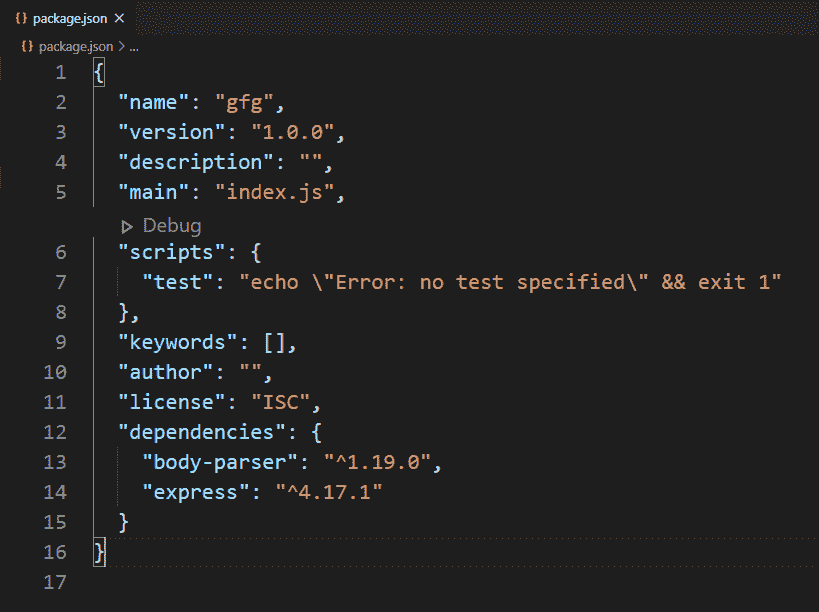
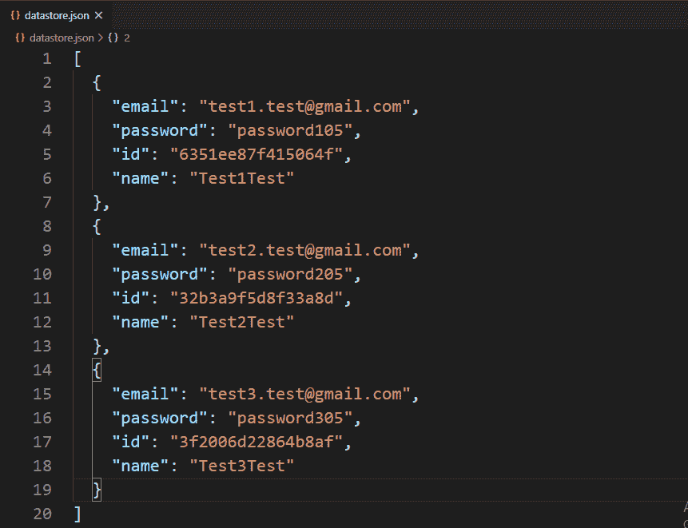
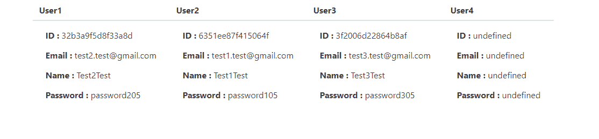

# 如何使用 Node.js 在本地/自定义数据库中使用记录的任意键值对信息查找记录？

> 原文:[https://www . geesforgeks . org/how-to-find-record-use-any-key-value-pair-information-of-record-in-your-local-custom-database-use-node-js/](https://www.geeksforgeeks.org/how-to-find-record-using-any-key-value-pair-information-of-record-in-your-local-custom-database-using-node-js/)

自定义数据库表示文件系统中的本地数据库。有两种类型的数据库“SQL”和“NoSQL”。在 SQL 数据库中，数据以表的方式存储，而在 Nosql 数据库中，数据以某种特定的方式独立存储，以独立标识每条记录。我们还可以用 Nosql 方式在本地创建自己的数据库或数据存储。
创建本地数据库并使用记录的键值对信息从其中获取记录需要一些步骤。这些步骤如下:

1.  使用以下命令在项目目录的根目录下创建 package.json 文件:

```js
npm init -y
```

1.  使用以下命令安装 express 和 body-parser 包:

```js
npm install express
npm install body-parser
```

1.  使用键值信息为数据库中的特定用户创建一个 POST 路由请求。
2.  将服务器设置为在特定端口(开发者端口–3000)上运行。
3.  创建一个存储库文件，并添加与创建本地数据库相关的所有逻辑。
4.  在存储库文件中创建一个方法，使用键值属性从数据库中获取记录。

**注意:**如果一条记录满足所有提供的键值属性，则只提取该记录(返回记录对象)，否则如果该记录不满足任何属性，则返回一个空对象。

**示例:**此示例说明了如何使用键值对属性从本地自定义数据库中获取记录。

**文件名:index.js**

## java 描述语言

```js
const express = require('express')
const repo = require('./repository')
const {userInfo} = require('./fetchUser')

const app = express()

const port = process.env.PORT || 3000

app.get('/', (req, res) => {
  res.send(`
    <form method='POST'>
      <button>Fetch User Information</button>
    </form>
  `)
})

// Route to fetch particular user
// information using id
app.post('/', async (req, res) => {

  // Find user from (id:3f2006d22864b8af)
  const user1 = await repo.findOneBy({
      name:'Test2Test',
      email: 'test2.test@gmail.com'
  })

  const user2 = await repo.findOneBy({
    email: 'test1.test@gmail.com'
  })

  const user3 = await repo.findOneBy({
    id: '3f2006d22864b8af'
  })

  const user4 = await repo.findOneBy({

    // The id and email are not belongs
    // to same user in such cases no
    // records are found
    id: '3f2006d22864b8af',
    email:'test1.test@gmail.com'
  })

  res.send(userInfo([user1, user2, user3, user4]))
})

// Server setup
app.listen(port, () => {
  console.log(`Server start on port ${port}`)
})
```

**文件名:fetchUser.js** 这个 js 文件有一个方法可以将获取的用户信息显示到网页上。

## java 描述语言

```js
const displayInfo = (users) => {
    const info = users.map(user => {
        return `
        <td>
          <table>
            <tr>
              <td>
<p><strong>ID :
                </strong>${user.id}</p>
</td>
            </tr>
            <tr>
              <td>
<p><strong>Email :
                </strong>${user.email}</p>
</td>
            </tr>
            <tr>
              <td>
<p><strong>Name :
                </strong>${user.name}</p>
</td>
            </tr>
            <tr>
              <td>
<p><strong>Password :
                </strong>${user.password}</p>
</td>
            </tr>
          </table>
        </td>
      `
    }).join('')
    return info
}
module.exports = {

    // Function to displays
    // user information
    userInfo(users) {
        return `
        <html>
          <head>
            <link rel ='stylesheet'
href='https://cdnjs.cloudflare.com/ajax/libs/bulma/0.9.0/css/bulma.min.css'> 
          </head>
          <body>
            <div class='container'>
              <table class='table'>
                <thead>
                  <tr>
                    <th>User1</th>
                    <th>User2</th>
                    <th>User3</th>
                    <th>User4</th>
                  </tr>

                </thead>
                <tbody>
                  <tr>
                    ${displayInfo(users)}
                  </tr>
                </tbody>
              </table>
            </div> 
          </body>
        </html>
      `
    }
}
```

**文件名:repository.js** 该文件包含使用键值信息查找记录的所有逻辑。

## java 描述语言

```js
// Importing node.js file system,
// crypto module
const fs = require('fs')
const crypto = require('crypto')

class Repository {
    constructor(filename) {

        // The filename where datas are
        // going to store
        if (!filename) {
            throw new Error('Filename is '
                + 'required to create a datastore!')
        }
        this.filename = filename
        try {
            fs.accessSync(this.filename)
        } catch (err) {

            // If file not exist, It is
            // created with empty array
            fs.writeFileSync(this.filename, '[]')
        }
    }

    async findOneBy(attrs) {

        // Read all file contents of
        // the datastore
        const jsonRecords = await
            fs.promises.readFile(this.filename, {
            encoding: 'utf8'
        })

        // Parsing json records in javascript
        // object type records
        const records = JSON.parse(jsonRecords)

        // Iterating through each record
        for (let record of records) {
            let found = true

            // Iterate through each given
            // propert for each record
            for (let key in attrs) {

                // If any given property not
                // matches with record record
                // is discarded
                if (record[key] !== attrs[key]) {
                    found = false
                }
            }
            // If 'found' remains true after
            // iterating through each given
            // property that means record found
            if (found) {
                return record
            }
        }

        // If record not found
        return {}
    }
}

// The 'datastore.json' file created
// at runtime if it not exist here we
// try to fetch information from
// database using some properties
// that means database(datastore.json)
// already exist and there are also
// records in it.
module.exports = new Repository('datastore.json')
```

**文件名:Package.json**



package.json 文件

**数据库**



数据库:

使用以下命令运行 **index.js** 文件:

```js
node index.js
```

**输出:**


输出屏

单击按钮后



点击按钮后输出屏幕

**注意:**首次运行的程序数据库(datastore.json)文件在项目目录中不存在。它在运行程序后动态创建。但是在这里，我们尝试使用键值对信息从数据库中获取信息，这意味着程序假设已经运行了一次，并且一些记录被添加到我们尝试获取的数据库中。