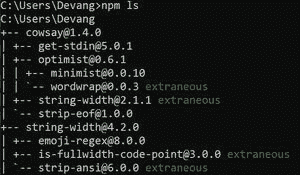
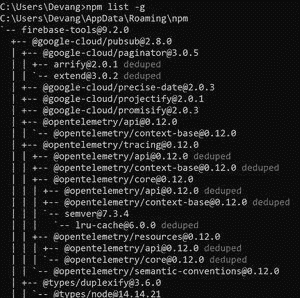
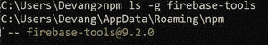
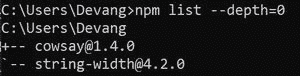

# 如何在 node.js 中找到已安装的 npm 包的版本？

> 原文:[https://www . geeksforgeeks . org/如何找到已安装的节点中的 npm 包版本-js/](https://www.geeksforgeeks.org/how-to-find-the-version-of-an-installed-npm-package-in-node-js/)

[NPM](https://www.geeksforgeeks.org/node-js-npm-node-package-manager/) 是 Node.js 的默认包管理器，NPM 管理我们在各种 node.js 应用中使用的所有内部和外部包或模块。NPM 的默认软件包不能满足开发人员的需求，所以我们需要外部软件包，我们可以在本地安装在我们机器上的特定目录中，也可以在我们机器上的任何位置轻松访问全局软件包。

**使用下面的** **命令在本地安装 npm 包:**该命令将在我们的本地目录中安装上述包。

```js
npm install <package-name> 
```


**使用下面的** **命令全局安装 npm 包****:**该命令将全局安装上述包。全局软件包都安装在我们机器上的一个位置，这就是为什么全局安装的软件包可以在我们机器上的任何目录下访问。

```js
npm install -g <package-name>
```

**在我们机器上检查 Node.js. packages 安装版本的方法:**

1.  使用下面的命令检查特定目录中本地安装的 Node.js 包。

    ```js
    npm ls
    ```

    **输出:**

    

2.  使用下面的命令检查我们机器上全局安装的软件包。

    ```js
    npm list -g
    ```

    **输出:**

    

3.  使用以下命令检查全局安装的 node.js 包中的特定包。

    ```js
    npm ls -g <package_name>
    ```

    **输出:**

    

4.  使用下面的命令只检查包的本地顶级域，而不检查所有的子包。

    ```js
    npm list --depth=0
    ```

    **输出:**

    

5.  使用以下命令检查全局顶级域节点. js 包。

    ```js
    npm list --depth=0 -g
    ```

    