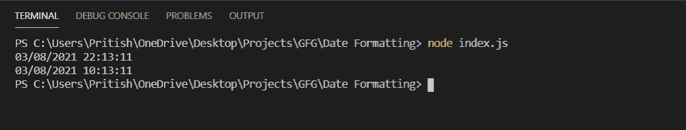

# 如何使用 Node.js 将当前日期格式化为 MM/DD/YYYY HH:MM:SS 格式？

> 原文:[https://www . geesforgeks . org/how-to-format-in-mm-DD-yyyy-hhmmss-format-using-node-js/](https://www.geeksforgeeks.org/how-to-format-the-current-date-in-mm-dd-yyyy-hhmmss-format-using-node-js/)

当前日期可以使用像日期对象这样的节点模块或像 [moment.js](https://www.geeksforgeeks.org/node-js-moment-module/) 、 [dayjs](https://www.geeksforgeeks.org/dayjs-introduction-and-installation/) 这样的库来格式化。

**方法一:使用 Node.js 日期对象**

可以使用以下命令在程序中使用 JavaScript 日期对象。

```js
const date = new Date();
```

现在在这个变量**日期**上，我们可以根据需要应用方法获得各种结果。一些方法是:

*   **getDate():** 方法返回当前日期。
*   **getMonth():** 方法返回当前月份。
*   **getFullYear():** 方法返回当前年份。
*   **getHour():** 该方法以 24 小时格式返回当前小时。
*   **getMinutes():** 方法返回当前小时的分钟数。
*   **getSeconds():** 方法返回当前分钟的秒数。

**下面是程序的实现:**

*   在对象格式中，dd 是当前日期，mm 是月份，yyyy 是年份，hh 是 24 小时格式的小时，HH 是 12 小时格式的小时，MM 是分钟，SS 是秒。
*   函数 **formatData()** 接受一个输入并检查它是否大于 9。如果它大于 10，它将返回它没有任何变化，但如果它小于 10，那么它将在输入前面附加一个 0。
*   功能 **formatHour()** 以小时为输入，按照 12 小时制进行转换。
*   功能**格式 24 小时()**和**格式 12 小时()**分别以 24 小时和 12 小时格式打印日期**格式/日/年 HH:MM:SS** 。

## index.js

```js
const date = new Date();

// Function to convert
// single digit input
// to two digits
const formatData = (input) => {
  if (input > 9) {
    return input;
  } else return `0${input}`;
};

// Function to convert
// 24 Hour to 12 Hour clock
const formatHour = (input) => {
  if (input > 12) {
    return input - 12;
  }
  return input;
};

// Data about date
const format = {
  dd: formatData(date.getDate()),
  mm: formatData(date.getMonth() + 1),
  yyyy: date.getFullYear(),
  HH: formatData(date.getHours()),
  hh: formatData(formatHour(date.getHours())),
  MM: formatData(date.getMinutes()),
  SS: formatData(date.getSeconds()),
};
const format24Hour = ({ dd, mm, yyyy, HH, MM, SS }) => {
  console.log(`${mm}/${dd}/${yyyy} ${HH}:${MM}:${SS}`);
};
const format12Hour = ({ dd, mm, yyyy, hh, MM, SS }) => {
  console.log(`${mm}/${dd}/${yyyy} ${hh}:${MM}:${SS}`);
};

// Time in 24 Hour format
format24Hour(format);
// Time in 12 Hour format
format12Hour(format);
```

使用以下命令运行 **index.js** 文件:

```js
node index.js
```

**输出:**


**方法二:使用 Moment.js 库。**

## index.js

```js
const moment = require("moment");

// 24 Hour format
console.log(moment().format("MM/DD/YYYY HH:mm:ss"));
// 12 Hour format
console.log(moment().format("MM/DD/YYYY hh:mm:ss"));
```

使用以下命令运行 **index.js** 文件:

```js
node index.js
```

**输出:**

