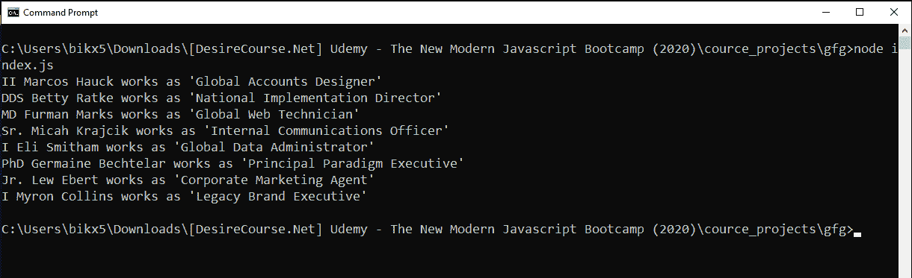
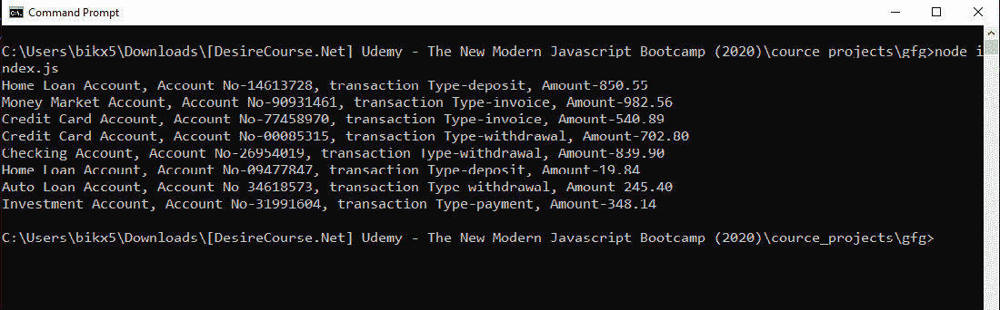

# 如何使用 Node.js 中的 Faker 模块生成假数据？

> 原文:[https://www . geeksforgeeks . org/如何使用节点中的 faker 模块生成假数据-js/](https://www.geeksforgeeks.org/how-to-generate-fake-data-using-faker-module-in-node-js/)

**Faker** 模块用于生成伪造数据，不仅伪造数据，感染组织良好的伪造数据。Faker 模块是一个广泛使用的 NPM 模块，它可以生成假的名称、地址、产品名称、价格。使用这个 faker 包，您还可以生成假的 IP 地址、图像等等。
**命令安装 faker 模块:**

```js
npm install faker
```

如下所述，有一些预定义的上下文为特定的上下文创建了假数据:

<figure class="table">运动、动物、时尚、美食、夜生活

| Context (object) | Aspects (methods) |
| --- | --- |
| **Name** | 名字・姓氏・查找名称・后缀・jobTitle・job 描述符 |
| **Address** | Latitude, longitude, country, state, city, zipCode, streetName |
| **Internet** | Email, url, ip, mac, password, domain name |

</figure>

**获取虚假数据的语法**

```js
faker.context.aspect()
```

**例 1:**

## java 描述语言

```js
// Program to generate some fake
// names with their job titles

// Requiring faker module
const faker = require('faker')

for(let i=0; i<8; i++){

// Fake first name
  const firstName = faker.name.firstName()

// Fake last name
  const lastName = faker.name.lastName()

// Fake suffix
  const suffix = faker.name.suffix()

// Fake job Title
  const jobTitle = faker.name.jobTitle()

  console.log(`${suffix} ${firstName}
    ${lastName} works as '${jobTitle}'`)
}
```

**输出:**



**例 2:**

## java 描述语言

```js
// Program to generate some fake
// products with their details

// Requiring faker module
const faker = require('faker')

for (let i = 0; i < 8; i++) {

    // Fake product name
    const product = faker.commerce.product()
    // fake price of that product
    const price = faker.commerce.price()

    // Fake details
    const productMaterial =
        faker.commerce.productMaterial()
    console.log(`${product} made with
        ${productMaterial}, price ${price}
如何使用 Node.js 中的 Faker 模块生成假数据？
)
}
```

**输出:**


**例 3:**

## java 描述语言

```js
// Program to generate some fake
// bank transaction details

// Requiring faker module
const faker = require('faker')

for (let i = 0; i < 8; i++) {

    // Fake account type
    const ac = faker.finance.account()

    // Fake account name
    const acName = faker.finance.accountName()

    // Fake transaction type
    const tT = faker.finance.transactionType()

    // Fake amount transaction
    const amt = faker.finance.amount()

    console.log(`${acName}, Account No-${ac},
    transaction Type-${tT}, Amount-${amt}`)
}
```

**输出:**



**例 4:**

## java 描述语言

```js
// Program to generate some fake
// domain name and ip addresses

// Requiring faker module
const faker = require('faker')

for (let i = 0; i < 8; i++) {

    // Fake ip address
    const ip = faker.internet.ip()

    // Fake domain name
    const domainName =
        faker.internet.domainName()

    console.log(`Domain name ->
        ${domainName}, ip-address-> ${ip}`)
}
```

**输出:**


**参考:**T2【NPM faker 套餐 T4】