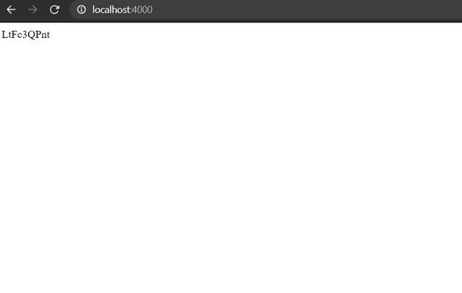
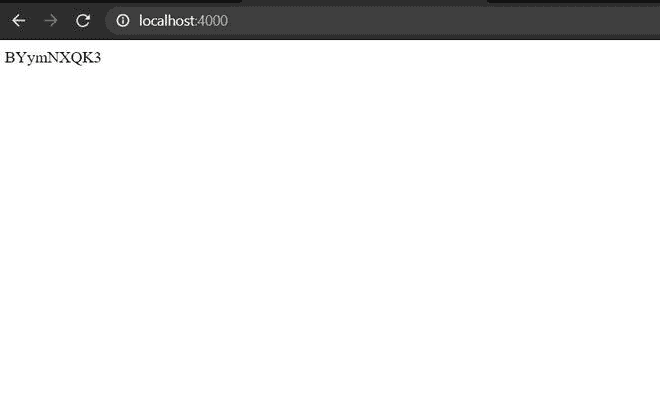

# 如何在 Node.js 中生成短 id？

> 原文:[https://www . geesforgeks . org/如何生成节点中的短 id-js/](https://www.geeksforgeeks.org/how-to-generate-short-id-in-node-js/)

在本文中，我们将看到如何在 Node.js 中生成一个短 id。有一个名为“ [shortid](https://www.geeksforgeeks.org/node-js-npm-shortid-module/) ”的 NPM 包，用于创建短的非顺序 url 友好的唯一 id。默认情况下，它使用 7-14 个 url 友好字符:a-z、A-Z、0-9、_-。它支持集群(自动)，自定义种子，自定义字母表。它可以生成任意数量的身份证没有重复。

**环境设置:**

*   项目 NPM 包的建立:

    ```
    npm init -y
    ```

*   安装依赖项:

    ```
    npm install express shortid
    ```

基本快速服务器:

## index.js

```
const express = require('express');
const app = express();

app.get('/' , (req , res)=>{
    res.send("GeeksforGeeks");
})

app.listen(4000 , ()=>{
    console.log("server is running on port 4000");
})
```

**输出:**


**示例:**将‘*shortid‘*导入到我们的项目中，short id 模块中有很多功能。

**语法:**

```
const short = require('shortid');
```

## server.js

```
const express = require('express');
const app = express();
const short = require('shortid');

app.get('/' , (req , res)=>{
    res.send(short()); // generating short id by calling short() function.
})

app.listen(4000 , ()=>{
    console.log("server is running on port 4000");
})
```

**输出:**
 