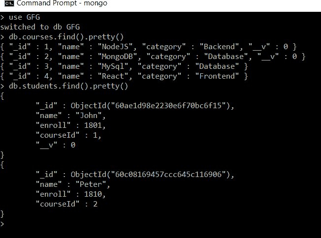
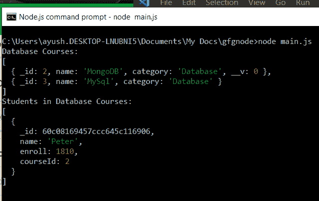

# 如何使用 Node.js 从 mongoDB 的 2 个不同集合中获取数据？

> 原文:[https://www . geesforgeks . org/如何从 2 个不同的 mongodb 集合中获取数据-使用节点-js/](https://www.geeksforgeeks.org/how-to-get-data-from-2-different-collections-of-mongodb-using-node-js/)

**mongose**是 MongoDB 的对象数据建模(ODM)库。它定义了一个强类型模式，带有默认值和模式验证，这些值和验证稍后会映射到 MongoDB 文档。

要在 NodeJS 中使用 Mongoose 从集合中获取数据，您必须具备两个必要条件:

1.  **Schema:** 它是一个包含属性及其类型(默认值、验证等)的文档结构。当需要时)作为键值对。
2.  **模型**:是一个借助已定义 Schema 创建的类，MongoDB 文档是模型的一个实例。因此，它充当 MongoDB 数据库的接口，用于创建、读取、更新和删除文档。

有了模型之后，我们可以在特定集合的模型上使用方法 **find()** 来获取该集合的文档。

**语法:**

```
<Model_Name>.find(<query>,<projection>)
```

*   ***<查询>*** **:** 是可选的。它指定了一个选择过滤器，用于使用各种 MongoDB 查询操作符过滤文档。如果没有通过，则返回所有文档。
*   ***<投影>*** **:它是可选的。它包含我们希望返回给与查询过滤器匹配的文档的字段。如果未通过，则返回所有字段。**

**安装猫鼬:**

**第一步:**可以访问[安装猫鼬](https://www.npmjs.com/package/mongoose)链接安装猫鼬模块。您可以使用此命令安装此软件包。

```
npm install mongoose
```

**步骤 2:** 现在，您可以使用以下命令导入文件中的猫鼬模块:

```
const mongoose = require('mongoose');
```

**实施:**

**第一步:**创建一个文件夹，在里面添加 model.js 和 main.js 文件。

*   **model.js:** 它包含了您想要使用的所有集合的模式和模型，然后我们正在导出创建的所有模型，以便它们可以导入到我们将从不同集合中获取数据的文件中。
*   **main.js:** 这里是主服务器文件，我们将从两个不同的集合中获取数据。

**第二步:**在 *model.js* 文件中写下以下代码。

## model.js

```
// Requiring module
const mongoose = require('mongoose');

// Course Modal Schema
const courseSchema = new mongoose.Schema({
    _id: Number,
    name: String,
    category: String
});

// Student Modal Schema
const studentSchema = new mongoose.Schema({
    name: String,
    enroll: Number,
    courseId: Number
});

// Creating model objects
const Course = mongoose.model('course', courseSchema);
const Student = mongoose.model('student', studentSchema);

// Exporting our model objects
module.exports = {
    Student, Course
}
```

**数据库:**我们的*课程*和*学生*集合中已经有文档，我们将从这些文档中获取数据，如下所示:



GFG 数据库的收藏课程和学生

**步骤 3:** 使用猫鼬可以轻松建立数据库连接，例如:

```
mongoose.connect('mongodb://localhost:27017/GFG',
{  
  useNewUrlParser: true,  
  useUnifiedTopology: true,  
  useFindAndModify: false
});
```

**第四步:**在 *main.js* 文件中写下以下代码。

## main.js

```
// Requiring mongoose module
const mongoose = require('mongoose');

// Importing Models Student and Course from model.js
const { Student, Course } = require('./model');

// Connecting to database
mongoose.connect('mongodb://localhost:27017/GFG',
    {
        useNewUrlParser: true,
        useUnifiedTopology: true,
        useFindAndModify: false
    });

var dbcourse = [];

// Finding courses of category Database
Course.find({ category: "Database" })
    .then(data => {
        console.log("Database Courses:")
        console.log(data);

        // Putting all course id's in dbcourse arrray
        data.map((d, k) => {
            dbcourse.push(d._id);
        })

        // Getting students who are enrolled in any
        // database course by filtering students
        // whose courseId matches with any id in
        // dbcourse array
        Student.find({ courseId: { $in: dbcourse } })
            .then(data => {
                console.log("Students in Database Courses:")
                console.log(data);
            })
            .catch(error => {
                console.log(error);
            })
    })
    .catch(error => {
        console.log(error);
    })
```

**步骤 5:** 使用以下命令运行 *main.js* 文件:

```
node main.js
```

**说明:**在上面的代码中，在文件 *main.js* 中，我们正在获取类别为数据库的*课程*集合的所有文档，然后将每个课程的 *_id* 存储在 *dbcourse* 数组中，然后从类别数据库的任何课程中注册的*学生*集合中获取所有文档。

**输出:**我们在如下所示的控制台中从两个不同的课程和学生集合中获取数据:



执行 main.js 后的输出