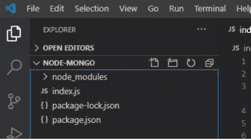
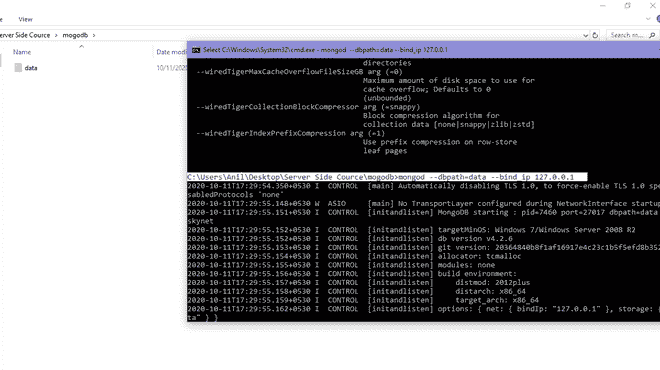
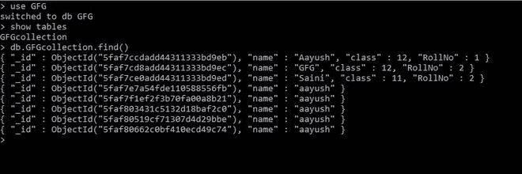
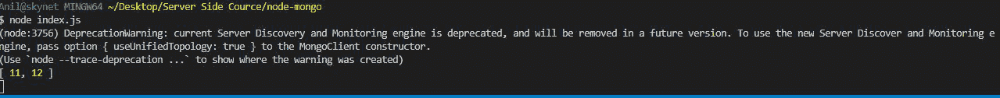

# 如何使用 Node.js 从 MongoDB 获取 Distinct Documents？

> 原文:[https://www . geesforgeks . org/how-distinct-documents-from-MongoDB-using-node-js/](https://www.geeksforgeeks.org/how-to-get-distinct-documents-from-mongodb-using-node-js/)

MongoDB 是一个跨平台、面向文档的数据库，致力于集合和文档的概念。它以键值对的形式存储数据，是一个 NoSQL 数据库程序。NoSQL 这个术语的意思是非关系的。

**MongoDB 模块:**node . js 的这个模块用于连接 MongoDB 数据库，也用于操作 MongoDB 中的集合和数据库。 **mongodb.connect()** 方法用于连接您机器上特定服务器上运行的 mongodb 数据库。(参考[这篇](https://www.geeksforgeeks.org/how-to-connect-mongodb-server-with-node-js/)文章)。我们还可以在这个方法中使用 promises 来解析包含集合操作所需的所有方法和属性的对象，在 reject 中，错误发生在连接期间。

**collection . distinct()**mongodb 模块的方法用于在 MongoDB 中查找特定数据库的不同文档。

**语法:**

```js
collection.distinct(key,callbackfunction)
```

**参数:**该函数取两个参数，如上所述，描述如下:

1.  用于查找其不同值的 MongoDB 数据库的键的名称
2.  回调函数，使该函数异步

**安装模块:**

```js
npm install mongodb
```

**项目结构:**



**在本地 IP 上运行服务器:**

```js
mongod --dbpath=data --bind_ip 127.0.0.1
```



**MongoDB 数据库:**

```js
Database:GFG
Collection:GFGcollection
```

**数据库结构:**



**Index.js**

## java 描述语言

```js
const MongoClient = require("mongodb");

const url = 'mongodb://localhost:27017/'
const database = "GFG";   // Database name
MongoClient.connect((url)).then((client) => {

    // Database reference
    const connect = client.db(database); 

    // Connect database to connection
    const collection = connect.collection("GFGcollection");

    // class key
    collection.distinct("class").then((ans) => {

        // Printing distinct value of class key
        console.log(ans);
    }).catch((err) => {
        console.log(err.Message);
    })
})
```

**输出:**

