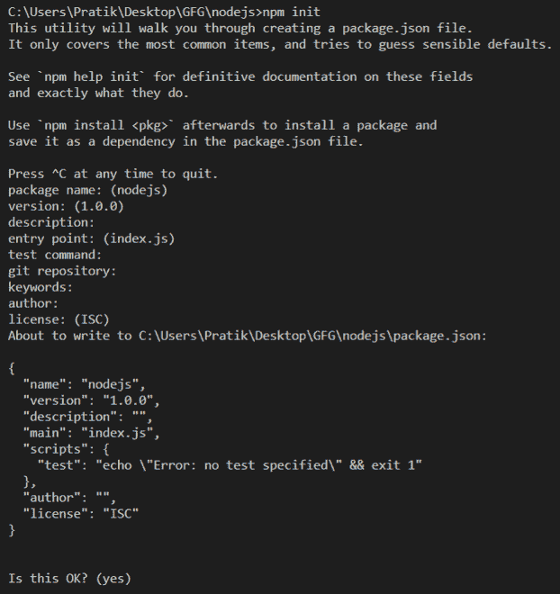
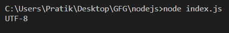

# 如何在 Node.js 中获取文件字符编码？

> 原文:[https://www . geesforgeks . org/how-to-file-character-encoding-in-node-js/](https://www.geeksforgeeks.org/how-to-get-file-character-encoding-in-node-js/)

计算机以二进制表示读取数据，这就是为什么我们需要一种方法将文本字符转换成二进制数据，这是借助字符编码来完成的。

最流行的字符编码类型是 ASCII 和 Unicode。Unicode 被定义为 UTF-8、UTF-16 等。

我们可以使用一个名为“**检测-文件-编码-语言**的模块来获取 node.js 中文件的字符编码

**语法:**

```
languageEncoding(pathToFile).then(
    fileInfo => // Do anything
);
```

**参数:**

*   **路径文件:**(相对或绝对)实际文件的路径。

**返回值:**

具有以下值的对象: ***{语言:法语，编码:CP1252，置信度:0.99 }***

**设置环境和执行:**

**步骤 1:** 初始化 node.js 项目

```
npm init
```



**步骤 2:** 安装所需模块

```
npm install detect-file-encoding-and-language
```

**步骤 3:** 创建文本文件

**文件名- a.txt**

```
Geeks for Geeks
```

**第四步:**index . js 文件中的代码

## index.js

```
import languageEncoding from "detect-file-encoding-and-language"

const pathToFile = "./a.txt"

languageEncoding(pathToFile)
    .then(fileInfo => console.log(fileInfo.encoding))
    .catch(err => console.log(err));
```

**步骤 5:** 运行 index.js 文件

```
node index.js
```

**输出:**参见控制台中的输出

