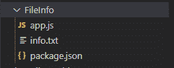
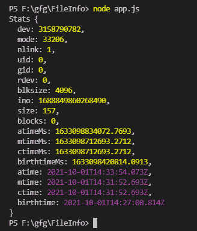

# 如何使用 Node.js 获取一个文件的信息？

> 原文:[https://www . geesforgeks . org/如何获取关于使用节点的文件的信息-js/](https://www.geeksforgeeks.org/how-to-get-information-about-a-file-using-node-js/)

[Node.js](https://www.geeksforgeeks.org/nodejs-tutorials/) 是一个开源的跨平台运行时环境，构建在 Chrome 的 V8 JavaScript 引擎上，用于在浏览器之外执行 JavaScript 代码。你需要记住 NodeJS 不是一个框架，也不是一种编程语言。在本文中，我们将讨论如何使用 Node.js 获取关于文件的信息

我们将使用*的 [**fs**](https://www.geeksforgeeks.org/node-js-file-system/) 模块提取文件信息。 *fs* 模块是一个内置模块。我们将使用 fs 模块的 [*fs.stat()*](https://www.geeksforgeeks.org/node-js-fs-stat-method/) 模块来获取与文件相关的所有信息。如果要获得关于上传文件的信息，那么我们可以使用 npm 包来处理它们，比如 multer，它处理所有不同类型的文件。让我们一步一步来。首先，在当前工作目录中创建一个您想要查看其信息的文件。*

**步骤 1:** 创建一个“ **app.js** 文件，并使用 *npm* 初始化您的项目。

```
npm init
```

**步骤 2:** 在项目文件夹中创建一个 info.txt 文件。

**项目结构:**



项目/文件结构

## app.js

```
//Importing fs module 
const fs = require("fs");

//stat methods takes path and a callback function as input
fs.stat("./info.txt", function(err, stats){

    //Checking for errors
   if(err){
       console.log(err)
   }
   else{
    //Logging the stats Object
   console.log(stats)
   }
});
```

使用以下命令运行 **app.js** 文件:

```
node app.js
```

现在，在查看输出之前，让我们讨论一下统计对象的属性:

*   ***dev:*** 包含文件的设备的 id。(bigInt 或 number)
*   ***模式:*** 给定文件的文件类型和模式的位域描述。(bigInt 或 number)
*   ***n 链接:*** 文件的硬链接数。(bigInt 或 number)
*   ***uid:*** 文件所有者的用户标识。(bigInt 或 number)
*   ***gid:*** 文件所有者的组标识。(bigInt 或 number)
*   ***rdev:*** 文件的设备 id 如果是特殊文件。(bigInt 或 number)
*   ***块大小:*** 文件系统输入/输出的块大小。(bigInt 或 number)
*   ***伊诺:*** 文件索引节点号。它包含文件的基本信息。(bigInt 或 number)
*   ***大小:*** 文件的总大小，以字节为单位。(bigInt 或 number)
*   ***块数:*** 分配给给定文件的块数。(bigInt 或 number)
*   ***atimeMs:*** 代表文件上次访问时间的时间戳。(bigInt 或 number)
*   ***mtimeMs:*** 代表文件上次修改时间的时间戳。(bigInt 或 number)
*   ***ctimeMs:*** 表示文件上次更改时间的时间戳，即索引节点更改的时间。(bigInt 或 number)
*   ***出生时间:*** 表示文件创建时间的时间戳。(bigInt 或 number)
*   ***aTime:*** 代表文件最后访问时间的 Date 对象。(日期)
*   ***【MTime:***代表文件上次修改时间的日期对象。(日期)
*   ***cTime:*** 代表文件最后更改时间的 Date 对象。(日期)
*   ***出生时间:*** 表示文件创建时间的 Date 对象。(日期)

***输出:***



输出

因此，通过使用 nodeJS 的文件系统，您可以获得关于本地文件系统中任何文件的所有必需信息。