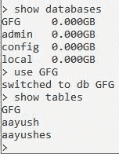
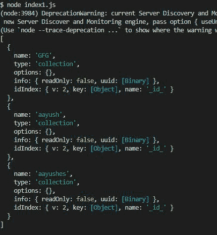

# 如何使用 Node.js 获取 MongoDB 数据库中存在的所有集合的信息？

> 原文:[https://www . geeksforgeeks . org/如何获取所有集合的信息-MongoDB-database-use-node-js/](https://www.geeksforgeeks.org/how-to-get-information-of-all-collections-present-in-mongodb-database-using-node-js/)

**MongoDB** ，最受欢迎的 NoSQL 数据库，我们可以使用 MongoDB Collection . count documents()函数统计 MongoDB Collection 中的文档数量。 **mongodb** **模块**用于连接 mongodb 数据库，也用于操作 MongoDB 中的集合和数据库。

**安装模块:**可以使用以下命令安装 **mongodb** 模块。

```js
npm install mongodb
```

**项目结构:**


项目结构

**在本地 IP 上运行服务器:**数据是 MongoDB 服务器所在的目录。

```js
mongod --dbpath=data --bind_ip 127.0.0.1
```


**蒙戈布收藏品:**



**文件名:index.js**

## java 描述语言

```js
// Requiring module
const MongoClient = require("mongodb");
const url = 'mongodb://localhost:27017/';

// Database name
const databasename = "GFG";

MongoClient.connect(url).then((client) => {
   const connect = client.db(databasename)
   connect.listCollections().toArray(function(err, names) {   
       if(!err) {
           console.log(names)
       }
   });
}).catch((err) => {

   // Printing the error message
   console.log(err.Message);
})
```

使用以下命令运行 **index.js** 文件:

```js
node index.js
```

**输出:**

