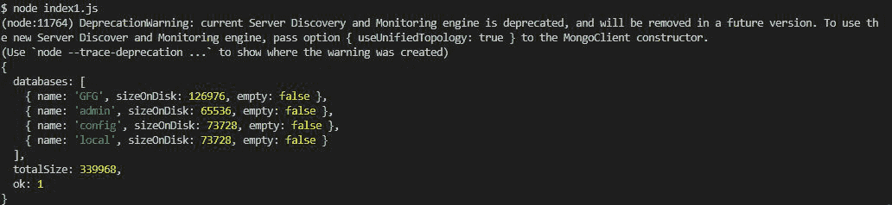

# 如何使用 Node.js 获取 MongoDB 中存在的所有数据库的信息？

> 原文:[https://www . geesforgeks . org/如何获取所有数据库的信息-mongodb 中存在-使用节点-js/](https://www.geeksforgeeks.org/how-to-get-information-of-all-databases-present-in-mongodb-using-node-js/)

**MongoDB** ，最受欢迎的 NoSQL 数据库，我们可以使用 MongoDB Collection . count documents()函数统计 MongoDB Collection 中的文档数量。 **mongodb** **模块**用于连接 mongodb 数据库，也用于操作 MongoDB 中的集合和数据库。

**安装模块:**可以使用以下命令安装 **mongodb** 模块。

```
npm install mongodb
```

**项目结构:**


**在本地 IP 上运行服务器:**数据是 MongoDB 服务器所在的目录。

```
mongod --dbpath=data --bind_ip 127.0.0.1
```


**蒙古数据库:**


**文件名:index.js**

## java 描述语言

```
// Requiring module
const MongoClient = require("mongodb");

// Connection URL
const url = 'mongodb://localhost:27017/';

// Database name
const databasename = "GFG";

MongoClient.connect(url).then((client) => {

   // Use admin request
   const connect = client.db(databasename).admin();

   connect.listDatabases((err,db) => {
      // Printing the databases
      if(!err) console.log(db);
   })
}).catch((err) => {

   // Printing the error message
   console.log(err.Message);
})
```

使用以下命令运行 **index.js** 文件:

```
node index.js
```

**输出:**

