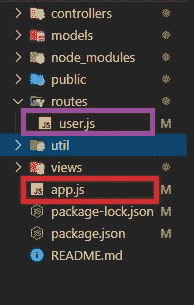

# 如何使用 Node.js 获取当前脚本的路径？

> 原文:[https://www . geesforgeks . org/如何获取当前脚本使用节点的路径-js/](https://www.geeksforgeeks.org/how-to-get-the-path-of-current-script-using-node-js/)

通过使用 [__dirname](https://nodejs.org/docs/latest/api/modules.html#modules_dirname) 和 [__filename](https://nodejs.org/docs/latest/api/modules.html#modules_filename) 模块范围变量，我们可以在 **node.js** 中获得当前脚本的路径。

*   **__dirname:** 返回当前脚本所在的当前模块的目录名。
*   **_ _ 文件名:**返回当前模块的文件名。这是当前模块文件的绝对路径，符号链接(符号链接)已解析。

我们来考虑下项目的文件结构:


下面的例子说明了**_ _ 目录名**和**_ _ 文件名**模块范围变量在 node.js 中的使用:

**例 1:** 执行 **app.js** 文件时确定当前脚本的路径。

**app.js** 文件:

```
// Node.js program to demonstrates how to
// get the current path of script

// To get the filename
console.log(`Filename is ${__filename}`);

// To get the directory name
console.log(`Directory name is ${__dirname}`);
```

**输出:**

```
Filename is D:\DemoProject\app.js
Directory name is D:\DemoProject

```

**示例 2:** 执行 **routes\user.js** 文件时确定当前脚本的路径。

**user.js** 文件:

```
// Node.js program to demonstrates how to
// get the current path of script

// To get the filename
console.log(`Filename is ${__filename}`);

// To get the directory name
console.log(`Directory name is ${__dirname}`);
```

**输出:**

```
Filename is D:\DemoProject\routes\app.js
Directory name is D:\DemoProject\routes

```