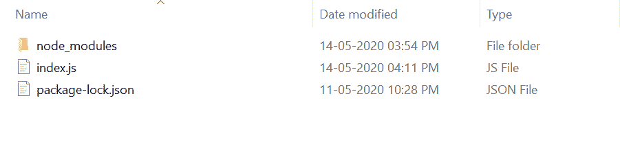
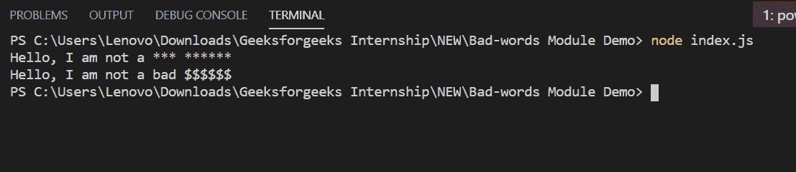

# 如何处理 Node.js 中的不良词汇？

> 原文:[https://www . geesforgeks . org/how-hand-bad words-in-node-js/](https://www.geeksforgeeks.org/how-to-handle-badwords-in-node-js/)

坏词模块用于通过清理给定的字符串来处理坏词。这是一个针对不良词汇的 JavaScript 过滤器。该模块搜索亵渎的单词，并用占位符字符替换它们。

**不良词汇模块特征:**

1.  它很容易上手，也很容易使用。
2.  它是广泛使用和流行的不良词汇过滤器。

**不良词汇模块安装:**

1.  您可以访问[安装不良词汇模块](https://www.npmjs.com/package/bad-words)的链接。您可以使用此命令安装此软件包。

    ```
    npm install bad-words
    ```

2.  安装坏词模块后，您可以使用命令在命令提示符下检查您的请求版本。

    ```
    npm version bad-words
    ```

3.  之后，您可以创建一个文件夹并添加一个文件，例如 index.js。

    ```
    node index.js
    ```

**文件名:index.js**

```
var Filter = require('bad-words');

var filter = new Filter();

filter.addWords('bad', 'dumb'); // Add your own words

console.log(filter.clean("Hello, I am not a bad ******"));

var new_filter = new Filter({ placeHolder: '{content}apos; });

console.log(new_filter.clean("Hello, I am not a bad ******"));
```

**运行程序的步骤:**

1.  项目结构会是这样的:
    
2.  使用以下命令确保您已经安装了不良词汇模块:

    ```
    npm install bad-words
    ```

3.  Run index.js file using below command:

    ```
    node index.js
    ```

    

这就是如何使用一个坏词模块，通过清理给定的字符串来处理坏词。