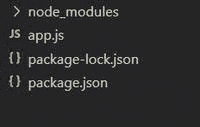
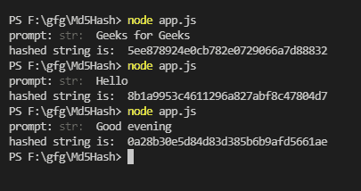

# 如何在 Node.js 中用 md5 函数对字符串进行哈希？

> 原文:[https://www . geesforgeks . org/how-hash-string-with-MD5-function-in-node-js/](https://www.geeksforgeeks.org/how-to-hash-string-with-md5-function-in-node-js/)

**散列**意味着将任意字符串作为关键字，并为其生成其他字符串作为值。这就像地图或字典中的键值对。 **md5** 哈希是一种加密算法，它获取文件的各个位并输出唯一的文本字符串。md5 是单向加密算法，即没有直接的解密方式。使用 md5 哈希，您只能通过比较为两个字符串生成的哈希字符串来比较它们是否相等。为此，我们将使用 **md5** npm 包和提示模块 md5 是一个用于加密数据的 javascript 模块，提示模块用于从终端获取输入。

**使用 md5 函数散列字符串的步骤:**

**步骤 1:** 创建一个“ *app.js* 文件，并使用 npm 初始化项目。

```
npm init
```

**步骤 2:** 使用 npm install 安装 *md5* 和*提示* npm 包。

```
npm install md5
npm install prompt
```

**项目结构:**



**第三步:**现在让我们对“ *app.js* 文件进行编码。我们将所需的字符串作为用户的输入，然后使用 *md5()* 函数来生成其散列字符串。

**app.js**

## java 描述语言

```
// Prompt is used to take input from console
const prompt = require("prompt");

// md5 is used to hash the given string
const md5 = require("md5");

// Utility function to perform the operation
function hash() {

  // Start the prompt
  prompt.start();

  // Get string input as str from the console
  prompt.get(["str"], function (err, res) {

    // To handle any error if occured
    if (err) {
      console.log(err);
    } else {

      // To generate the hashed string
      const hash = md5(res.str);

      // To print hashed string in the console
      console.log("hashed string is: ", hash);
    }
  });
}

// Calling the function
hash();
```

**步骤 4:** 使用以下命令运行 app.js 文件:

```
node app.js
```

**输出:**

